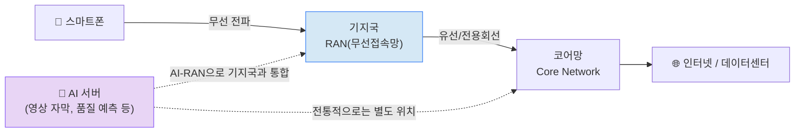

# 주간 통신 브리핑 — 2026-08-11

## 이번 주 3줄 요약
- 이번 주 최대 화두는 **AI-RAN**(기지국에 AI 연산 기능을 결합하는 기술)입니다. 삼성전자·NTT도코모의 상용망 실증부터 Nvidia·Nokia·T-Mobile 시험, IEEE 논문, arXiv 신규 논문까지 거의 모든 소스에서 동시에 다뤄졌습니다.
- 일반 스마트폰을 위성에 직접 연결하는 위성통신(NTN) 경쟁이 AST SpaceMobile의 위성 3기 추가 발사로 한층 가속화되고 있습니다.
- 국내 통신 3사는 회선(전화·인터넷) 사업에서 AI데이터센터(AIDC) 사업으로 무게중심을 옮기며 실적을 방어하는 모습이 뚜렷해졌습니다.

## 한눈에 보기

| 소스 | 항목 | 난이도 | 한 줄 설명 |
|---|---|---|---|
| TTA | 제1302호 — 로봇 Affective AI 기술 동향 | ★★ | 휴머노이드 로봇의 감성 대화 AI 표준화 동향 (본문 접근 불가) |
| 저널 | AI-RAN 6G 실증 (IEEE Spectrum) | ★★ | Nvidia·Nokia·T-Mobile, 기지국+AI서버 통합 실증 성공 |
| 저널 | AI-RAN 개념 정리 논문 (IEEE Comm. Magazine) | ★★★ | 기지국이 AI 연산까지 겸하는 3가지 형태를 학술적으로 정리 |
| 저널 | 기업 Wi-Fi의 AI 부담 (IEEE Spectrum) | ★ | 사내 AI 도입 확산이 낡은 사내 와이파이망에 부담을 줌 |
| arXiv | EvoRIC — LLM 자율 기지국 제어 | ★★★ | AI가 스스로 판단해 기지국을 조정하는 연구 |
| arXiv | FM4WiFi — 차세대 와이파이 자동 조정 | ★★★ | AI가 여러 공유기 설정을 1초 안에 자동 최적화 |
| arXiv | Radio-FM — 무선신호 범용 AI 모델 | ★★★ | 무선신호 전반에 두루 쓰는 "만능 AI" 개발 |
| arXiv | BALANCE — 엣지 AI 챗봇 서비스 확대 | ★★ | 기지국 근처 서버에서 더 많은 이용자에게 AI 서비스 제공 |
| arXiv | 5G 신호로 드론 3D 추적 | ★★ | 별도 레이더 없이 통신 신호만으로 드론 탐지 |
| 표준화 | 3GPP Release 21 (6G) 타임라인 | ★★ | 3GPP 최초의 6G 표준 릴리즈, 이번 주 신규 소식은 없음 |
| 표준화 | ITU IMT-2030 성능요구사항 | ★★ | 국제기구가 정하는 6G 성능 기준, 이번 주 신규 소식은 없음 |
| IITP | 저궤도 위성 주파수 관리 시스템 | ★★ | 위성 인터넷 사업자 간 전파 간섭을 막는 국가 지원 체계 |
| 업계뉴스 | 삼성전자·NTT도코모 AI-RAN 상용검증 | ★ | AI가 통신 품질 저하를 미리 막아주는 기술을 실제 망에서 검증 |
| 업계뉴스 | AST SpaceMobile 위성 3기 발사 | ★ | 스마트폰을 위성에 직접 연결하는 서비스용 위성 확충 |
| 업계뉴스 | 국내 통신 3사 2분기 실적 | ★ | 통신사들의 AI데이터센터 사업 성장이 실적을 견인 |
| 업계뉴스 | 아태 통신사 AI 인프라 투자 경쟁 | ★ | 아시아 통신사들의 자국 AI 인프라 구축 경쟁 심화 |

*위 그림: 전통적으로 AI 연산은 코어망이나 별도 데이터센터에서 이뤄졌지만, "AI-RAN"은 이 AI 기능을 기지국(RAN) 단계로 끌어와 통합하는 방식입니다. 이번 주 여러 소스에서 공통으로 다룬 주제입니다.*

---

## 1. TTA ICT Standard Weekly 제1302호

**발행일**: 2026-08-10 (이번 주 신규 호 확인됨)

TTA(한국정보통신기술협회)가 매주 발행하는 ICT 표준 동향 소식지입니다. 이번 호 목록에서 확인된 기사는 다음과 같습니다.

### 휴머노이드 로봇과 교감/공감 대화를 위한 Affective AI 기술 동향 ★★
- **원문 링크**: https://committee.tta.or.kr/data/weekly_view.jsp?news_id=10312
- **쉬운 설명**: "Affective AI(감성 AI)"란 사람의 표정·말투·감정 신호를 읽고 이에 공감하듯 반응하는 AI를 뜻합니다. 이 기사는 휴머노이드(사람 형태) 로봇이 사람과 감정적으로 자연스럽게 대화하도록 만드는 기술 표준화 동향을 다룬 것으로 제목에서 확인됩니다.
- **왜 중요한가**: 로봇이 단순 명령 수행을 넘어 사람과 정서적으로 교감하는 방향으로 표준화가 진행 중임을 보여줍니다.
- **⚠️ 접근 제한 안내**: 이번 주 이 세션의 네트워크 환경에서 TTA 본문(PDF, weekly.tta.or.kr 호스트)에 접근이 차단되어 상세 요약은 작성하지 못했습니다. 목록 페이지의 제목·발행일만 확인했습니다. 같은 호에 다른 기사가 더 있는지도 목록 페이지 로딩 오류로 확인하지 못했습니다.

---

## 2. 저널/학회 신규 논문

### AI-RAN 실증, 6G의 AI 네이티브 미래를 예고하다 ★★
- **원문 링크**: https://spectrum.ieee.org/ai-ran-6g (IEEE Spectrum)
- **쉬운 설명**: "RAN(Radio Access Network, 무선접속망)"이란 스마트폰과 통신사 핵심망 사이를 무선으로 연결하는 기지국 구간을 말합니다. 지금까지 기지국 장비는 통신 전용으로 설계됐지만, Nvidia는 이를 ChatGPT 같은 AI를 돌리는 서버처럼 범용 컴퓨팅 장비로 바꾸려 하고 있습니다. Nokia·Nvidia·T-Mobile은 미국 시애틀 혁신랩에서 무선 장비 한 대와 Nvidia 서버가 실제 5G 통신과 영상 스트리밍·자막 생성 같은 AI 작업을 동시에 처리하는 실증(PoC) 시험을 성공적으로 마쳤습니다.
- **왜 중요한가**: 통신망과 AI 컴퓨팅을 하나로 합치는 'AI-RAN' 개념이 실험실을 넘어 통신사 실증 단계로 진입했습니다.

### AI-RAN: AI 기반 컴퓨팅 인프라로 RAN을 바꾸다 ★★★
- **원문 링크**: https://ieeexplore.ieee.org/document/11141658/ (IEEE Communications Magazine, Vol.64 No.1)
- **쉬운 설명(도입)**: 위와 같은 맥락으로, 기지국이 통신 전용 장비에서 통신+AI 연산을 함께 처리하는 범용 컴퓨팅 플랫폼으로 바뀌고 있다는 흐름을 다룹니다.
- **심화 내용**: 이 논문은 이런 변화를 AI-for-RAN(AI로 RAN을 최적화), AI-on-RAN(RAN 장비 위에서 AI 서비스 구동), AI-and-RAN(RAN과 AI를 동일 하드웨어로 통합) 세 가지 형태로 체계적으로 정리했습니다. Nvidia의 고성능 서버(Grace-Hopper GH200)로 통신 신호처리와 AI 연산을 동시에 수행하는 실험 결과도 함께 제시합니다.
- **왜 중요한가**: AI-RAN 개념을 정리한 대표 논문으로, 이후 관련 연구·산업 표준 논의의 기준점 역할을 하고 있습니다.

### AI 붐이 오랫동안 미뤄온 Wi-Fi 개혁을 강제하다 ★
- **원문 링크**: https://spectrum.ieee.org/wi-fi-enterprise-networks (IEEE Spectrum)
- **쉬운 설명**: 기업들이 사내에 AI 시스템 도입을 서두르고 있지만, 이를 뒷받침해야 할 사내 와이파이망은 오래된 표준에 머물러 있다는 문제를 다룹니다. 설문 결과 현재 기업의 28%가 이미 와이파이망에서 AI 업무를 운용 중이며, 2027년까지 이 비율이 75% 이상으로 늘어날 전망입니다.
- **왜 중요한가**: AI 도입 확산이 Wi-Fi 7 등 무선랜 인프라 고도화를 강제하는 새로운 수요로 떠오르고 있습니다.

*(참고: IEEE Network 지면은 2026년 AI-RAN·에이전틱 AI 특집을 계획 중이나, 조사 시점 기준 확정 게재된 기사는 확인되지 않아 포함하지 않았습니다.)*

---

## 3. arXiv 주목 논문

지난 7일(2026-08-04~08-11) cs.NI(네트워킹), eess.SP(신호처리) 카테고리에 제출된 논문 중 선별했습니다.

### EvoRIC — LLM 기반 자율 기지국 제어 ★★★
- **원문 링크**: https://arxiv.org/abs/2608.06789 (제출일 2026-08-07)
- **쉬운 설명(도입)**: 통신사 기지국(RAN)을 사람 개입 없이 스스로 판단·조정하게 만드는 연구입니다.
- **심화 내용**: 거대언어모델(LLM, 방대한 텍스트를 학습해 사람처럼 대화·판단하는 AI)을 실제 무선 환경과 상호작용시키며 강화학습(시행착오를 통해 스스로 개선하는 학습 방식)으로 훈련시켰습니다.
- **왜 중요한가**: 범용 AI가 통신 상황에 맞게 똑똑해지면, 다양한 네트워크 환경에서도 성능이 유지되는 자율 기지국 관리가 가능해집니다.

### FM4WiFi — 차세대 와이파이 다중 공유기 자동 조정 ★★★
- **원문 링크**: https://arxiv.org/abs/2608.04050 (제출일 2026-08-04)
- **쉬운 설명(도입)**: 여러 와이파이 공유기가 밀집한 곳에서 전파가 서로 방해되지 않도록 설정을 자동으로 찾아주는 연구입니다.
- **심화 내용**: 생성형 AI를 활용해, 기존 방식이 오래 걸리던 계산을 단 한 번의 추론만으로 30개 이상의 공유기를 1초 이내에 조정하도록 만들었습니다.
- **왜 중요한가**: 이후 세대 와이파이(Wi-Fi 8 등)처럼 공유기가 촘촘하게 몰린 환경에서도 빠르고 안정적인 통신을 가능하게 합니다.

### Radio-FM — 무선 신호용 "만능 AI 모델" ★★★
- **원문 링크**: https://arxiv.org/abs/2608.05793 (제출일 2026-08-06)
- **쉬운 설명(도입)**: 이미지·텍스트 분야에 챗GPT 같은 범용 AI가 있듯, 무선 전파 신호에도 여러 문제를 두루 풀 수 있는 "기반 모델(Foundation Model)"을 만든 연구입니다.
- **심화 내용**: 신호 인식, 위치 추적 등 서로 다른 통신 문제마다 AI를 새로 개발할 필요 없이 하나의 모델을 재사용할 수 있도록 설계했습니다.
- **왜 중요한가**: 통신 AI 개발 비용과 시간을 크게 줄일 수 있는 접근입니다.

### BALANCE — 무선망에서 더 많은 이용자에게 AI 챗봇 서비스하기 ★★
- **원문 링크**: https://arxiv.org/abs/2608.05926 (제출일 2026-08-06)
- **쉬운 설명**: 스마트폰과 가까운 기지국 근처 서버("엣지 서버")에서 LLM 서비스를 제공할 때, 빠르지만 메모리를 많이 쓰는 방식과 느리지만 가벼운 방식을 상황에 맞게 섞어 쓰는 기술입니다.
- **왜 중요한가**: 제한된 통신 자원으로도 더 많은 사용자에게 지연 없이 AI 서비스를 동시에 제공할 수 있습니다.

### 5G 통신 신호로 드론 탐지 및 3D 추적 ★★
- **원문 링크**: https://arxiv.org/abs/2608.05826 (제출일 2026-08-06)
- **쉬운 설명**: 별도의 레이더 장비 없이, 스마트폰이 기지국과 통신할 때 쓰는 기존 5G 신호만으로 저고도 드론의 위치를 3차원으로 실시간 추적하는 기술을 실제 통신 장비(O-RAN 테스트베드)로 검증했습니다.
- **왜 중요한가**: 통신망 하나로 통신과 드론 감시를 동시에 수행해 저비용으로 공역 안전을 지킬 수 있습니다.

---

## 4. 표준화 동향 (3GPP/ITU)

**이번 주(2026-08-04~08-11) 확인된 신규 공식 소식은 없습니다.** 3GPP 다음 주요 회의는 8월 24~28일(RAN 워킹그룹, 마스트리흐트), ITU-R WP5D 다음 회의는 9월 28일로 예정되어 있어 현재는 소강 상태입니다. 참고로 가장 최근 확인된 배경 동향은 아래와 같습니다 (조사 기간 밖의 정보임을 밝힙니다).

### (참고) 3GPP Release 21 — 최초의 6G 표준 릴리즈 ★★
- **쉬운 설명(도입)**: 3GPP(3rd Generation Partnership Project)는 전 세계 이동통신사·제조사가 참여해 3G/4G/5G 같은 이동통신 표준을 만드는 국제 협의체입니다. "Release(릴리즈)"는 몇 년 주기로 발표하는 표준 규격 묶음으로, 그 시점까지 합의된 속도·지연시간·서비스 기능이 확정된 문서입니다. Release 21은 3GPP가 처음으로 6G 자체를 규정하는 릴리즈입니다.
- **내용(2026년 6월 확인)**: 서비스 요구사항 동결은 2027년 3월, 최종 규격 완성은 2029년 초로 예정되어 있으며, 6G 공중 인터페이스(전파를 주고받는 방식) 핵심 기술 방향이 논의되고 있습니다.

### (참고) ITU IMT-2030 — 6G 성능 요구사항 ★★
- **쉬운 설명(도입)**: ITU(국제전기통신연합)는 UN 산하의 통신 표준·주파수 관장 기구입니다. "Recommendation(권고)"은 각국 정부와 산업계가 따르는 ITU의 공식 기술 지침입니다. IMT-2030은 ITU가 6G에 붙인 공식 명칭으로, 5G의 공식명 IMT-2020의 후속입니다. ITU가 먼저 "6G가 갖춰야 할 성능 기준"을 정하면 3GPP 등이 이 기준을 만족하는 구체 기술을 제출·경쟁하는 구조입니다.
- **내용(2026년 2월 확인)**: 20개 기술성능요구사항(TPR) 초안에 합의했으며, 상위 기구의 정식 승인은 2026년 12월로 예정되어 있습니다.

---

## 5. IITP 주간기술동향

**이번 주 최신호(2217호, 2026-07-29 발행)에는 통신/네트워크 관련 기사가 없습니다.** (AI반도체·로봇·데이터센터 기사만 수록) 확인 가능했던 최근 호(2210~2217호, 2026년 5~7월) 중 통신 관련 아티클은 아래 한 건뿐이었습니다.

### (5월호 참고) 저궤도 위성망 확산에 따른 위성 주파수 관리 정책과 이용지원 시스템 ★★
- **출처**: IITP 주간기술동향 2211호 (2026-05-06 발행)
- **쉬운 설명**: 스페이스X 같은 저궤도(LEO, 지구 표면에서 가까운 궤도) 위성 인터넷 사업자가 급증하면서, 여러 위성이 같은 전파 주파수를 두고 충돌·간섭을 일으키지 않도록 국가 간 조정이 중요해지고 있습니다. 우리 정부가 위성망 신청부터 국제 등록, 전파 간섭 분석까지 지원하는 '위성망 이용지원 시스템'을 만든 배경과 기능을 설명합니다.
- **왜 중요한가**: 하늘 위 위성 인터넷 서비스들이 서로 전파를 방해하지 않고 운영되도록 돕는 국가 차원의 "교통정리" 체계입니다. 아래 업계뉴스의 위성통신 소식과 함께 보면 이해에 도움이 됩니다.

---

## 6. 업계 뉴스

### 삼성전자·NTT도코모, AI-RAN 기반 통신품질 최적화 상용망 검증 성공 ★
- **날짜**: 2026-08-10
- **원문 링크**: https://www.hankyung.com/article/202608103732h
- **쉬운 설명**: AI가 이용자의 이동 경로와 동영상 시청 패턴을 미리 학습해, 화질 저하나 버퍼링이 예상되면 네트워크 설정을 스스로 바꿔주는 기술을 실제 상용망 데이터로 검증했습니다. 품질 저하 발생률이 13.1%에서 7.2%로 절반 가까이 줄었습니다.
- **왜 중요한가**: AI-RAN이 실험실을 넘어 실제 상용망에서도 통한다는 것을 보여준 사례입니다.

### AST SpaceMobile, '블루버드' 위성 11·12·13호 발사 성공 ★
- **날짜**: 2026-08-05
- **원문 링크**: https://www.lightreading.com/satellite/ast-spacemobile-sets-launch-for-bluebird-11-12-13
- **쉬운 설명**: 일반 스마트폰을 별도 장비 없이 위성에 직접 연결하는 'D2D(Direct-to-Device)' 서비스를 준비 중인 AST SpaceMobile이 대형 통신위성 3기를 추가로 쏘아 올려 총 13기를 확보했습니다. 최대 200Mbps급 속도를 제공할 전망입니다.
- **왜 중요한가**: 산간·해상 등 통신 음영지역을 없애는 '비지상망(NTN)' 경쟁이 스타링크·AT&T·버라이즌 등과 맞물려 본격화되고 있습니다.

### SK텔레콤·LG유플러스·KT, 2분기 실적 발표…AI데이터센터 사업이 성장 견인 ★
- **날짜**: 2026-08-05~06
- **원문 링크**: https://www.sentv.co.kr/article/view/sentv202608060115
- **쉬운 설명**: SK텔레콤은 2분기 영업이익이 전년 대비 67.3% 늘었고 AIDC(AI데이터센터) 매출은 92.5% 급증했습니다. LG유플러스도 AIDC 사업 성장으로 수익성이 개선된 반면, KT는 해킹 사고 여파로 영업이익이 주춤할 전망입니다.
- **왜 중요한가**: 국내 통신 3사가 단순 회선 사업자에서 AI 인프라 기업으로 전환하는 흐름이 실적으로 확인되고 있습니다.

### 아시아태평양 통신사들, AI 인프라 투자 경쟁 가속 ★
- **날짜**: 2026-08-07
- **원문 링크**: https://www.rcrwireless.com/20260807/carriers/telco-diary-apac-telcos-pile-into-ai-infrastructure
- **쉬운 설명**: 대만 중화텔레콤, 인도네시아 인도샛, 소프트뱅크, 중동 e& 등 아태 지역 통신사들이 잇달아 자국 AI 인프라(소버린 컴퓨팅) 구축에 나서고 있습니다.
- **왜 중요한가**: 한국뿐 아니라 아시아 통신사 전반이 AI 인프라 투자로 사업 모델을 전환하는 글로벌 흐름을 보여줍니다.

*(참고: 이번 7일간 국제 소스에서 Wi-Fi 7/8 관련 신규 발표는 확인되지 않았습니다. 가장 최근 관련 뉴스는 2026년 5월 말입니다.)*

---

## 이번 주 기초 개념 한 가지: RAN(무선접속망)이란 무엇인가?

여러분이 스마트폰으로 통화하거나 영상을 볼 때, 신호는 이런 경로를 지나갑니다: **스마트폰 → 기지국(RAN) → 통신사 코어망 → 인터넷.** 이 중 "RAN(Radio Access Network, 무선접속망)"은 스마트폰과 통신사 핵심망 사이를 '무선'으로 연결해주는 구간, 즉 우리 주변에 세워진 기지국들이 담당하는 영역입니다. 흔히 통신탑이나 건물 옥상의 안테나로 보이는 장비가 바로 이 RAN의 일부입니다. 기지국은 스마트폰이 보낸 전파 신호를 받아 디지털 데이터로 바꾸고, 이를 유선(또는 전용회선)으로 코어망에 전달하는 "번역·중계소" 역할을 합니다. 지금까지 RAN 장비는 통신이라는 한 가지 일만 하도록 특수 설계된 전용 하드웨어였습니다. 그런데 최근 컴퓨터 성능이 좋아지면서, 이 전용 장비를 일반 서버처럼 범용 컴퓨팅 장비로 바꾸고 그 위에서 AI 연산까지 함께 돌리려는 흐름이 생겼습니다. 이것이 바로 이번 주 리포트 전체에서 반복적으로 등장한 "AI-RAN"입니다. 예를 들어 기지국이 통신 신호를 처리하는 동시에, 그 옆 자리에서 영상 자막을 생성하거나 통신 품질 저하를 예측하는 AI 작업까지 처리하는 식입니다. 통신사 입장에서는 기지국이라는 비싼 장비를 통신에만 쓰지 않고 AI 서비스로도 활용해 추가 수익을 낼 수 있다는 장점이 있습니다. 반대로 관리해야 할 소프트웨어와 보안 이슈가 늘어난다는 과제도 있습니다. 앞으로 6G 시대에는 RAN이 "통신 전용 장비"가 아니라 "통신+AI를 함께 처리하는 범용 인프라"로 진화할 가능성이 높다고 업계는 보고 있습니다.

---

## 이번 주 용어집 (가나다순)

- **AI-RAN**: 기지국(RAN)에 AI 연산 기능을 결합해, 통신 처리와 AI 서비스를 같은 장비에서 함께 수행하는 기술. 이번 주 가장 많이 등장한 키워드입니다.
- **AIDC(AI데이터센터)**: AI 연산(모델 학습·추론)을 대규모로 처리하기 위해 만든 데이터센터. 국내 통신사들의 새로운 성장 사업으로 떠오르고 있습니다.
- **D2D(Direct-to-Device)**: 별도의 위성 수신기 없이 일반 스마트폰이 위성과 직접 통신하는 방식입니다.
- **IMT-2030**: ITU가 6G에 붙인 공식 명칭. 5G의 공식명 IMT-2020의 후속으로, 6G가 갖춰야 할 성능 기준을 담습니다.
- **ITU(국제전기통신연합)**: UN 산하의 통신 표준·주파수 관장 국제기구로, 각국이 따르는 "Recommendation(권고)"을 발표합니다.
- **LEO(저궤도)**: 지구 표면에서 비교적 가까운 궤도. 이 궤도에 위성을 띄우면 신호 지연이 적어 인터넷 서비스에 유리합니다.
- **LLM(거대언어모델)**: 방대한 텍스트 데이터를 학습해 사람처럼 대화하고 판단할 수 있는 AI 모델. 챗GPT가 대표적 예시입니다.
- **NTN(비지상망)**: 지상 기지국이 아닌 위성 등을 이용해 통신 서비스를 제공하는 네트워크입니다.
- **O-RAN(오픈랜)**: 특정 제조사의 전용 장비에 묶이지 않고, 여러 회사의 장비를 표준화된 방식으로 섞어 쓸 수 있게 만든 개방형 기지국 구조입니다.
- **RAN(무선접속망)**: 스마트폰과 통신사 코어망 사이를 무선으로 연결하는 기지국 구간. 이번 주 "기초 개념" 코너에서 자세히 설명했습니다.
- **Release(릴리즈)**: 3GPP가 몇 년 주기로 발표하는 이동통신 표준 규격 묶음입니다.
- **3GPP**: 전 세계 이동통신사·제조사가 참여해 3G/4G/5G/6G 표준을 만드는 국제 표준화 협의체입니다.
- **기반 모델(Foundation Model)**: 하나의 AI 모델로 여러 문제를 두루 풀 수 있도록 광범위하게 학습시킨 범용 AI 모델입니다.
- **엣지 서버**: 스마트폰 이용자와 물리적으로 가까운 곳(기지국 인근 등)에 배치해 지연시간을 줄이는 서버입니다.
