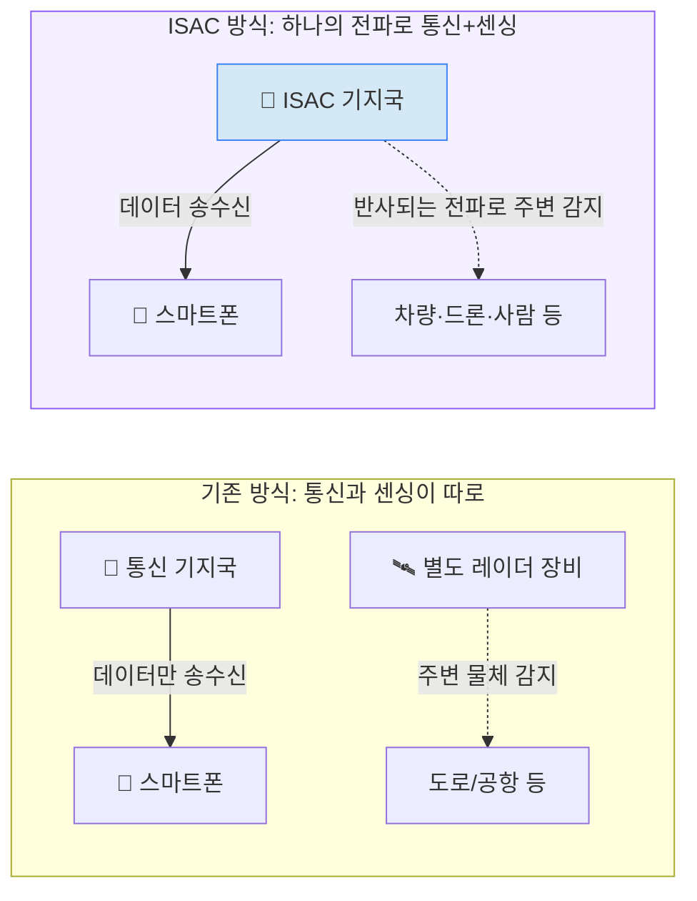

# 주간 통신 브리핑 — 2026-08-18

## 이번 주 3줄 요약
- **ISAC(통신-센싱 통합)**이 이번 주 학술·표준 소식을 관통하는 주제입니다. 3GPP의 5G-Advanced→6G ISAC 진화 논문부터, 위성 핸드오버·기지국 구조 관련 arXiv 논문까지 "통신망이 레이더처럼 주변을 감지하는" 흐름이 여러 소스에서 동시에 확인됐습니다.
- 3GPP는 9월 14~17일 스페인 마드리드 회의(RAN#113)에서 5G를 6G로 전환하는 두 가지 방식(옵션1 vs 옵션3) 중 하나를 확정할 예정이며, 이는 6G 초기 장비·서비스의 실제 모습을 좌우하는 중요한 갈림길입니다.
- 국내 통신 3사는 상반기 매출 대비 연구개발비 비중을 발표했는데, SK텔레콤(2.13%)이 KT(1.03%)·LG유플러스(0.95%)를 크게 앞서며 AI·네트워크 고도화 투자에 가장 적극적인 모습을 보였습니다.

## 한눈에 보기

| 소스 | 항목 | 난이도 | 한 줄 설명 |
|---|---|---|---|
| TTA | 제1303호 — AI 기반 미디어 압축용 텐서 압축 표준 | ★★ | AI 데이터(텐서)를 효율적으로 압축하는 표준화 동향 (본문 접근 불가, 제목 기반 설명) |
| 표준화 | 3GPP RAN#113 마드리드 회의 (9월) — 6G 전환 방식 결정 | ★★ | 5G에서 6G로 넘어가는 두 가지 기술 경로 중 하나를 확정하는 분수령 |
| 저널 | IEEE Comm. Magazine 8월호 — Net-Zero 6G 특집 | ★★★ | 에너지를 스스로 조달해 친환경적으로 운영되는 6G망 연구 특집 |
| arXiv | IEEE 802.11bn(Wi-Fi 8) 다중 공유기 전력 배분 | ★★ | 여러 와이파이 공유기가 서로 겹치지 않게 전력을 나누는 Wi-Fi 8 표준 기술 연구 |
| arXiv | 3GPP ISAC: 5G-Advanced에서 6G로의 진화 | ★★ | 통신망이 통신뿐 아니라 주변 감지(레이더 기능)까지 겸하는 표준화 흐름 정리 |
| arXiv | AI-Native 6G를 위한 이종 기기 간 시맨틱 통신 동기화 | ★★★ | 서로 다른 AI 기기들이 "같은 의미"로 이해하도록 맞춰주는 6G 통신 기법 |
| arXiv | 옴니-포토닉 기지국 — 6G용 광 기반 기지국 구조 | ★★★ | 전기 대신 빛으로 통신·센싱·연산을 모두 처리하는 미래형 기지국 개념 |
| arXiv | 다중궤도 위성망 핸드오버 강화학습 | ★★ | 위성 간 연결을 AI가 스스로 판단해 자동으로 넘겨주는 기술 |
| IITP | 이번 주 확인 불가 (사이트 접속 오류) | - | itfind.or.kr / iitp.kr 접속이 이번 조사 시점에 차단·오류로 확인 불가 |
| 업계뉴스 | 국내 통신 3사 상반기 R&D 투자 비교 | ★ | SK텔레콤이 매출 대비 연구개발비 비중에서 3사 중 1위 |
| 업계뉴스 | 휴즈(HughesNet) 챕터11 파산보호 신청 | ★★ | 저궤도 위성(스타링크 등)에 밀린 정지궤도 위성 인터넷 업체의 구조조정 |

*위 그림: ISAC(Integrated Sensing and Communication, 통신-센싱 통합)는 기지국이 통신에 쓰는 전파의 반사파를 함께 분석해, 별도 레이더 장비 없이도 주변의 차량·드론·사람을 감지하는 기술입니다. 이번 주 3GPP 표준화 논문과 여러 arXiv 논문에서 공통으로 다뤄진 주제입니다.*

---

## 1. TTA ICT Standard Weekly 제1303호

**발행일**: 2026-08-17 (이번 주 신규 호 확인됨)

이번 호에는 아래 한 건의 기사가 확인되었습니다.

### AI 기반 미디어 압축을 위한 텐서(Tensor) 압축 표준 기술의 등장 ★★
- **원문 링크**: https://committee.tta.or.kr/data/weekly_view.jsp?news_id=10324
- **쉬운 설명**: "텐서(Tensor)"란 숫자를 여러 차원(가로·세로·깊이 등)으로 늘어놓은 데이터 묶음을 말합니다. AI가 영상이나 이미지를 처리할 때 내부적으로 데이터를 텐서 형태로 다루는데, 이 텐서는 용량이 매우 커서 그대로 저장·전송하기 어렵습니다. "텐서 압축"은 이런 대용량 텐서 데이터를 최대한 작게 줄이면서도 품질 손실을 최소화하는 기술입니다. 제목으로 볼 때 이 기사는 이런 텐서 압축을 국제 표준(예: MPEG 계열)으로 만들려는 움직임을 다룬 것으로 보입니다.
- **왜 중요한가**: AI가 처리하는 영상·이미지 데이터가 점점 커지는 상황에서, 이를 표준화된 방식으로 압축할 수 있으면 저장 공간과 전송 대역폭을 크게 절약할 수 있습니다.
- **⚠️ 접근 제한 안내**: 이번 주도 TTA 본문 파일(weekly.tta.or.kr 호스트)에 이 세션의 네트워크 환경에서 접근이 차단되어(host_not_allowed), 위 설명은 기사 제목과 일반적인 배경지식을 바탕으로 작성했습니다. 기사 본문의 구체적 표준 명칭이나 수치는 확인하지 못했습니다.

---

## 2. 저널/학회 신규 논문

### IEEE Communications Magazine 8월호 — "Net-Zero 6G Networks" 특집 ★★★
- **원문 링크**: https://www.comsoc.org/publications/magazines/ieee-communications-magazine/cfp/net-zero-6g-networks-enabling-technologies
- **쉬운 설명(도입)**: 기지국이나 통신 장비도 전기를 많이 씁니다. "Net-Zero(넷제로)"란 쓰는 에너지만큼 재생에너지 등으로 조달해 순배출을 0으로 만든다는 개념입니다.
- **심화 내용**: 이번 호는 태양광 등 주변 에너지를 직접 모아 쓰는 "에너지 하베스팅", AI를 이용한 전력 관리, 저전력 통신 기법 등 6G망을 친환경적으로 운영하기 위한 기술들을 종합적으로 다루는 특집입니다.
- **왜 중요한가**: 6G는 AI 연산까지 겸하며 에너지 소비가 더 늘어날 전망이라, 초기 설계 단계부터 에너지 효율을 고려하는 흐름이 학계에서 본격화되고 있음을 보여줍니다.

*(참고: 이번 주 IEEE Spectrum·IEEE Network에서는 지난주 이미 다룬 AI-RAN·기업용 Wi-Fi 주제 외에 새로 확인된 독립 기사가 없어 추가 항목은 싣지 않았습니다.)*

---

## 3. arXiv 주목 논문

지난 7일(2026-08-11~08-18) cs.NI(네트워킹), eess.SP(신호처리) 카테고리에 제출된 논문 중 선별했습니다. (arXiv 공지 특성상 주말 제출분은 다음 주 초 반영되어, 이번 주는 8/11~8/14 제출분이 대상입니다.)

### IEEE 802.11bn(Wi-Fi 8) 다중 공유기 협조 전송 시 전력 배분 ★★
- **원문 링크**: https://arxiv.org/abs/2608.11971 (제출일 2026-08-12)
- **쉬운 설명(도입)**: 차세대 와이파이 표준인 Wi-Fi 8(공식 명칭 IEEE 802.11bn)은 여러 공유기가 서로 협력해 하나의 팀처럼 움직이는 "다중 AP(공유기) 협조" 기능을 새로 도입합니다.
- **심화 내용**: 이 논문은 여러 공유기가 동시에 신호를 보낼 때, 서로의 신호가 방해되지 않으면서도 각 공유기가 적절한 세기로 전파를 낼 수 있도록 송신 전력을 자동으로 나누는 방법을 연구했습니다.
- **왜 중요한가**: 지난주 다룬 Wi-Fi 관련 기업 수요 증가와 맞물려, 차세대 와이파이가 실제로 촘촘한 공유기 환경에서도 안정적으로 동작하기 위한 핵심 기반 기술입니다.

### 3GPP 표준에서의 ISAC(통신-센싱 통합): 5G-Advanced에서 6G로 ★★
- **원문 링크**: https://arxiv.org/abs/2608.11606 (제출일 2026-08-12)
- **쉬운 설명(도입)**: 위 "이번 주 기초 개념" 코너에서 다루는 ISAC이 3GPP 표준에 실제로 어떻게 반영되고 있는지를 정리한 논문입니다.
- **심화 내용**: 현재 5G-Advanced 단계에서 도입 중인 초기 센싱 기능이 6G에서 어떤 방향으로 확장될지, 관련 3GPP 워킹그룹 논의와 기술 후보들을 정리했습니다.
- **왜 중요한가**: 학계 연구와 실제 국제 표준화 작업이 어떻게 연결되는지 보여주는 좋은 사례로, 이번 주 표준화 섹션의 3GPP 소식과 함께 보면 이해에 도움이 됩니다.

### AI 네이티브 6G를 위한 이종 기기 간 시맨틱 통신 동기화 ★★★
- **원문 링크**: https://arxiv.org/abs/2608.13394 (제출일 2026-08-13)
- **쉬운 설명(도입)**: "시맨틱 통신(Semantic Communication)"이란 데이터를 있는 그대로 전송하는 대신, "의미"만 뽑아서 훨씬 적은 양으로 주고받는 통신 방식입니다. 마치 긴 문장을 요약해서 전달하는 것과 비슷합니다.
- **심화 내용**: 서로 다른 종류의 AI 기기(예: 자율주행차의 AI와 스마트폰의 AI)는 같은 상황을 서로 다르게 "이해"할 수 있는데, 이 논문은 이런 기기들이 의미를 주고받을 때 생기는 이해 불일치(오해)를 줄이는 동기화 기법을 제안합니다.
- **왜 중요한가**: 데이터 원본을 통째로 보내지 않고 의미만 압축해서 통신하면 6G 시대의 폭증하는 트래픽 부담을 크게 줄일 수 있습니다.

### 옴니-포토닉 기지국 — 미래 6G를 위한 광(光) 기반 기지국 구조 ★★★
- **원문 링크**: https://arxiv.org/abs/2608.13909 (제출일 2026-08-14)
- **쉬운 설명(도입)**: 지금의 기지국은 전기 신호로 통신·연산 대부분을 처리합니다. 이 논문은 전기 대신 빛(광, Photonic)을 이용해 통신·센싱·연산 기능을 한 장비 안에서 모두 처리하는 새로운 기지국 구조를 제안합니다.
- **심화 내용**: 광 기술은 전기 신호보다 더 빠르고 발열이 적어, 여러 기능(통신·센싱·데이터 처리)을 하나의 장비에 통합하기 유리하다는 점을 시스템 설계 차원에서 다뤘습니다.
- **왜 중요한가**: 앞서 소개한 Net-Zero 6G(에너지 절감) 흐름과도 맞닿아 있는, 하드웨어 차원의 미래 기지국 청사진입니다.

### 다중궤도 위성망에서 강화학습 기반 핸드오버·전력 관리 ★★
- **원문 링크**: https://arxiv.org/abs/2608.14335 (제출일 2026-08-14)
- **쉬운 설명**: 여러 고도(저궤도·중궤도 등)의 위성이 섞여 있는 위성망에서, 스마트폰이 어느 위성으로 연결을 옮겨갈지(핸드오버)와 각 위성이 전력을 어떻게 쓸지를 AI(강화학습)가 스스로 판단해 최적화하는 연구입니다.
- **왜 중요한가**: 위성이 빠르게 움직이는 저궤도 위성망 특성상 연결 전환이 매우 잦은데, 이를 사람이 일일이 관리할 수 없어 AI 자동화가 필수적입니다. 지난주 다룬 위성통신(NTN) 경쟁 흐름과 함께 보면 좋은 후속 연구입니다.

---

## 4. 표준화 동향 (3GPP/ITU)

### 3GPP RAN#113 마드리드 회의 — 5G→6G 전환 방식 결정 임박 ★★
- **원문 링크**: https://spectrum.ieee.org/ai-ran-6g / https://www.6ghow.com/6G_agreements_RAN_109/
- **쉬운 설명(도입)**: 3GPP(3rd Generation Partnership Project)는 전 세계 이동통신사·제조사가 모여 이동통신 표준을 만드는 국제 협의체입니다. 새로운 세대(4G→5G, 5G→6G)로 넘어갈 때는 기존 망과 새 망을 어떻게 연결할지 "전환 방식"을 먼저 정해야 실제 장비 개발이 시작될 수 있습니다.
- **내용**: 3GPP TSG RAN 의장은 지난 회의에서 전환 방식에 대한 최종 결론을 내리지 못했으며, 오는 9월 14~17일 스페인 마드리드에서 열리는 RAN#113 회의에서 "옵션1(6G를 5G NR과 이중 연결로 운용)"과 "옵션3(5G·6G를 완전히 분리된 이중 스택으로 운용)" 중 하나를 확정할 예정입니다. 6G에 AI 기능을 얼마나 깊이 내장할지에 대한 논의도 함께 진행 중입니다.
- **왜 중요한가**: 이 결정에 따라 통신사들이 6G를 "5G 위에 얹는 업그레이드"로 준비할지, "완전히 새로운 별도 망"으로 준비할지가 갈립니다. 통신 장비 구매 전략과 투자 규모에 직접 영향을 미치는 분수령입니다.

### ITU IMT-2030 ★★
**이번 주(2026-08-11~08-18) 확인된 신규 공식 소식은 없습니다.** 지난 2월 20개 성능요구사항(TPR) 초안 합의 이후, 상위 기구(ITU-R SG5)의 정식 승인은 예정대로 2026년 12월로 남아 있어 현재는 소강 상태입니다.

---

## 5. IITP 주간기술동향

**이번 주 확인 불가**: itfind.or.kr, iitp.kr 두 사이트 모두 이번 조사 시점에 접속 오류(503 Service Unavailable / 보안정책 차단)가 발생해 최신호 목록을 확인하지 못했습니다. 검색으로도 정확한 최신 호수·발행일을 특정하지 못했습니다. 다음 주에 재확인하겠습니다.

---

## 6. 업계 뉴스

### 국내 통신 3사, 상반기 R&D 투자 비교…SK텔레콤이 1위 ★
- **날짜**: 2026-08-14
- **원문 링크**: https://www.ddaily.co.kr/page/view/2026081418062351973
- **쉬운 설명**: 2026년 상반기 매출 대비 연구개발비 비중이 SK텔레콤 2.13%, KT 1.03%, LG유플러스 0.95%로 집계됐습니다. 금액으로는 SK텔레콤이 1868억원, KT가 1388억원, LG유플러스가 714억원을 각각 투입했습니다. 3사 모두 AI와 네트워크 고도화에 연구개발 역량을 집중했다고 밝혔습니다.
- **왜 중요한가**: 통신사의 연구개발 투자 규모는 향후 AI-RAN, 6G 등 신기술 도입 속도를 가늠하는 지표입니다. SK텔레콤이 비중·금액 모두에서 앞서며 기술 경쟁에서 한발 앞서가려는 모습입니다.

### 위성 인터넷 업체 휴즈(HughesNet), 챕터11 파산보호 신청 ★★
- **날짜**: 2026-08-02~03 (※지난주 조사 기간 직전 소식이나, 중요도가 높아 이번 주 리포트에 포함합니다)
- **원문 링크**: https://www.satellitetoday.com/finance/2026/08/03/hughes-files-for-chapter-11-with-plan-to-reorganize-around-enterprise-defense-business/
- **쉬운 설명**: "챕터11(Chapter 11)"은 미국 파산법상 회사를 청산하지 않고 빚을 재조정하며 운영을 이어가는 회생 절차입니다. 정지궤도(지구에서 매우 먼 궤도) 위성 인터넷을 제공해온 휴즈넷(HughesNet)의 모회사가 이 절차를 신청했습니다. 만기가 돌아온 약 15억 달러 채권을 갚을 현금이 부족한 데다, 최근 6년간 고객의 절반 가까이를 스타링크 등 저궤도(LEO) 위성 인터넷에 빼앗긴 것이 주된 원인으로 지목됩니다.
- **왜 중요한가**: 지난주 다룬 AST SpaceMobile의 위성 확충 소식과 같은 맥락으로, "정지궤도 위성 → 저궤도 위성" 세대교체가 시장에서 실제 기업 구조조정으로 나타나기 시작했다는 신호입니다. 다만 서비스 자체는 파산 절차 중에도 계속 제공될 예정입니다.

*(참고: 이번 7일간 국내 6G/AI-RAN 관련 정부·통신사 발표는 지난주와 유사한 기조가 이어졌으나 새로운 공식 발표는 확인되지 않았고, Wi-Fi 7/8 상용화 관련 국내외 신규 뉴스도 이번 주는 확인되지 않았습니다.)*

---

## 이번 주 기초 개념 한 가지: ISAC(통신-센싱 통합)이란 무엇인가?

지금까지 통신망과 레이더(물체 감지 장비)는 완전히 다른 두 세계였습니다. 통신 기지국은 스마트폰과 데이터를 주고받는 일만 했고, 도로의 차량 감지나 공항의 항공기 추적 같은 "센싱(감지)" 업무는 별도의 레이더 장비가 전담했습니다. 그런데 두 기술 모두 사실 "전파를 쏘고 되돌아오는 신호를 분석한다"는 점에서 원리가 비슷합니다. 통신은 전파에 데이터를 실어 상대방에게 보내는 것이고, 레이더는 전파를 쏜 뒤 물체에 반사되어 돌아오는 신호의 시간차와 세기로 거리·속도를 계산하는 것입니다. "ISAC(Integrated Sensing and Communication, 통신-센싱 통합)"은 바로 이 두 기능을 하나의 기지국, 하나의 전파로 동시에 수행하자는 아이디어입니다. 예를 들어 기지국이 스마트폰과 통신하면서 내보내는 전파의 일부가 주변 차량이나 드론에 반사되어 돌아오면, 이 반사파를 분석해 "저기 몇 미터 앞에 물체가 있고 이 속도로 움직인다"는 정보까지 뽑아낼 수 있습니다. 별도 레이더 장비를 새로 설치할 필요 없이, 이미 촘촘하게 깔린 통신 기지국망을 그대로 "공짜 레이더망"처럼 활용할 수 있는 셈입니다. 이 기술은 자율주행차가 도로 상황을 더 정확히 파악하도록 돕거나, 드론의 불법 비행을 감시하거나, 공장에서 로봇과 사람의 위치를 실시간으로 추적하는 등 다양한 곳에 쓰일 수 있습니다. 그래서 3GPP 등 국제 표준화 기구는 이미 5G-Advanced 단계부터 ISAC의 초기 기능을 도입하기 시작했고, 6G에서는 이를 핵심 기능 중 하나로 훨씬 더 정교하게 발전시킬 계획입니다. 이번 주 리포트에서 소개한 3GPP ISAC 논문, 옴니-포토닉 기지국 연구 등이 모두 이 흐름과 맞닿아 있습니다.

---

## 이번 주 용어집 (가나다순)

- **802.11bn(Wi-Fi 8)**: 차세대 와이파이 표준의 공식 명칭. 속도보다 안정성·신뢰성 향상에 초점을 맞추며, 여러 공유기가 협력해 통신하는 "다중 AP 협조" 기능이 특징입니다.
- **AI 네이티브(AI-Native)**: 통신망을 나중에 AI로 개선하는 게 아니라, 처음 설계 단계부터 AI를 핵심 요소로 넣어 만드는 방식을 뜻합니다.
- **ISAC(통신-센싱 통합)**: 통신에 쓰는 전파로 주변 물체까지 함께 감지하는 기술. 이번 주 "기초 개념" 코너에서 자세히 설명했습니다.
- **Net-Zero(넷제로)**: 소비하는 에너지만큼을 재생에너지 등으로 조달해 순 탄소·에너지 배출을 0으로 만든다는 개념입니다.
- **NTN(비지상망)**: 지상 기지국이 아닌 위성 등을 이용해 통신 서비스를 제공하는 네트워크입니다.
- **챕터11(Chapter 11)**: 미국 파산법상 회사를 청산하지 않고 빚을 재조정하며 운영을 지속하는 회생 절차입니다.
- **텐서(Tensor)**: 숫자를 여러 차원으로 배열한 데이터 묶음. AI가 영상·이미지를 처리할 때 내부적으로 쓰는 기본 데이터 형태입니다.
- **시맨틱 통신(Semantic Communication)**: 데이터를 그대로 보내지 않고 "의미"만 압축해서 전달하는 통신 방식입니다.
- **핸드오버(Handover)**: 이동 중인 단말이 연결된 기지국(또는 위성)을 다른 것으로 자동으로 바꾸는 과정입니다.
