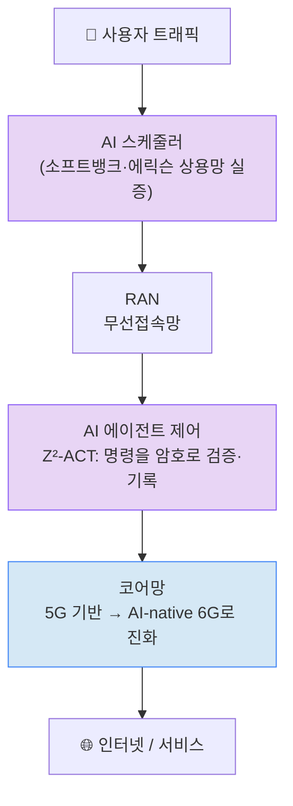

# 주간 통신 브리핑 — 2026-08-25

## 이번 주 3줄 요약
- 이번 주는 **"AI가 통신망을 직접 운영·제어하기 시작했다"**는 흐름이 도드라졌습니다. 소프트뱅크·에릭슨이 실제 서비스 중인 5G 상용망에서 AI 스케줄러로 다운로드 속도를 최대 50% 높이는 데 성공했고, arXiv에서는 이런 AI가 폭주하지 않도록 명령을 암호학적으로 검증하는 "AI 에이전트 안전장치" 연구(Z²-ACT)가 함께 등장했습니다.
- TTA 특집 기사로 **PQC(양자내성암호)**가 이번 주 화두로 떠올랐습니다. 미래 양자컴퓨터로도 뚫리지 않는 새 암호로 통신 인프라를 교체하는 준비가 본격 논의되고 있습니다.
- 6G는 "완전히 새로운 시스템"이 아니라 **5G 인프라 위에서 점진적으로 진화**하는 방향으로 정리되는 분위기입니다. 코어망은 5G의 음성통화 체계를 재사용하고, 커버리지는 위성(NTN)으로 보완하는 식입니다. 3GPP·ITU 공식 표준화 소식은 이번 주 소강 상태입니다.

## 한눈에 보기

| 소스 | 항목 | 난이도 | 한 줄 설명 |
|---|---|---|---|
| TTA | 제1304호 — PQC 전환의 현장 | ★★★ | 미래 양자컴퓨터에도 안전한 암호로 통신망을 바꾸는 준비 |
| TTA | 제1303호 — 무인해양시스템 통신장치 시험지침 | ★★ | 무인선박용 통신장치 성능을 검증하는 국내 표준 제정 |
| TTA | 제1304호 — 접근점(AP) 절전 | ★ | 와이파이 공유기의 전력 소비를 줄이는 기술 용어 |
| TTA | 제1304호 — ITU-T AI 신뢰·신원 포커스그룹 신설 | ★★★ | 국제표준기구가 "AI를 하나의 행위자로 식별"하는 연구 착수 |
| 저널 | V2X, 5G/O-RAN 기반 해법을 얻다 (IEEE Spectrum) | ★★ | 자율주행차 통신 간섭 문제를 개방형 기지국 구조로 해결하는 제안 |
| arXiv | Z²-ACT — 검증 가능한 AI 에이전트 통신망 제어 | ★★★ | AI가 기지국을 조작하기 전 "이 명령이 안전한지" 암호로 증명 |
| arXiv | LLM 챗봇의 5G 고장 진단 실증 | ★★ | 챗봇 AI로 통신 장애를 진단시켜본 결과, 잘하는 것과 못하는 것 확인 |
| arXiv | 무선 신호 파운데이션 모델 서베이 | ★★ | "무선판 챗GPT" 연구 흐름을 정리한 리뷰 논문 |
| arXiv | Orchra — 6G 서비스 끊김 없는 전환 | ★★★ | 통신 슬라이스를 옮겨 다닐 때 끊김 시간을 절반으로 단축 |
| arXiv | GCNO — 대규모 안테나 채널 정보 경량화 | ★★★ | 스마트폰이 기지국에 보내는 전파 보고서를 물리 기반으로 압축 |
| 표준화 | 3GPP/ITU — 이번 주 신규 소식 없음 | - | RAN 워킹그룹 회의 진행 중이나 결과는 9월 총회에서 발표 예정 |
| IITP | 주간기술동향 — 접근 불가 | - | 방화벽(WAF) 차단으로 이번 주 확인 불가 |
| 업계뉴스 | 소프트뱅크·에릭슨, 日 상용 5G AI-RAN 첫 검증 | ★ | AI 스케줄러 하나로 다운로드 속도 최대 50% 향상 |
| 업계뉴스 | KT·LG유플러스, 6G 커버리지는 위성으로 | ★ | 국내 통신사·학계가 6G 비지상망(NTN) 전략 공유 |
| 업계뉴스 | 버라이즌·구글클라우드 AI 파트너십 확대 | ★ | 통신망 장애를 AI가 미리 예측·해결하는 체계 구축 |
| 업계뉴스 | 초기 6G 코어망은 5G 위에서 진화 전망 | ★★ | 6G가 5G 음성 체계를 재사용하며 점진적으로 시작될 전망 |

*위 그림: 이번 주 소스들을 관통하는 흐름입니다. AI가 ①스케줄러로 무선 자원 배분을 최적화하고(실제 상용망 검증 완료), ②그 AI가 내리는 제어 명령을 다시 암호로 검증하는 안전장치가 연구되고 있으며(Z²-ACT), ③이런 흐름 속에 코어망 자체가 "AI를 기본 내장한" 구조로 진화하는 6G를 준비하고 있습니다.*

---

## 1. TTA ICT Standard Weekly 제1303호·제1304호

**발행일**: 제1303호 2026-08-17, 제1304호 2026-08-24 (지난 리포트 이후 2주치가 새로 발행됨)

> ⚠️ **접근 제한 안내**: 이번 주 세션 환경에서 기사 본문이 실린 PDF 원문(weekly.tta.or.kr)에는 접근이 차단되어, 아래 요약은 기사 **제목·소속 코너·표준 번호**와 일반적으로 알려진 배경지식을 토대로 재구성한 것입니다. 실제 기사 본문의 세부 수치나 논지와는 차이가 있을 수 있습니다. 관심 분야(AI+통신, 무선, 네트워크)와 직접 관련이 낮은 항목(멀티모달리티, 원시 데이터, 양자컴퓨팅 정책, EU·영국·일본의 IT 정책, 스마트시티 데이터허브, 분산에너지 설비, ISO/IEC 그래픽스 표준 등 약 10건)은 통신 초점을 유지하기 위해 이번 리포트에서 생략했습니다.

### PQC 전환의 현장 — 통신 인프라 적용과 표준화 과제 ★★★
- **원문 링크**: https://committee.tta.or.kr/data/weekly_view.jsp?news_id=10334
- **쉬운 설명(도입)**: 지금 우리가 쓰는 암호(비밀번호를 안전하게 지키는 수학적 방식)는 미래에 등장할 "양자컴퓨터"라는 매우 강력한 컴퓨터로는 뚫릴 수 있다는 우려가 있습니다. **PQC(Post-Quantum Cryptography, 양자내성암호)**는 이 양자컴퓨터로도 풀기 어렵게 새로 설계한 암호 방식입니다.
- **심화 내용**: 이 기사는 기지국·교환기·백본망(통신망 핵심 설비) 같은 실제 통신 인프라에 PQC를 적용하려면 장비·소프트웨어를 대대적으로 교체해야 하고, 이를 위한 국제·국내 표준화가 필요하다는 과제를 다룹니다.
- **왜 중요한가**: 양자컴퓨터가 아직 등장하지 않았어도, 지금 오가는 통신 데이터를 미리 저장해뒀다가 나중에 양자컴퓨터로 해독하려는 위협("지금 훔쳐서 나중에 해독" 전략)에 대비해 통신망 보안을 선제적으로 바꿔야 한다는 점에서 국가 인프라 안보와 직결됩니다.

### ITU-T, 인간과 에이전트형 AI를 위한 신뢰·신원 포커스그룹(FG-TIDA) 신설 ★★★
- **원문 링크**: https://committee.tta.or.kr/data/weekly_view.jsp?news_id=10330
- **쉬운 설명(도입)**: **ITU-T**는 유엔 산하 국제전기통신연합(ITU)에서 통신 관련 국제표준을 만드는 부문입니다. **에이전트형 AI(Agentic AI)**는 사람이 매번 지시하지 않아도 스스로 판단해 여러 단계의 작업을 이어서 수행하는 AI를 말합니다(예: "다음 주 일정 잡아줘"라고만 하면 알아서 메일 확인·약속 조율까지 하는 AI).
- **심화 내용**: ITU-T가 이런 AI를 사람처럼 "하나의 행위자"로 보고, 이 AI를 얼마나 믿을 수 있는지, 그리고 신원(어떤 AI가 어떤 행동을 했는지)을 어떻게 확인할지 연구하는 한시적 연구모임(포커스그룹)을 새로 만들었습니다.
- **왜 중요한가**: AI 에이전트가 통신망 운영(이번 주 다른 항목인 소프트뱅크 AI 스케줄러, arXiv의 Z²-ACT 등)에까지 관여하기 시작하면서, "이 AI가 내린 결정을 믿어도 되는가"를 국제 표준 차원에서 다루기 시작했다는 의미입니다.

### 무인해양시스템용 통신장치의 시험장내 통신 성능 시험 지침 ★★
- **원문 링크**: https://committee.tta.or.kr/data/weekly_view.jsp?news_id=10316 (표준번호 TTAK.KO-06.0643)
- **쉬운 설명**: 사람이 타지 않는 무인 선박·해양 드론에 쓰이는 통신장치가 실제로 안정적인 성능을 내는지, 정해진 시험장에서 어떻게 측정할지 정한 국내 표준입니다.
- **왜 중요한가**: 해양 무인기술이 실제 상용화되려면 통신 품질을 객관적으로 검증할 공통 기준이 있어야 합니다.

### 접근점 절전 ★
- **원문 링크**: https://committee.tta.or.kr/data/weekly_view.jsp?news_id=10332
- **쉬운 설명**: **접근점(AP, Access Point)**은 스마트폰·노트북이 와이파이(Wi-Fi)로 인터넷에 연결할 때 중계 역할을 하는 장치, 흔히 말하는 '와이파이 공유기'입니다. '절전'은 데이터를 주고받지 않을 때 AP의 전력 소비를 줄이는 기술을 말합니다.
- **왜 중요한가**: 가정·사무실마다 와이파이 기기가 계속 늘어나는 만큼, 절전 기술 표준화는 전체 전력 소비 절감과 탄소중립에 기여합니다.

---

## 2. 저널/학회 신규 논문

> 참고: 이번 주 IEEE Spectrum·Communications Magazine·Network 세 매체 모두 AI-RAN·AI-네이티브 네트워크(최우선 관심 분야)를 새롭게 다룬 게재물은 확인되지 않았습니다. IEEE Communications Magazine 8월 특집은 "Net-Zero 6G Networks"(친환경 6G)로 이번 주 우선순위와는 결이 달라 제외했습니다.

### V2X, 5G 기반 해법을 얻다 ★★
- **원문 링크**: https://spectrum.ieee.org/v2x-technology-5g-open-ran (IEEE Spectrum)
- **쉬운 설명(도입)**: **V2X(Vehicle-to-Everything)**는 자동차가 다른 차, 신호등, 보행자 등 주변 모든 것과 무선으로 정보를 주고받는 기술입니다. 문제는 도로 위 여러 차량이 동시에 신호를 보내면 신호끼리 부딪혀(간섭) 메시지가 최대 80%까지 손실될 수 있다는 점입니다.
- **심화 내용**: 이 기사는 **O-RAN(Open RAN, 오픈랜)**을 해법으로 제시합니다. O-RAN은 원래 이동통신 기지국 장비를 여러 회사 제품으로 섞어 쓸 수 있게 만든 개방형 구조인데, 이를 자동차에 적용해 각 차량을 일종의 "움직이는 기지국"처럼 다루면 기존 셀룰러 통신 규격을 그대로 재사용할 수 있다는 제안입니다. 웨이모·테슬라식으로 차 한 대에 센서를 잔뜩 싣는 "자립형" 접근과 달리, 주변 차량이 서로 정보를 공유하는 "협력형" 접근입니다.
- **왜 중요한가**: 5G/O-RAN 기술이 자율주행·커넥티드카 분야로 확장되는 흐름을 보여주며, "기지국 인프라의 개방화·범용화"라는 큰 트렌드와 맞닿아 있습니다. 다만 아직 실제 시험망은 없는 연구 제안 단계입니다.

---

## 3. arXiv 주목 논문

지난 7일(2026-08-18~08-25) cs.NI(네트워킹), eess.SP(신호처리), cs.IT(정보이론) 카테고리에 제출된 논문 중 선별했습니다.

### Z²-ACT — 검증 가능한 AI 에이전트의 6G 오픈랜 제어 ★★★
- **원문 링크**: https://arxiv.org/abs/2608.21049 (제출일 2026-08-21)
- **쉬운 설명(도입)**: 핵심만 보면 "AI가 기지국을 조작해도 되는지 매번 증명서를 붙여서 확인하는 시스템"입니다.
- **심화 내용**: 여러 제조사 장비가 섞인 차세대(6G) 오픈랜 통신망에서, AI(거대언어모델)가 운영자의 지시를 해석해 망을 자동 제어할 때, 이 AI가 엉뚱하거나 조작된 지시를 실행하지 않도록 "이 명령이 진짜 안전하고 정당한지"를 암호학적으로 증명하고 기록을 남기는 안전장치입니다.
- **왜 중요한가**: AI가 통신망을 직접 운영하는 시대(이번 주 소프트뱅크·에릭슨 사례 참고)에 가장 큰 우려인 "AI 오작동·해킹 위험"을 다루는 실질적 안전 프레임워크입니다.

### 5G 고장 진단, LLM(챗봇)에게 시켜보니 어땠나 ★★
- **원문 링크**: https://arxiv.org/abs/2608.21021 (제출일 2026-08-21)
- **쉬운 설명**: Claude, GPT, Gemini의 경량 버전들에게 5G 통신망 고장 원인을 서술형으로 설명하게 시키고, 다른 AI가 채점하도록 해서 성능을 비교했습니다. 고장 진단 정확도는 90% 이상으로 높았지만, 통신 표준 문서(3GPP·O-RAN) 세부 지식은 60% 미만으로 아직 부족했습니다.
- **왜 중요한가**: 통신사 현장에서 챗봇을 장애 대응에 실제로 투입할 수 있을지 가늠하는 실증 데이터로, AI가 잘하는 것과 아직 못하는 것을 구체적으로 보여줍니다.

### 무선 신호를 위한 "파운데이션 모델" 총정리 서베이 ★★
- **원문 링크**: https://arxiv.org/abs/2608.20486 (제출일 2026-08-20)
- **쉬운 설명**: 챗GPT처럼 "하나의 모델을 미리 학습시켜 여러 작업에 재사용"하는 방식(**파운데이션 모델**)을 무선 신호(채널 상태, 전파 세기 등)에 적용하려는 최근 연구들을 총정리한 리뷰 논문입니다. 위치 추적, 전파 예측, 센싱 등에 하나의 AI 모델을 재사용할 수 있는지를 다룹니다.
- **왜 중요한가**: "통신 전용 거대 AI 모델"이라는 업계 트렌드가 어디까지 왔는지 한눈에 파악할 수 있는 자료입니다.

### Orchra — 6G 네트워크에서 서비스 끊김 없이 갈아타기 ★★★
- **원문 링크**: https://arxiv.org/abs/2608.20893 (제출일 2026-08-21)
- **쉬운 설명(도입)**: 5G/6G의 **네트워크 슬라이싱**은 하나의 통신망을 자율주행용, 일반 스마트폰용 등 여러 개의 "가상 전용회선"처럼 나눠 쓰는 기술입니다.
- **심화 내용**: 스마트폰이 서로 다른 용도의 슬라이스(예: 일반 인터넷용 ↔ 실시간 서비스용) 사이를 옮겨 다닐 때, 기존 방식은 최대 245밀리초 동안 통신이 끊겼는데, 이 논문은 사용자 정보를 임시 저장소에 미리 옮겨두는 방식으로 끊김 시간을 절반 이하로 줄였습니다.
- **왜 중요한가**: 자율주행차·원격수술처럼 끊김이 치명적인 6G 서비스를 실현하는 데 필요한 실용적 개선입니다.

### GCNO — 안테나가 많아질수록 무거워지는 통신 정보를 가볍게 ★★★
- **원문 링크**: https://arxiv.org/abs/2608.18522 (제출일 2026-08-18)
- **쉬운 설명(도입)**: 스마트폰이 기지국에 "전파가 어떻게 오고 있는지" 보고서를 매번 보내는데, 이 보고서를 최대한 작게 압축하는 기술입니다.
- **심화 내용**: 안테나 개수가 많은 최신 기지국(**MIMO**, 여러 안테나로 동시에 신호를 주고받아 속도를 높이는 기술)에서는 스마트폰이 전파 상태를 기지국에 보고하는 데이터양(**채널 피드백**)이 매우 커지는 문제가 있습니다. 이 논문은 AI 신경망 대신 전파의 물리적 경로(직접 도달, 반사 등 핵심 경로 몇 개)만 뽑아 보고하는 방식을 제안해, 더 적은 데이터로도 정확하고 안테나 개수가 바뀌어도 재학습 없이 바로 쓸 수 있게 했습니다.
- **왜 중요한가**: 5G/6G·Wi-Fi 7의 성능을 좌우하는 "채널 피드백 부담" 문제를 실용적으로 줄인 사례입니다.

*(참고: 이번 주 AI-RAN 직접 키워드의 신규 논문은 없었으나, AI 에이전트가 통신망을 제어·진단하는 위 연구들이 그 흐름을 잇고 있습니다. Wi-Fi 7 관련 신규 논문은 발견되지 않았습니다.)*

---

## 4. 표준화 동향 (3GPP/ITU)

**이번 주(2026-08-18~08-25) 3GPP·ITU 신규 공식 소식은 없습니다.**

3GPP RAN 워킹그룹 회의가 8월 24~28일 네덜란드 마스트리흐트에서 진행 중이지만, 회의 결과는 통상 몇 주 뒤 열리는 상위 총회(TSG RAN Plenary, 다음 회차 RAN#113은 9월 예정)에서 정리·발표되므로 아직 공식 결과가 나오지 않았습니다. ITU-R WP5D(6G 성능요구사항 담당)도 다음 회의가 9월 28일~10월 8일 제네바로 예정돼 있어 이번 주는 소강 상태입니다. 참고로 가장 최근 배경 동향(조사 기간 밖)은 아래와 같습니다.

### (참고) 3GPP Release 21 로드맵 확정 ★★
- **쉬운 설명(도입)**: 3GPP는 전 세계 이동통신사·제조사가 참여해 이동통신 표준을 만드는 국제 협의체이며, Release 21은 3GPP가 처음으로 6G 자체를 규정하는 릴리즈입니다.
- **내용(2026년 6월 확인)**: 싱가포르 총회(TSG#112)에서 Release 21의 세부 일정(로드맵)이 확정됐습니다.

---

## 5. IITP 주간기술동향

**이번 주 확인 불가**: itfind.or.kr 사이트가 웹방화벽(WAF)으로 접속을 차단해 최신호 목차를 확인하지 못했습니다. 우회 경로(모바일판, 검색엔진 캐시, 아카이브)도 모두 접근이 막혀 있었습니다. 부정확한 내용을 지어내지 않기 위해 이번 주는 내용을 포함하지 않습니다. (참고: 발행 주기상 2217호 이후 2~3개 호가 새로 나왔을 것으로 추정되나 확인된 사실은 아닙니다.)

---

## 6. 업계 뉴스

### 소프트뱅크·에릭슨, 일본 상용 5G망에서 AI-RAN 첫 검증…다운로드 속도 최대 50% 향상 ★
- **날짜**: 2026-08-20
- **원문 링크**: https://www.ericsson.com/en/press-releases/2/2026/softbank-corp-and-ericsson-conduct-japans-first-trial-of-ericsson-ai-in-ran-on-5g-commercial-network
- **쉬운 설명**: **RAN(무선접속망)**은 스마트폰과 기지국을 연결하는 통신망의 '입구' 구간입니다. 일본 소프트뱅크와 스웨덴 통신장비업체 에릭슨이 실험실이 아닌 실제 서비스 중인 5G 상용망에서, AI가 전파 상태를 실시간 예측해 통신 자원을 나눠주고 전송 방식을 스스로 고르는 **AI 스케줄러**를 처음으로 검증했습니다. 그 결과 스펙트럼 효율은 최대 약 25%, 사용자 다운로드 속도는 최대 약 50%(평균 약 10%) 향상됐으며, 새 하드웨어 교체 없이 소프트웨어 업데이트만으로 이뤄냈습니다.
- **왜 중요한가**: 하드웨어 교체 없이 소프트웨어만으로 통신 속도를 크게 높일 수 있다는 것을 실제 상용망에서 증명해, AI-RAN 상용화가 한 걸음 더 가까워졌습니다.

### KT·LG유플러스, "6G 커버리지는 위성으로"…6G 통신산업 워크숍서 비지상망(NTN) 논의 ★
- **날짜**: 2026-08-21
- **원문 링크**: https://www.ddaily.co.kr/page/view/2026082116540586298
- **쉬운 설명**: **비지상망(NTN, Non-Terrestrial Network)**은 땅 위 기지국이 아니라 하늘의 위성 등을 이용해 통신 신호를 전달하는 네트워크로, 산·바다·재난 지역처럼 기지국을 세우기 어려운 곳에서도 통신을 가능하게 합니다. 서울 용산에서 열린 '2026 6G 통신산업 워크숍'에서 KT가 'KT 6G 비전'을 발표하며, 건물이 높아지고 재난·항공 등 새 통신 수요가 늘어 지상 기지국만으로는 커버리지를 채우기 어렵다는 점에서 위성을 6G 커버리지 확장의 핵심 수단으로 삼는다는 내용을 공유했습니다.
- **왜 중요한가**: 국내 통신사와 학계가 6G 표준화를 앞두고 위성 기반 커버리지 확장 전략을 구체적으로 논의하기 시작했다는 점에서 한국의 6G 준비 상황을 보여줍니다.

### 버라이즌·구글클라우드, AI 파트너십 확대…네트워크 자동화까지 확장 ★
- **날짜**: 2026-08-24
- **원문 링크**: https://www.googlecloudpresscorner.com/2026-08-24-Google-Cloud-Announces-Strategic-Partnership-with-Verizon-to-Scale-Enterprise-AI
- **쉬운 설명**: 미국 최대 통신사 버라이즌이 구글클라우드와 파트너십을 확대해, AI를 고객 상담·보안뿐 아니라 네트워크 운영에도 적용합니다. 특히 통신망 문제가 고객에게 영향을 주기 전에 미리 예측해 해결하는 **자율형 네트워크** 체계를 구축 중입니다.
- **왜 중요한가**: 통신사가 단순 회선 판매를 넘어 빅테크와 손잡고 AI 서비스 기업으로 전환하는 흐름을 보여줍니다.

### "초기 6G 코어망은 5G 위에서 AI 네이티브로 진화"…9월 3GPP 표준화 회의 앞두고 전망 ★★
- **날짜**: 2026-08-20
- **원문 링크**: https://www.lightreading.com/6g/why-the-first-ai-native-6g-cores-will-run-on-5g-foundations
- **쉬운 설명**: **코어망(Core Network)**은 여러 기지국을 총괄하며 통화 연결·데이터 전송 경로를 관리하는 통신망의 '두뇌' 부분입니다(RAN이 '입구'라면 코어망은 '심장'). 2030년경 상용화될 초기 6G는 완전히 새로운 코어망이 아니라, 음성통화·긴급전화 같은 필수 기능 유지를 위해 4G/5G의 음성 시스템을 그대로 재사용하면서 새로운 AI 전용 영역을 추가하는 방식으로 시작될 전망입니다.
- **왜 중요한가**: 6G가 완전히 새로운 시스템이 아니라 지금 쓰는 5G 인프라 위에서 점진적으로 진화한다는 점을 보여줘, 통신사들의 투자 부담과 전환 속도를 가늠하게 해줍니다. 2026년 9월 3GPP 총회에서 관련 핵심 결정이 내려질 예정입니다.

*(참고: 이번 주 국내외 소스에서 Wi-Fi 7/8, 오픈랜(Open RAN) 관련 신규 발표는 확인되지 않았습니다.)*

---

## 이번 주 기초 개념 한 가지: 무선 스케줄링(Scheduling)이란 무엇인가?

이번 주 가장 눈에 띈 뉴스는 소프트뱅크·에릭슨이 "AI 스케줄러" 하나로 5G 다운로드 속도를 최대 50% 높였다는 소식이었습니다. 그런데 애초에 "스케줄러"가 뭘 하는 물건인지부터 짚고 넘어가겠습니다. 기지국 하나에는 보통 수십~수백 명의 스마트폰 사용자가 동시에 붙어 있습니다. 하지만 기지국이 한 번에 실어 나를 수 있는 전파 자원(주파수 대역, 시간)은 한정돼 있습니다. 마치 편도 1차선 도로에 수십 대의 차가 동시에 진입하려는 상황과 비슷합니다. 이때 "누구를 몇 초 동안, 얼마나 좋은 도로 상태에서 먼저 보낼지" 매 순간(보통 1000분의 1초 단위로) 결정해주는 소프트웨어가 바로 **스케줄러(Scheduler)**입니다. 스케줄러는 각 사용자의 전파 상태(신호가 얼마나 깨끗한지), 대기 중인 데이터양, 요금제나 서비스 우선순위 등을 종합해 "이번 순간엔 누구에게 자원을 줄지"를 계산합니다. 전파 상태가 좋은 사용자에게 우선 자원을 몰아주면 전체 처리량은 늘지만 상태가 나쁜 사용자는 계속 밀릴 수 있고, 반대로 공평하게만 나누면 전체 속도가 느려질 수 있습니다. 이 균형을 잘 잡는 것이 스케줄러 설계의 핵심 과제입니다. 지금까지는 이 계산 방식이 정해진 규칙(알고리즘)으로 고정돼 있었는데, 최근에는 AI가 실시간으로 전파 상태 변화를 예측해 그때그때 더 나은 배분 방식을 스스로 고르도록 바꾸는 시도가 늘고 있습니다. 이번 주 소프트뱅크·에릭슨 사례가 바로 이 "AI 스케줄러"를 실제 상용망에 적용해 성과를 낸 것이고, 이번 주 arXiv의 Z²-ACT 논문은 이런 AI가 내리는 결정을 다시 검증하는 안전장치를 연구한 것입니다. 즉 스케줄링은 통신 속도를 좌우하는 매우 기초적이면서도, 최근 AI 기술과 가장 활발하게 결합되고 있는 영역입니다.

---

## 이번 주 용어집 (가나다순)

- **AI 스케줄러**: 기지국이 한정된 무선 자원(주파수·시간)을 여러 사용자에게 어떻게 나눠줄지, AI가 실시간으로 판단해 결정하는 소프트웨어. 이번 주 "기초 개념" 코너에서 자세히 설명했습니다.
- **NTN(비지상망)**: 지상 기지국이 아닌 위성 등을 이용해 통신 서비스를 제공하는 네트워크.
- **MIMO**: 여러 개의 안테나로 신호를 동시에 주고받아 통신 속도를 높이는 기술. 안테나가 많을수록 성능은 좋아지지만 전파 상태 보고 부담(채널 피드백)도 커집니다.
- **O-RAN(오픈랜)**: 특정 제조사의 전용 장비에 묶이지 않고, 여러 회사의 기지국 장비를 표준화된 방식으로 섞어 쓸 수 있게 만든 개방형 구조.
- **PQC(양자내성암호)**: 미래의 양자컴퓨터로도 풀기 어렵게 새로 설계한 암호 방식. 지금 쓰는 암호(RSA, ECC 등)를 대체할 차세대 보안 기술로 통신 인프라에 적용이 논의되고 있습니다.
- **RAN(무선접속망)**: 스마트폰과 통신사 코어망 사이를 무선으로 연결하는 기지국 구간.
- **V2X(Vehicle-to-Everything)**: 자동차가 다른 차·신호등·보행자 등 주변 모든 것과 무선으로 정보를 주고받는 기술.
- **채널 피드백**: 스마트폰이 "전파 상태가 지금 어떤지"를 기지국에 보고하는 데이터. 안테나가 많아질수록 이 데이터양이 커지는 문제가 있습니다.
- **코어망(Core Network)**: 여러 기지국을 총괄해 통화 연결·데이터 전송 경로를 관리하는 통신망의 핵심부. RAN이 '입구'라면 코어망은 '두뇌'에 해당합니다.
- **파운데이션 모델(Foundation Model)**: 하나의 AI 모델로 여러 문제를 두루 풀 수 있도록 광범위하게 학습시킨 범용 AI 모델.
- **AP(접근점, Access Point)**: 스마트폰·노트북이 와이파이로 인터넷에 연결할 때 중계 역할을 하는 장치. 흔히 '와이파이 공유기'라고 부릅니다.
- **에이전트형 AI(Agentic AI)**: 사람이 매번 지시하지 않아도 스스로 판단해 여러 단계의 작업을 이어서 수행하는 AI.
- **네트워크 슬라이싱**: 하나의 통신망을 자율주행용, 일반 인터넷용 등 여러 개의 "가상 전용회선"처럼 나눠 쓰는 5G/6G 기술.
- **ITU-T**: 유엔 산하 국제전기통신연합(ITU)에서 통신 관련 국제표준을 만드는 부문.
