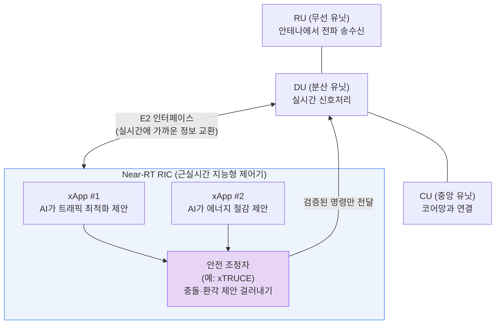

# 주간 통신 브리핑 — 2026-09-01

## 이번 주 3줄 요약
- 3GPP가 네덜란드 마스트리흐트에서 RAN 워킹그룹 회의(8/24~28)를 열어 **Release 19**(5G-Advanced)를 사실상 마무리하고 **Release 20**의 **6G 연구**에 본격 착수했습니다. 같은 주 노키아·도이치텔레콤은 실험실 환경에서 **AI 네이티브 6G 코어망** 실증에 성공했다고 발표했습니다.
- 국내에서는 과기정통부가 통신 3사(SKT·KT·LG유플러스)와 **'AI 시대 통신망 투자 촉진 민·관협의체'**를 발족(8/27)했고, SK텔레콤은 데이터센터·해저케이블 사업을 **'SK호라이즌'**으로 분사하며 AI 인프라 기업 전환에 속도를 냈습니다.
- 오픈랜(개방형 기지국 구조)에 거대언어모델(LLM) 기반 AI를 안전하게 결합하려는 연구(xTRUCE)를 비롯해, 오픈랜·6G 보안·위성통신 관련 arXiv 신규 논문이 다수 발표됐습니다.

## 한눈에 보기

| 소스 | 항목 | 난이도 | 한 줄 설명 |
|---|---|---|---|
| TTA | 제1305호 — 트럼프 2기 행정부의 AI·디지털 정책 동향 | ★★ | 미국 정부의 AI·디지털 정책 변화가 국내 ICT 표준화에 주는 시사점 (본문 접근 불가) |
| arXiv | xTRUCE — 오픈랜 AI 에이전트 충돌 방지 심판 | ★★★ | 기지국을 조정하려는 여러 AI가 서로 다른 명령을 내릴 때 안전하게 중재하는 기술 |
| arXiv | PRO-RAN — 오픈랜 장비 성능 정밀 분석 | ★★★ | 오픈랜 기지국 소프트웨어가 일반 서버에서 실제로 얼마나 무거운 연산인지 측정 |
| arXiv | FaulT-Bench — 통신 장애진단 AI 벤치마크 | ★★ | 잘못된 신고까지 섞인 상황에서 AI가 통신 장애를 얼마나 잘 진단하는지 시험하는 기준 |
| arXiv | 6G NOMA 가짜 채널정보 공격 위협 분석 | ★★★ | 차세대 다중접속 기술이 조작된 신호 정보에 속아 통신 품질이 무너질 수 있는 취약점 정리 |
| arXiv | 위성-지상 통신용 3GPP 도심 전파모델 개선 | ★★ | 드론 등 공중 단말과 위성이 도심에서 통신할 때 신호 세기를 더 정확히 예측하는 모델 |
| 표준화 | 3GPP RAN 워킹그룹 마스트리흐트 회의 | ★★ | Release 19 마무리 + Release 20의 6G 연구 착수, 이번 주 실제로 열린 회의 |
| 표준화 | ITU IMT-2030(6G) | ★★ | 이번 주 신규 소식 없음, 다음 회의는 9/28~10/8 제네바 |
| IITP | 주간기술동향 최신호 | — | 사이트 구조 변경(격주 발행 전환 확인)으로 이번 주 목록 확인 불가 |
| 업계뉴스 | 과기정통부·통신3사 'AI시대 통신망 투자' 민관협의체 발족 | ★ | 5G단독모드·AI-RAN·6G·해저케이블·위성통신 투자 확대를 정부와 통신사가 함께 논의 |
| 업계뉴스 | SK텔레콤, 데이터센터·해저케이블 'SK호라이즌'으로 분사 | ★ | SK브로드밴드에서 AI데이터센터·해저케이블 사업을 떼어내 새 회사로 독립 |
| 업계뉴스 | 노키아·도이치텔레콤, AI 네이티브 6G 코어망 실증 | ★★ | 네트워크 조각내기(슬라이싱)와 주파수 배분을 AI가 실시간 판단, 지연시간 40% 단축 |

*위 그림: 오픈랜(Open RAN)은 기지국을 RU·DU·CU로 잘게 나누고, 그 옆에 "Near-RT RIC"라는 지능형 제어기를 두어 여러 AI 앱(xApp)이 기지국 동작을 실시간으로 조정하도록 설계됩니다. 이번 주 arXiv 논문 xTRUCE는 여러 AI 제안이 서로 충돌하거나 잘못된(환각) 지시를 내릴 때 이를 걸러내는 "안전 조정자" 역할을 제안했습니다.*

---

## 1. TTA ICT Standard Weekly 제1305호

**발행일**: 2026-08-31 (이번 주 신규 호 확인됨)

TTA(한국정보통신기술협회)가 매주 발행하는 ICT 표준 동향 소식지입니다.

### 트럼프 2기 행정부의 AI·디지털 정책 동향과 시사점 ★★
- **원문 링크**: https://committee.tta.or.kr/data/weekly_view.jsp?news_id=10347
- **쉬운 설명**: 미국 정부의 AI·디지털 관련 정책(규제, 투자, 수출 등)이 어떻게 바뀌고 있는지 다루고, 이것이 한국의 ICT 표준화 전략에 어떤 의미를 주는지 살펴보는 기사로 제목에서 추정됩니다.
- **왜 중요한가**: 미국은 세계 최대 통신·AI 시장이자 표준화 논의를 주도하는 국가 중 하나여서, 정책 변화가 국내 통신 표준·기업 전략에도 영향을 줄 수 있습니다.
- **⚠️ 접근 제한 안내**: 이번 주도 TTA 본문 PDF(weekly.tta.or.kr 호스트)에 접근이 차단(HTTP 403)되어 상세 요약은 작성하지 못했습니다. 또한 목록 페이지(weekly_list.jsp)가 이번 주부터 최신 1건만 노출하는 구조로 보여, 같은 호에 다른 기사가 더 있는지도 확인하지 못했습니다.

---

## 2. 저널/학회 신규 논문

**이번 주 확인 불가**: IEEE Communications Magazine, IEEE Network, IEEE Spectrum의 웹사이트(spectrum.ieee.org, ieeexplore.ieee.org)에 이번 세션 네트워크 환경에서 접근이 차단되어 있었고, 웹검색으로도 지난 7일(2026-08-25~09-01) 내 새로 게재된 통신 관련 기사를 확인하지 못했습니다. 검색되는 관련 콘텐츠는 대부분 6월 이전에 발행된 것이었습니다. 억지로 채우지 않고 이번 주는 건너뜁니다.

---

## 3. arXiv 주목 논문

지난 7일(2026-08-25~09-01 기준, arXiv에 실제 등록된 최신일은 08-28까지) cs.NI(네트워킹), eess.SP(신호처리) 카테고리에 제출된 논문 중 관심 분야에 맞춰 선별했습니다.

### xTRUCE — 오픈랜에서 여러 AI 에이전트의 충돌을 안전하게 중재하기 ★★★
- **원문 링크**: https://arxiv.org/abs/2608.28532 (제출일 2026-08-28)
- **쉬운 설명(도입)**: "오픈랜(O-RAN, Open RAN)"이란 기지국을 여러 부품(무선 유닛·분산 유닛·중앙 유닛)으로 잘게 나누고, 특정 제조사에 묶이지 않도록 표준화된 방식으로 조합하는 개방형 기지국 구조입니다. 오픈랜은 "Near-RT RIC"라는 지능형 제어기를 두어, 이 위에서 여러 개의 작은 AI 프로그램("xApp")이 기지국 설정을 실시간으로 조정하도록 진화하고 있습니다.
- **심화 내용**: 거대언어모델(LLM)이 만든 xApp들의 제안은 서로 충돌하거나, 실행 불가능하거나, AI의 "환각(그럴듯하지만 틀린 답)"일 수 있습니다. 이 논문은 이런 제안들이 실제로 기지국에 적용되기 전에 안전성을 수학적으로 보장하며 우선순위에 따라 조정하고, 왜 그렇게 결정했는지 추적 가능한 "심판(arbiter)" 시스템 xTRUCE를 제안합니다.
- **왜 중요한가**: AI가 통신망을 직접 조작하는 시대가 다가오면서, "AI가 실수해도 통신망 전체가 먹통이 되지 않도록" 막는 안전장치가 실용화 단계의 핵심 과제로 떠오르고 있습니다.

### PRO-RAN — 오픈랜 장비, 일반 서버에서 실제로 얼마나 무거운가 ★★★
- **원문 링크**: https://arxiv.org/abs/2608.26498 (제출일 2026-08-27)
- **쉬운 설명(도입)**: 오픈랜은 기지국의 CU(중앙 유닛, 코어망과 연결되는 부분)와 DU(분산 유닛, 실시간 신호처리를 담당하는 부분)를 전용 하드웨어가 아닌 일반 컴퓨터(서버) 위에서 소프트웨어로 돌릴 수 있게 합니다.
- **심화 내용**: 이 논문은 CPU 사용률 같은 단순 지표를 넘어, CU와 DU 소프트웨어가 프로세서 내부에서 실제로 어떤 연산 경로를 거치고 어디서 병목이 생기는지를 정밀 계측했습니다.
- **왜 중요한가**: 통신사가 오픈랜 장비를 도입할 때 서버를 얼마나, 어떻게 구성해야 하는지 판단하는 근거 자료가 됩니다.

### FaulT-Bench — "믿을 수 없는" 장애 신고 속에서 통신 장애를 진단하는 AI 시험 ★★
- **원문 링크**: https://arxiv.org/abs/2608.27021 (제출일 2026-08-27)
- **쉬운 설명**: 통신망에 문제가 생기면 사람이 "여기가 고장난 것 같다"고 신고하는데, 실제로는 신고 내용이 틀리거나 원인을 잘못 짚은 경우가 많습니다. 이 논문은 실제 현장처럼 '가짜 신고', '잘못된 장비 지목' 등이 섞인 200개 시나리오로 AI 장애진단 프로그램의 실력을 시험하는 기준(벤치마크)을 만들었습니다.
- **왜 중요한가**: 지금까지 AI 장애진단 연구는 "신고가 항상 정확하다"고 가정했지만, 실제 상황은 훨씬 지저분합니다. 이 벤치마크는 AI가 실전에 투입될 준비가 됐는지 더 현실적으로 검증합니다.

### 6G 다중접속 기술(NOMA), 가짜 채널정보 공격에 취약할 수 있다 ★★★
- **원문 링크**: https://arxiv.org/abs/2608.28351 (제출일 2026-08-28)
- **쉬운 설명(도입)**: "채널상태정보(CSI)"란 기지국이 "지금 이 사용자에게 신호가 얼마나 잘/약하게 도달하는지"를 파악한 정보입니다. 기지국은 이 정보를 바탕으로 누구에게 얼마만큼 전파 세기(전력)를 배분할지 정합니다. "NOMA(비직교 다중접속)"는 여러 사용자에게 전력 세기를 다르게 배분해 같은 주파수를 동시에 나눠 쓰게 하는 6G 후보 기술입니다.
- **심화 내용**: 공격자가 기지국에 거짓 CSI를 흘려보내면, 기지국이 잘못된 판단으로 전력을 배분하거나 사용자를 잘못 묶어(페어링) 통신 품질이 무너질 수 있습니다. 이 논문은 이런 공격 유형을 체계적으로 분류하고 시스템 전체에 미치는 영향을 분석했습니다.
- **왜 중요한가**: NOMA는 아직 상용화 전이지만, 6G 설계 단계에서 이런 보안 위협을 미리 알아야 나중에 뚫리지 않는 시스템을 만들 수 있습니다.

### 위성-드론 통신을 위한 3GPP 도심 전파모델 정밀화 ★★
- **원문 링크**: https://arxiv.org/abs/2608.28331 (제출일 2026-08-28)
- **쉬운 설명**: "NTN(비지상망)"은 위성 등 지상 기지국이 아닌 장비로 통신하는 네트워크입니다. 드론처럼 지면보다 높이 떠 있는 단말이 도심에서 위성과 통신할 때는 건물에 신호가 가려지는 정도가 고도와 각도에 따라 달라집니다. 연구진은 유럽 여러 도시를 3D로 재현해 전파가 실제로 어떻게 도달하는지 시뮬레이션(레이 트레이싱)했습니다.
- **왜 중요한가**: 더 정확한 전파 모델은 드론 배송, 도심 위성통신 서비스 설계 시 "어디서 신호가 끊길지"를 미리 예측하는 데 쓰입니다.

---

## 4. 표준화 동향 (3GPP/ITU)

### 3GPP RAN 워킹그룹, 마스트리흐트 회의 개최 — Release 19 마무리, Release 20 6G 연구 착수 ★★
- **원문 링크**: https://www.3gpp.org/specifications-technologies/releases/release-20 (관련 검색 결과 기반, 3gpp.org 직접 접근은 이번 세션에서 차단됨)
- **쉬운 설명(도입)**: "3GPP(3rd Generation Partnership Project)"는 전 세계 이동통신사·제조사가 참여해 3G~6G 이동통신 표준을 만드는 국제 협의체입니다. "Release(릴리즈)"는 몇 년 주기로 발표하는 표준 규격 묶음입니다. 한 릴리즈가 "동결(freeze)"되면 그 시점부터는 오류 수정 정도만 허용되고, 새 기능은 다음 릴리즈로 넘어갑니다.
- **내용**: 3GPP RAN(무선접속망) 워킹그룹들이 2026년 8월 24~28일 네덜란드 마스트리흐트에서 회의를 열었습니다. Release 19(5G-Advanced 마지막 릴리즈로, 위성-지상 통신·AI/ML 결합 등을 포함)의 유지보수를 다루는 동시에, Release 20의 정규 표준화 작업과 그 안에 포함된 6G 연구(6GR) 논의에 상당한 시간을 할애했습니다. 같은 회의에서 RAN5 워킹그룹(단말 적합성 시험 담당)은 퀄컴 소속 Pradeep Gowda를 새 의장으로 선출했습니다.
- **왜 중요한가**: "6G가 언젠가 나온다"는 수준의 이야기가 아니라, 실제로 매 분기 열리는 3GPP 회의에서 6G의 구체적인 기술 방향(공중 인터페이스, 성능 목표 등)이 조금씩 문서로 확정되어 가는 과정입니다. 지난주 리포트에서 다음 회의로 예고했던 바로 그 회의입니다.

### ITU IMT-2030 — 6G 성능 요구사항 ★★
- **이번 주(2026-08-25~09-01) 신규 공식 소식은 없습니다.** ITU-R WP5D(6G 표준을 실무 조율하는 작업반)의 다음 회의는 2026년 9월 28일~10월 8일 제네바에서 열릴 예정입니다. 지난 2월 합의된 20개 기술성능요구사항(TPR) 초안의 상위 기구 정식 승인은 2026년 12월로 예정되어 있습니다. (참고: ITU는 UN 산하 통신 표준·주파수 관장 국제기구이며, IMT-2030은 ITU가 6G에 붙인 공식 명칭입니다.)

---

## 5. IITP 주간기술동향

**이번 주 확인 불가**: IITP 홈페이지(iitp.kr)와 ITFIND(itfind.or.kr)의 발행물 목록 페이지가 자바스크립트로 동적 로딩되는 구조로 바뀌어, 최신호의 호수·발행일·기사 목록을 이번 세션에서 확인하지 못했습니다. 다만 IITP 홈페이지 안내 문구에서 주간기술동향이 기존 "매주" 발행에서 **"격주(2주에 한 번)" 발행으로 전환**된 것으로 보이는 표기를 확인했습니다. 다음 주에는 웹검색으로 최신호 존재 여부를 다시 확인하겠습니다.

---

## 6. 업계 뉴스

### 과기정통부, 통신 3사와 'AI 시대 통신망 투자' 민·관협의체 발족 ★
- **날짜**: 2026-08-27
- **원문 링크**: https://www.etnews.com/20260723000334 (배경) / https://www.businesspost.co.kr/BP?command=article_view&num=445749
- **쉬운 설명**: 과학기술정보통신부가 SK텔레콤·KT·LG유플러스와 함께 5G 단독모드(SA), AI 기반 무선접속망(AI-RAN), 6G, 해저케이블, 위성통신, AI데이터센터(AIDC), 광통신 등 차세대 통신 인프라에 대한 투자를 늘리기 위한 협의체를 공식 출범시켰습니다. 연말까지 구체적인 투자 규모와 종합대책을 확정할 계획입니다.
- **왜 중요한가**: AI 시대에 필요한 통신망 투자를 정부와 통신사가 함께 계획하는 구조가 만들어지면서, 이번 주 다른 소스에서 다룬 6G·AI-RAN·위성통신 기술들이 실제 국내 투자로 이어질 발판이 마련됐습니다.

### SK텔레콤, 데이터센터·해저케이블 사업 'SK호라이즌'으로 분사 ★
- **날짜**: 2026-08-27
- **원문 링크**: https://news.sktelecom.com/229987
- **쉬운 설명**: SK텔레콤의 자회사 SK브로드밴드가 인적분할되어, 기존 인터넷·IPTV 등 유선통신 사업은 SK브로드밴드에 남고, 국내 데이터센터 8곳과 해저케이블 사업은 새 회사 'SK호라이즌'으로 독립합니다. 글로벌 사모펀드 KKR과 국내 IMM-스톤브릿지 컨소시엄이 각각 1조8200억 원, 1조2600억 원을 투자해 지분 29%, 20%를 확보합니다.
- **왜 중요한가**: 통신사가 전통적인 회선 사업과 AI 인프라(데이터센터) 사업을 아예 별도 회사로 분리할 만큼, AI데이터센터가 독자적인 대규모 사업으로 성장하고 있음을 보여주는 사례입니다.

### 노키아·도이치텔레콤, AI 네이티브 6G 코어망 실증 성공 ★★
- **날짜**: 2026년 8월 말 (8월 28일 주간 보도 기준)
- **원문 링크**: https://www.nokia.com/blog/ai-native-6g-is-now-the-industry-direction/ (관련 배경)
- **쉬운 설명**: "코어망"은 기지국(RAN)을 지나온 통신 신호가 최종적으로 처리되고 인터넷 등으로 연결되는 통신망의 두뇌 부분입니다. 노키아와 도이치텔레콤(독일 통신사)은 베를린의 실험실 환경에서, 통신망을 용도별로 쪼개 쓰는 "네트워크 슬라이싱"과 주파수 배분을 AI가 실시간으로 직접 판단하는 6G용 코어망을 시험했습니다. 기존 AI 보조 5G망보다 지연시간을 최대 40% 줄였다고 발표했습니다.
- **왜 중요한가**: 이번 주 3GPP가 6G 연구에 공식 착수한 것과 맞물려, 통신 장비 업체들도 실험실 단계에서나마 "AI가 설계 단계부터 내장된" 6G 코어망을 실제로 시연하기 시작했음을 보여줍니다.

*(참고: 이번 7일간 Wi-Fi 7/8 관련 신규 발표, AST SpaceMobile·스타링크 등 위성 발사 소식은 검색됐으나 대부분 조사 기간(8/25~9/1) 이전 뉴스여서 이번 호에는 포함하지 않았습니다.)*

---

## 이번 주 기초 개념 한 가지: 오픈랜(Open RAN)이란 무엇인가?

지난주 리포트에서 "RAN(무선접속망)"은 스마트폰과 통신사 코어망 사이를 무선으로 연결하는 기지국 구간이라고 설명했습니다. 전통적으로 이 RAN 장비는 삼성전자·노키아·에릭슨 같은 한 제조사가 안테나부터 소프트웨어까지 통째로 만들어 파는 "완제품" 형태였습니다. 문제는 한 통신사가 A사 장비를 쓰기 시작하면, 이후로도 계속 A사 장비만 써야 하는 "특정 업체 종속(lock-in)" 현상이 생긴다는 점입니다. "오픈랜(Open RAN, O-RAN)"은 이 기지국을 RU(무선 유닛, 안테나에서 전파를 실제로 주고받는 부분)·DU(분산 유닛, 실시간 신호처리)·CU(중앙 유닛, 코어망과 연결) 세 부분으로 잘게 나누고, 이들 부품 사이를 서로 다른 제조사끼리도 호환되는 표준 인터페이스로 연결하도록 만든 개방형 구조입니다. 마치 컴퓨터를 살 때 CPU는 인텔, 그래픽카드는 엔비디아처럼 부품을 섞어 살 수 있는 것과 비슷합니다. 오픈랜은 여기서 한 걸음 더 나아가 "RIC(Radio Intelligent Controller, 무선 지능형 제어기)"라는 두뇌를 추가로 두는데, 이 위에서 여러 회사가 만든 작은 AI 프로그램("xApp", "rApp")이 실시간으로 기지국 설정을 최적화하도록 설계됩니다. 통신사 입장에서는 부품 선택의 자유와 가격 경쟁을 얻는 대신, 여러 회사 장비를 섞어 쓰다 보니 통합·검증이 까다롭고, 이번 주 xTRUCE 논문이 지적했듯 서로 다른 AI 프로그램들이 충돌하는 지시를 내릴 수 있다는 새로운 과제도 안게 됩니다. 오픈랜 시장은 2021년 12억 달러에서 2026년 64억 달러 규모로 5배 넘게 성장할 것으로 전망되며, 국내에서도 SKT·KT·LG유플러스와 삼성전자 등이 참여하는 산·학·연 협의체(ORIA)가 활동 중입니다. 앞으로 6G 시대에는 오픈랜 구조 위에 AI가 더 깊이 결합되는 방향으로 발전할 것으로 업계는 보고 있습니다.

---

## 이번 주 용어집 (가나다순)

- **3GPP**: 전 세계 이동통신사·제조사가 참여해 3G/4G/5G/6G 표준을 만드는 국제 표준화 협의체.
- **AIDC(AI데이터센터)**: AI 연산(학습·추론)을 대규모로 처리하기 위해 만든 데이터센터. 통신사들의 새로운 성장 사업으로 떠오르고 있습니다.
- **AI-RAN**: 기지국(RAN)에 AI 연산 기능을 결합해, 통신 처리와 AI 서비스를 같은 장비에서 함께 수행하는 기술.
- **CSI(채널상태정보)**: 기지국이 파악한 "지금 이 사용자에게 전파가 얼마나 잘 도달하는지"에 대한 정보. 전력 배분·사용자 묶음 등의 판단 근거가 됩니다.
- **CU/DU/RU**: 오픈랜에서 기지국을 나눈 세 부분. CU(중앙 유닛)는 코어망과 연결, DU(분산 유닛)는 실시간 신호처리, RU(무선 유닛)는 안테나에서 전파를 직접 송수신합니다.
- **LLM(거대언어모델)**: 방대한 텍스트를 학습해 사람처럼 대화·판단하는 AI 모델. 챗GPT가 대표적입니다.
- **NOMA(비직교 다중접속)**: 여러 사용자에게 전력 세기를 다르게 배분해 같은 주파수를 동시에 나눠 쓰게 하는 6G 후보 기술.
- **NTN(비지상망)**: 지상 기지국이 아닌 위성 등을 이용해 통신 서비스를 제공하는 네트워크.
- **O-RAN(오픈랜)**: 기지국을 여러 부품으로 나누고 서로 다른 제조사끼리도 표준 인터페이스로 호환되게 만든 개방형 기지국 구조. 이번 주 "기초 개념" 코너에서 자세히 설명했습니다.
- **RIC(무선 지능형 제어기)**: 오픈랜 구조에서 여러 AI 프로그램(xApp/rApp)이 기지국 설정을 실시간 최적화하도록 돕는 두뇌 역할의 제어기.
- **Release(릴리즈)**: 3GPP가 몇 년 주기로 발표하는 이동통신 표준 규격 묶음. 한 릴리즈가 "동결"되면 이후로는 오류 수정만 허용됩니다.
- **해저케이블**: 대륙과 대륙, 섬과 섬 사이 바다 밑에 깔아 대용량 데이터를 주고받는 통신 케이블. 데이터센터와 함께 통신사의 디지털 인프라 사업으로 묶이는 경우가 많습니다.
