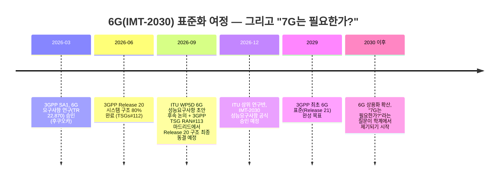

# 주간 통신 브리핑 — 2026-09-08

## 이번 주 3줄 요약
- 3GPP의 분기 전체회의 **TSG RAN#113**이 9월 14~17일 스페인 마드리드에서 열려 **Release 20**(6G 연구를 포함한 표준 규격 묶음)의 시스템 구조를 최종 확정(동결)할 예정입니다. 같은 흐름 속에서 arXiv에는 "굳이 7G가 필요한가?"를 정면으로 묻는 논문이 올라와, 세대(G) 숫자가 왜 늘어나는지 돌아볼 계기가 됐습니다.
- 국내에서는 국회에서 열린 'AI 시대 네트워크 고도화' 정책간담회(9/2)에서 "5년 내 통신 트래픽이 최대 5배 증가할 것"이라는 전망이 나오며 통신 3사가 AI-RAN·해저케이블·위성망 투자에 대한 세제 지원을 요청했고, 에릭슨코리아도 서울에서 'AI 네트워크' 행사를 열어 AI-RAN 상용 제품(평균 주파수 효율 10% 개선)과 6G 핵심기술 ISAC 로드맵을 공개했습니다.
- 해외에서는 퀄컴이 '6G 리더십 데이'를 열고 에이전틱 AI·AI 네이티브 기기를 6G의 핵심 축으로 제시했으며, arXiv에서도 6G 무선망을 관리하는 여러 AI가 서로의 "속마음(추론)"을 헤아리게 하자는 연구 등 AI-통신 융합 논문이 다수 발표됐습니다.

## 한눈에 보기

| 소스 | 항목 | 난이도 | 한 줄 설명 |
|---|---|---|---|
| TTA | 제1306호 — 에이전틱 AI 환경의 제로트러스트 가이드라인 고도화 | ★★★ | 스스로 판단·행동하는 AI 에이전트를 어떻게 "매번 검증"하는 보안 원칙으로 다룰지에 관한 국내 표준 동향 (본문 접근 제한) |
| 저널 | IEEE Spectrum — AI-RAN 실증이 AI 네이티브 6G를 예고 | ★★ | 노키아·엔비디아·T모바일이 하나의 장비로 5G 통신과 AI 연산을 동시에 처리하는 실험에 성공 |
| 저널 | IEEE Spectrum — 6GHz 대역을 둘러싼 6G-와이파이 힘겨루기 | ★★ | 같은 주파수 대역을 6G 기지국과 와이파이 중 누가 더 많이 가져갈지 나라마다 다르게 결정 중 |
| arXiv | "Will there be a 7G?" — 7G, 정말 필요한가 | ★★ | 세대 번호를 올리는 것 자체가 목적이 아니라 실제로 못 푸는 문제가 있을 때만 새 세대가 정당화된다는 주장 |
| arXiv | 6G 관리 AI들의 "마음이론(Theory of Mind)" | ★★★ | 기지국을 조종하는 여러 AI가 서로의 판단 근거까지 헤아려야 AI의 잘못된 확신이 통신 장애로 번지지 않는다는 연구 |
| arXiv | OCUDU용 E3 컨트롤러 — 오픈랜의 실시간 지능 | ★★★ | 통신 신호를 1000분의 1초 단위로 들여다보며 AI 앱이 즉시 개입할 수 있게 하는 개방형 인터페이스 구현 |
| arXiv | 와이파이, 충돌 없는 순서 정하기는 정말 이득일까 | ★★ | 여러 기기가 동시에 신호를 보내 부딪히는 문제를 미리 순번을 정해 막는 방식이 실제로는 큰 효과가 없을 수 있다는 실험 결과 |
| arXiv | 6G 스마트폰을 위한 "초소형 언어모델" | ★★ | 거대언어모델을 기기에 담기 힘드니, 의미만 압축해 보내는 통신에 kb~MB급 초소형 AI를 붙이는 기술 정리 |
| 표준화 | 3GPP TSG RAN#113 (9/14~17, 마드리드) 예고 | ★★ | Release 20의 시스템 구조를 최종 확정하는 분기 전체회의, 6G로 가는 길의 다음 이정표 |
| 표준화 | ITU IMT-2030(6G) | ★★ | 이번 주 신규 소식 없음, 다음 실무회의는 9/28~10/8 제네바 |
| IITP | 주간기술동향 | — | 최신호는 2219호(8/26, 로봇·AI 에이전트 특집)로 지난 확인과 동일, 통신 관련 신규 기사 없음 |
| 업계뉴스 | 국회 'AI 시대 네트워크 고도화' 정책간담회 | ★ | 트래픽 5배 증가 전망에 통신 3사가 AI-RAN·해저케이블·위성 투자 지원 요청 |
| 업계뉴스 | 에릭슨코리아, AI 네트워크 행사 개최 | ★★ | AI-RAN 상용 소프트웨어로 주파수 효율 10% 개선, 6G ISAC 로드맵 공개 |
| 업계뉴스 | 퀄컴 '6G 리더십 데이' — 6G와 AI의 충돌 코스 | ★★ | 에이전틱 AI와 AI 네이티브 웨어러블을 6G 설계의 핵심 축으로 제시 |

*위 타임라인은 "6G가 언제 나오나"라는 질문에 대한 실제 절차를 보여줍니다. ITU(국제전기통신연합)가 성능 목표를 정하면, 3GPP가 그 목표를 만족하는 구체적인 기술 규격을 릴리즈 단위로 만들어 가는 2단계 구조입니다. 이번 주 arXiv 논문은 이 여정이 끝나기도 전에 "그 다음(7G)은 정말 필요한가"를 미리 묻고 있습니다.*

---

## 1. TTA ICT Standard Weekly 제1306호

**발행일**: 2026-09-07

TTA(한국정보통신기술협회)가 매주 발행하는 ICT 표준 동향 소식지입니다. 지난주(제1305호, 트럼프 2기 행정부 AI·디지털 정책)에 이어 이번 주 새 호가 발행됐습니다.

### 에이전틱 AI 환경에서의 제로트러스트 가이드라인 고도화 방안 ★★★
- **원문 링크**: https://committee.tta.or.kr/data/weekly_view.jsp?news_id=10358
- **쉬운 설명(도입)**: "제로트러스트(Zero Trust)"란 "사내망 안이니까 안전하다"처럼 위치나 소속만 보고 무조건 믿어주지 않고, 누가·무엇이 접속하든 매번 신원과 권한을 다시 확인하는 보안 원칙입니다. "에이전틱 AI(Agentic AI)"는 사람이 매 단계 지시하지 않아도 스스로 목표를 세우고, 여러 단계의 작업을 계획해서 실행하는 자율형 AI를 말합니다(예: "이 서버 로그를 분석해서 문제가 있으면 담당자에게 보고까지 해줘"라고 하면 알아서 여러 단계를 수행).
- **심화 내용(제목 기반 추정)**: 이 기사는 이런 에이전틱 AI가 사람 대신 시스템에 직접 접근해 명령을 실행하는 환경에서, 기존 제로트러스트 보안 지침(매번 접속을 검증하는 규칙)을 어떻게 더 정교하게 다듬어야 하는지를 다룬 것으로 제목에서 추정됩니다. AI 에이전트는 사람과 달리 초당 수십 번씩 시스템에 접근할 수 있고, 그 판단 과정이 사람 눈에 잘 보이지 않는다는 점이 새로운 보안 과제로 떠오르고 있습니다.
- **왜 중요한가**: AI가 통신망·서버에 자율적으로 접근해 작업을 수행하는 시대가 다가오면서, "이 AI 에이전트가 실제로 믿을 만한 주체인지"를 확인하는 절차가 국내 보안 표준의 새로운 화두가 되고 있습니다.
- **⚠️ 접근 제한 안내**: TTA 본문은 PDF(weekly.tta.or.kr 호스트)로만 제공되는데, 이번 주에도 해당 호스트 접근이 차단(조직 정책상 차단, host_not_allowed)되어 상세 본문 요약은 작성하지 못했습니다. 지난주 접근이 막혔던 제1305호(트럼프 2기 정책) 본문도 이번 주 재시도했으나 동일하게 접근이 막혀 있었고, 이번 호와 직접적인 관련성도 낮아 보충 설명 없이 생략합니다.

---

## 2. 저널/학회 신규 논문

IEEE Xplore·Communications Magazine 사이트는 이번 세션에서 직접 접근이 차단되어, 웹검색으로 IEEE Spectrum(IEEE 대중 매체, 통신 기사 포함)의 2026년 9월호 관련 기사를 확인했습니다.

### AI-RAN 실증이 "AI 네이티브 6G"의 미래를 보여주다 ★★
- **원문 링크**: https://spectrum.ieee.org/ai-ran-6g
- **쉬운 설명(도입)**: "AI-RAN"이란 기지국(RAN, 스마트폰과 통신사 망을 무선으로 잇는 구간) 장비 안에서 통신 신호 처리와 AI 연산(추론)을 같은 하드웨어로 함께 처리하는 기술입니다. 지금까지 기지국은 통신 전용 하드웨어였지만, AI-RAN은 이 장비를 AI 서버처럼 범용화하려는 시도입니다.
- **내용**: 노키아·엔비디아가 미국 통신사 T모바일의 시애틀 실험실에서, 하나의 무선 장비와 엔비디아 서버로 실제 5G 통신 연결과 영상 스트리밍·자막 생성 같은 AI 작업을 동시에 처리하는 데 성공했습니다. 노키아는 2026년 하반기 중 더 넓은 상용 실증을, 2027년 상용화를 목표로 하고 있으며, 경쟁사 에릭슨도 2025년 초부터 T모바일과 유사한 실증을 이어오다 올해 6월부터는 기존 기지국에 AI 기능을 더하는 소프트웨어 업그레이드 판매를 시작했습니다.
- **왜 중요한가**: "AI가 통신망에 들어간다"는 말이 이제 실험실 시연을 넘어 상용화 일정(2027년)까지 구체화되고 있다는 신호입니다. 이번 주 국내 에릭슨 행사, 3줄 요약의 SKT·삼성 AI-RAN 소식과 같은 흐름입니다.

### 6GHz 대역을 둘러싼 6G와 와이파이의 힘겨루기 ★★
- **원문 링크**: https://spectrum.ieee.org/6g-wifi-united-states-china
- **쉬운 설명(도입)**: 무선통신은 "주파수 대역"이라는, 눈에 안 보이는 도로 같은 자원을 나눠 씁니다. 같은 도로를 여러 차가 동시에 쓰면 정체가 생기듯, 같은 주파수를 여러 기술이 동시에 쓰려 하면 간섭이 생기기 때문에 각국 정부가 "이 대역은 이 용도로만 써라"라고 나눠줍니다(주파수 할당).
- **내용**: 6GHz 대역(5,925~7,125MHz)을 두고 통신 업계는 도심 6G 기지국의 "기본 용량"으로, 와이파이 업계는 저지연·초고속 스트리밍과 AR/VR용 와이파이 7·8의 핵심 대역으로 각각 원하고 있습니다. 미국은 이 대역 전체를 와이파이 등 비면허(허가 없이 쓰는) 용도로 열어준 반면, 중국은 반대로 상당 부분을 이동통신사 전용(면허) 대역으로 지정하는 등 나라마다 정반대로 결정하고 있어, 기기 제조사들이 나라별로 다른 하드웨어를 만들어야 하는 부담이 커지고 있습니다.
- **왜 중요한가**: "6G냐 와이파이 8이냐"는 소비자에게는 잘 안 보이지만, 실제로는 같은 주파수 자원을 누가 더 많이 가져가느냐를 둘러싼 산업 간 경쟁이며, 그 결과에 따라 미래 기기의 성능과 가격이 달라집니다.

---

## 3. arXiv 주목 논문

cs.NI(네트워킹), eess.SP(신호처리) 카테고리에서 지난 7일(2026-09-01~09-08) 제출된 논문 중 관심 분야에 맞춰 선별했습니다. 지난주 다룬 xTRUCE·PRO-RAN·FaulT-Bench·NOMA 공격·NTN 전파모델 논문과 겹치지 않는 새 논문들입니다.

### "Will there be a 7G?" — 7G, 정말 필요할까? ★★
- **원문 링크**: https://arxiv.org/abs/2609.01877 (제출일 2026-09-01)
- **쉬운 설명**: 이동통신은 지금까지 대략 10년마다 "세대(1G→2G→…→6G)"를 하나씩 올려왔습니다. 이 논문은 6G 표준화가 한창 진행 중인 지금 시점에 "그럼 7G도 당연히 나오는 건가?"라는 도발적인 질문을 던집니다.
- **심화 내용**: 저자들은 세대 번호를 올리는 일이 "더 빠른 속도 경쟁"처럼 자동으로 정당화돼서는 안 되며, ①실제 수요, ②기존 6G·와이파이·위성망·사설망 등으로는 도저히 못 푸는 근본적인 문제(시스템 단절), ③여러 기술을 조율할 가치, ④지속가능성, ⑤신뢰, ⑥국제 정치 등 6가지 기준을 충족할 때만 새 세대가 정당화된다는 "판단 틀"을 제시합니다. 에이전틱 AI 운영, 전파 자체를 컴퓨팅에 쓰는 기술, 양자 연동 등을 7G 후보 요인으로 검토하되, "7G가 반드시 나온다"고 예측하지는 않습니다.
- **왜 중요한가**: 뉴스에서 "5G 다음은 6G, 그다음은 7G"라고 당연하게 여기기 쉽지만, 실제로는 매 세대가 "정말 필요한가"라는 검증을 거쳐야 한다는 점을 짚어줍니다. 이번 주 "기초 개념" 코너와 바로 이어지는 주제입니다.

### 6G 무선망을 관리하는 AI들에게 "마음이론(Theory of Mind)"이 필요하다 ★★★
- **원문 링크**: https://arxiv.org/abs/2609.01779 (제출일 2026-09-01)
- **쉬운 설명(도입)**: 미래 6G에서는 거대언어모델(LLM) 기반 AI 에이전트 여러 개가 기지국(RAN)을 나눠서 관리할 것으로 예상됩니다. 이 AI들은 서로 메시지("이 구역은 신호가 약하다" 등)를 주고받으며 판단을 내립니다.
- **심화 내용**: 문제는 AI가 보내는 메시지가 "객관적 사실"이 아니라 "그 AI 나름의 추론 결과"라는 점입니다. 겉보기엔 형식이 멀쩡한 메시지라도 AI의 잘못된 확신(환각)이 담겨 있으면, 이를 받은 다른 AI들이 그대로 믿고 전파하다가 통신망 전체 장애로 번질 수 있습니다. 이 논문은 사람 사이의 "마음이론"(상대가 무엇을 믿고 있을지 짐작하는 능력)처럼, AI 에이전트도 메시지를 받기 전에 "상대가 어떤 근거로 이런 결론을 냈을지"를 먼저 헤아리게 하는 설계 원칙 5가지를 제안하고, 실제 통신 특화 소형 AI 모델로 실험해 효과를 확인했습니다.
- **왜 중요한가**: 여러 AI가 협력해서 망을 운영하는 시대에는 "메시지 내용"뿐 아니라 "그 메시지를 누가, 왜 그렇게 판단해서 보냈는가"까지 따져야 안전하다는, AI 신뢰성 논의의 다음 단계를 보여줍니다.

### 오픈랜에 "즉시 반응하는" AI를 붙이는 새 인터페이스, OCUDU용 E3 컨트롤러 ★★★
- **원문 링크**: https://arxiv.org/abs/2609.03162 (제출일 2026-09-02)
- **쉬운 설명(도입)**: 지난주 소개한 오픈랜(Open RAN)의 지능형 제어기 "RIC"는 대체로 수십 밀리초~수초 단위로 판단합니다. 하지만 주파수를 실시간으로 나눠 쓰거나 통신·센싱을 통합하는 등 어떤 작업은 1000분의 1초(밀리초) 이하의 반응 속도가 필요합니다. 이런 초고속 AI 개입을 위한 프로그램을 "dApp"이라 부르고, dApp이 기지국의 신호 처리 장비(CU/DU)와 표준화된 방식으로 대화하는 통로를 "E3 인터페이스"라고 합니다.
- **심화 내용**: 이 논문은 리눅스 재단이 만든 오픈소스 기지국 소프트웨어 OCUDU에 이 E3 인터페이스를 실제로 구현하고, 스펙트럼(주파수 상태) 감지 dApp을 실제 무선 장비에 연결해 검증했습니다. 그 결과 E3를 통해 AI가 개입해도 기존 통신 처리 속도(처리량)에 손해가 없음을 확인했습니다.
- **왜 중요한가**: "오픈랜 위에 AI를 얹는다"는 아이디어가 실제 오픈소스 소프트웨어에서 성능 저하 없이 동작함을 보여준 사례로, AI-RAN이 실험실을 넘어 실제 장비로 넘어가는 데 필요한 배관(인터페이스) 공사에 해당합니다.

### 와이파이에서 "충돌 없는 순서 정하기", 정말 이득일까? ★★
- **원문 링크**: https://arxiv.org/abs/2609.03817 (제출일 2026-09-03)
- **쉬운 설명(도입)**: 와이파이는 여러 기기가 같은 채널(주파수)을 공유하기 때문에, 두 기기가 동시에 신호를 보내면 "충돌"이 나서 둘 다 실패합니다. 기존 와이파이는 각 기기가 무작위로 잠깐 기다렸다가(백오프) 신호를 보내는 방식으로 충돌 확률을 낮춥니다. 이 방식을 개선해, 아예 기기들끼리 순서를 미리 정해 충돌 자체를 없애자는 "충돌 없는 백오프" 방식들도 제안돼 왔습니다.
- **심화 내용**: 연구진이 실제와 비슷한 트래픽(항상 꽉 채워 보내는 게 아니라 간헐적으로, 그리고 업로드·다운로드가 섞인 상황)으로 시뮬레이션한 결과, 트래픽이 꽉 찬 상황에서는 충돌 없는 방식이 최대 6.3%의 속도 개선만 줄 뿐이었고, 간헐적 트래픽에서는 오히려 다운로드가 많은 상황에서 성능이 나빠지기도 했습니다. 기기들은 93% 이상의 시간 동안 결국 무작위 대기로 되돌아가, 실제로는 "충돌 없는 순서"가 잘 형성되지 않았습니다.
- **왜 중요한가**: 와이파이 7·8을 설계할 때 "더 정교한 순서 관리"가 늘 좋은 것은 아니라는 것을 실측으로 보여주며, 실제 트래픽 패턴을 반영한 검증이 왜 중요한지 알려줍니다.

### 6G 스마트폰·IoT 기기를 위한 "초소형 언어모델" 정리 ★★
- **원문 링크**: https://arxiv.org/abs/2609.03747 (제출일 2026-09-03)
- **쉬운 설명(도입)**: 6G는 "의미 통신(semantic communication)"이라는 개념을 지향합니다. 지금까지 통신은 데이터를 있는 그대로(비트 단위로) 정확히 전달하는 데 집중했다면, 의미 통신은 "전달하려는 의미"만 뽑아서 보내 데이터량을 줄이는 방식입니다. 이 "의미 뽑기"를 잘하는 것이 거대언어모델(LLM)인데, LLM은 용량이 너무 커서 스마트폰이나 IoT 기기에 그대로 넣기 어렵습니다.
- **심화 내용**: 이 논문은 LLM을 양자화·가지치기·지식증류 등의 방법으로 킬로바이트~메가바이트 수준까지 압축한 "초소형 언어모델(TinyLM)"을 6G 의미 통신에 어떻게 붙일 수 있는지 정리한 서베이(총정리 논문)입니다. 예를 들어 특정 압축 기법으로 신경망 기반 통신 프로토콜을 4.55MB에서 1KB로, 성능 손실 없이 99.98% 줄인 사례도 소개합니다.
- **왜 중요한가**: "6G에는 AI가 기본 탑재된다"는 방향이 맞더라도, 실제 스마트폰 배터리와 메모리로 감당 가능한 크기의 AI가 있어야 상용화가 가능합니다. 이 서베이는 그 현실적인 격차를 메우는 기술들을 지도처럼 정리했습니다.

---

## 4. 표준화 동향 (3GPP/ITU)

### 3GPP TSG RAN#113, 9월 14~17일 마드리드 개최 예고 — Release 20 구조 최종 확정 ★★
- **원문 링크**: https://www.3gpp.org/specifications-technologies/releases/release-20 (배경, 3gpp.org 직접 접근은 이번 세션에서 차단되어 웹검색 기반 정리)
- **쉬운 설명(도입)**: "3GPP"는 전 세계 이동통신사·제조사가 모여 3G~6G 표준을 만드는 국제 협의체이고, "Release(릴리즈)"는 몇 년 주기로 묶어 발표하는 표준 규격 세트입니다. 3GPP는 분기(3개월)마다 "TSG(기술 규격 그룹) 전체회의"를 열어 그동안 실무그룹(RAN1, RAN2 등)이 만든 초안을 승인하거나 확정합니다.
- **내용**: 지난주 리포트에서 다룬 마스트리흐트 회의(8/24~28)는 RAN 실무그룹 수준의 회의였다면, 이번에 예고된 **TSG RAN#113**(9/14~17, 스페인 마드리드)은 그보다 상위 단계인 분기 전체회의로, Release 20의 "시스템 구조(Stage-2)"를 최종 확정(동결)할 예정입니다. 이 구조 동결이 이뤄지면, 이후로는 6G 연구를 포함한 Release 20의 큰 틀은 바뀌지 않고 세부 규격을 채우는 단계로 넘어갑니다. 참고로 이 구조에 대한 논의는 지난 3월 후쿠오카 회의에서 6G 요구사항 연구 보고서(TR 22.870, 약 161개 활용사례·473개 요구사항 정리)가 승인되면서 본격화됐고, 지난 6월 회의(TSGs#112)에서 80% 완료 지점을 통과했습니다.
- **왜 중요한가**: "6G는 언제 확정되나"라는 질문에 대한 실제 다음 이정표입니다. 이번 회의에서 구조가 동결되면, 6G의 뼈대(전체적인 네트워크 설계 방향)가 사실상 굳어지는 셈이어서, 앞으로 통신 장비사·통신사들이 어떤 기술에 투자할지 판단하는 기준이 됩니다. (참고: 이 회의는 아직 열리지 않았으므로 결과는 다음 주 리포트에서 확인하겠습니다.)

### ITU IMT-2030(6G) — 이번 주 신규 소식 없음 ★★
- 지난 2월 제네바 회의에서 합의된 20개 기술성능요구사항(TPR) 초안 이후, 이번 주(9/1~9/8)에는 공식 발표가 확인되지 않았습니다. 다음 실무회의(ITU-R WP5D)는 9월 28일~10월 8일 제네바에서 열리며, 상위 기구의 정식 승인은 2026년 12월로 예정되어 있습니다.

---

## 5. IITP 주간기술동향

**최신호**: 2219호 (2026-08-26 발행) — "로봇 파운데이션 모델 기술 동향", "첨단로봇 시장 재편과 피지컬 AI", "AI 에이전트 하네스 엔지니어링" 등 3건으로, 모두 로봇·AI 에이전트 주제이며 통신·네트워크 관련 기사는 없습니다.

지난주 확인했던 "격주 발행 전환" 정황대로, 이번 주(9/1~9/8)에는 2219호 다음 호(2220호)가 아직 발행되지 않은 것으로 확인됩니다. 통신 관련 신규 기사가 없어 이번 호는 요약을 생략합니다.

---

## 6. 업계 뉴스

### 국회 'AI 시대 네트워크 고도화 방안' 정책간담회 — "5년 내 트래픽 최대 5배" 전망 ★
- **날짜**: 2026-09-02
- **원문 링크**: https://news.bizwatch.co.kr/article/mobile/2026/09/02/0038 / https://www.mt.co.kr/tech/2026/09/02/2026090212555844663
- **쉬운 설명**: 국회의원회관에서 열린 정책간담회에서 이경원 동국대 교수는 "앞으로 5년 정도를 보면 트래픽이 적게는 2배, 많게는 5배까지 증가할 수 있다"고 전망했습니다. SK텔레콤은 AI-RAN이나 5G 데이터센터 간 연결망 투자도 "AI 인프라 투자"로 인정해 세제·투자 지원을 검토해달라고 요청했고, LG유플러스는 미래망 세제 지원과 주파수 투자 인센티브, AI-RAN 실증을 하나의 투자 패키지로 묶어달라고 제안했습니다. 과기정통부는 지난주(8/27) 발족한 민·관협의체를 계기로 이 제안들을 실질적으로 논의하겠다고 답했습니다.
- **왜 중요한가**: 지난주 발족만 됐던 민·관협의체가 이번 주 국회 차원의 구체적인 정책 토론(트래픽 전망치, 세제 지원 방식 등)으로 이어진 후속 소식으로, "AI 때문에 통신망 투자가 왜 필요한가"에 대한 근거 수치가 처음 공개적으로 제시됐습니다.

### 에릭슨코리아, 서울서 'AI 네트워크' 행사 개최 — AI-RAN 상용화·6G ISAC 로드맵 공개 ★★
- **날짜**: 2026-09-01
- **원문 링크**: https://www.mt.co.kr/tech/2026/09/01/2026090113365345970
- **쉬운 설명**: "ISAC(통신·센싱 통합)"란 기지국이 통신 신호를 보내는 동시에, 그 신호가 물체에 반사돼 돌아오는 것을 분석해 레이더처럼 주변을 감지하는 기술로, 6G의 핵심 후보 기능 중 하나입니다. 에릭슨은 올해 6월 출시한 AI-RAN 소프트웨어(기지국에 AI 연산 기능을 더하는 상용 제품)를 적용한 통신망에서 평균 10%의 주파수 효율 개선을 확인했다고 밝혔고, 이날 행사에서 이 AI-RAN 기술과 ISAC 상용화 로드맵을 국내 통신사·산업계에 소개했습니다.
- **왜 중요한가**: 앞서 IEEE Spectrum 기사(노키아·엔비디아·T모바일 실증)와 마찬가지로, AI-RAN이 "미래 기술"에서 "이미 판매 중인 상용 소프트웨어"로 넘어가고 있다는 것을 국내에서도 확인할 수 있는 사례입니다.

### 퀄컴 '6G 리더십 데이' — "6G와 AI가 충돌 코스에 있다" ★★
- **날짜**: 2026-09-02 (미국 샌디에이고)
- **원문 링크**: https://www.lightreading.com/6g/6g-and-ai-are-on-a-collision-course
- **쉬운 설명**: 퀄컴은 이 행사에서 6G를 "연결성 + 센싱(주변 감지) + AI 지원"이라는 세 축으로 정의하며, 스마트폰을 넘어 AI 기능을 가진 웨어러블 기기(안경, 핀, 이어폰형 기기 등 이른바 'AI 퍽')들이 여러 개씩 사람 곁에 함께 다니는 시대를 준비해야 한다고 밝혔습니다. 특히 스스로 목표를 세우고 행동하는 "에이전틱 AI"가 네트워크 말단(기기)부터 코어망까지 걸쳐 중요해질 것이라고 강조했습니다.
- **왜 중요한가**: 이번 주 arXiv의 "6G 마음이론" 논문, 3GPP의 6G 논의와 같은 방향으로, "6G는 곧 AI 인프라"라는 인식이 표준화 기구뿐 아니라 칩 제조사(퀄컴)에서도 확산되고 있음을 보여줍니다. 다만 일부 분석가들은 AI가 실제 무선 접속망 성능에 미치는 영향에 대해 여전히 회의적인 시각도 있다고 함께 지적됐습니다.

---

## 이번 주 기초 개념 한 가지: 이동통신의 "세대(G)"란 무엇이고, 왜 계속 늘어날까?

뉴스에서 "5G", "6G"라는 말은 자주 보지만, 정작 이 "G"가 왜 계속 숫자가 올라가는지는 잘 설명되지 않습니다. "G"는 영어 Generation(세대)의 줄임말로, 이동통신 기술이 대략 10년에 한 번씩 겪는 큰 도약을 구분하는 이름표입니다. 1G는 목소리를 아날로그 전파에 실어 보내던 초기 휴대전화였고, 2G는 목소리와 문자를 디지털 신호로 바꿔 더 안정적으로 보내기 시작했습니다(대표 기술 GSM). 3G는 여기에 인터넷 접속과 영상통화를, 4G(LTE)는 본격적인 모바일 데이터(동영상 스트리밍 등)를 가능하게 했고, 5G는 초고속·초저지연(반응이 매우 빠름)·초연결(한 번에 매우 많은 기기 접속)이라는 세 가지 목표를 내세웠습니다. 각 세대는 그냥 "더 빠르다"는 마케팅 문구가 아니라, 실제로는 새로운 주파수 대역을 쓰고, 신호를 변환하는 방식(변조)이나 여러 사용자가 자원을 나눠 쓰는 방식(다중접속)을 바꾸고, 기지국·코어망의 구조 자체를 새로 설계하는 대규모 공학적 변화입니다. 그렇다면 이 "몇 세대"라는 딱지는 누가 정할까요? 앞서 표준화 동향에서 봤듯이, 국제전기통신연합(ITU)이 "이번 세대는 이런 성능(속도, 지연시간 등)을 만족해야 한다"는 큰 목표(예: 6G의 경우 IMT-2030)를 먼저 정하고, 3GPP가 그 목표를 실제로 만족시키는 구체적인 기술 규격을 릴리즈 단위로 만들어가는 2단계 구조로 작동합니다. 그런데 이번 주 arXiv에 올라온 논문은 이 과정 한가운데서 "그럼 6G 다음의 7G도 당연히 나오는 거냐"는 질문을 던졌습니다. 저자들의 답은 "아니오, 자동으로는 아니다"입니다. 세대를 올리는 것은 속도 경쟁이 아니라, 기존 기술(6G, 와이파이, 위성망 등)로는 도저히 풀 수 없는 새로운 문제가 실제로 나타났을 때만 정당화돼야 한다는 것입니다. 이 관점으로 보면, 이번 주 예고된 3GPP TSG RAN#113(9/14~17, 마드리드) 회의에서 Release 20(6G 연구 포함)의 구조를 확정하는 일도 "그냥 다음 세대를 만드는 절차"가 아니라, 실제로 AI 트래픽 급증이나 위성-지상 통합 같은 구체적인 문제를 풀기 위한 근거를 계속 쌓아가는 과정으로 이해할 수 있습니다. 앞으로 "6G", "7G" 같은 말을 뉴스에서 볼 때, 숫자 자체보다 "이번 세대가 실제로 어떤 문제를 풀려고 하는가"를 함께 살펴보면 훨씬 이해하기 쉬워집니다.

---

## 이번 주 용어집 (가나다순)

- **AI-RAN**: 기지국(RAN) 장비 안에서 통신 신호 처리와 AI 연산(추론)을 같은 하드웨어로 함께 처리하는 기술. 이번 주 노키아·엔비디아·T모바일, 에릭슨코리아 사례로 상용화가 구체화되고 있습니다.
- **다중접속(Multiple Access)**: 여러 사용자가 하나의 주파수·시간 자원을 어떻게 나눠 쓸지 정하는 방식. 이동통신 세대마다 이 방식이 바뀌어 왔습니다.
- **릴리즈(Release)**: 3GPP가 몇 년 주기로 발표하는 이동통신 표준 규격 묶음. Release 20은 5G-Advanced 마무리와 6G 연구를 함께 담고 있습니다.
- **변조(Modulation)**: 데이터를 실어 보내기 위해 전파의 모양(진폭·주파수·위상)을 바꾸는 방식. 세대가 바뀔 때마다 더 많은 정보를 담을 수 있는 변조 방식으로 발전해왔습니다.
- **세대(G, Generation)**: 이동통신 기술이 약 10년 주기로 겪는 큰 도약을 구분하는 이름표. 1G(아날로그 음성)부터 6G(연구 진행 중)까지 이어지고 있으며, 이번 주 "기초 개념" 코너에서 자세히 다뤘습니다.
- **에이전틱 AI(Agentic AI)**: 사람이 매 단계 지시하지 않아도 스스로 목표를 세우고 여러 단계의 작업을 계획·실행하는 자율형 AI. 이번 주 TTA 기사와 퀄컴 6G 리더십 데이에서 모두 핵심 키워드로 등장했습니다.
- **의미 통신(Semantic Communication)**: 데이터를 있는 그대로 정확히 보내는 대신, 전달하려는 "의미"만 뽑아 압축해서 보내는 통신 방식. 6G의 지향점 중 하나입니다.
- **ISAC(통신·센싱 통합)**: 기지국이 통신 신호를 보내는 동시에, 반사되는 신호를 분석해 레이더처럼 주변을 감지하는 기술. 6G 핵심 후보 기능입니다.
- **제로트러스트(Zero Trust)**: 내부 네트워크인지 여부와 상관없이 모든 접속·요청을 매번 검증하는 보안 원칙.
- **주파수 대역/할당**: 무선통신이 신호를 실어 보내는, 눈에 보이지 않는 "도로"와 같은 자원. 같은 대역을 여러 기술(6G, 와이파이 등)이 동시에 쓰려 하면 간섭이 생기므로 정부가 용도를 나눠 할당합니다.
- **초소형 언어모델(TinyLM)**: 거대언어모델(LLM)을 양자화·가지치기 등으로 킬로바이트~메가바이트 수준까지 압축해, 스마트폰이나 IoT 기기에도 담을 수 있게 만든 AI 모델.
- **TSG(Technical Specification Group)**: 3GPP 안에서 표준 규격을 만드는 기술 그룹들의 상위 조직. 분기마다 전체회의를 열어 실무그룹의 초안을 승인·확정합니다.
- **ITU(국제전기통신연합)**: UN 산하의 통신 표준·주파수 관장 국제기구. 6G의 성능 목표(IMT-2030)를 정하는 역할을 합니다.
