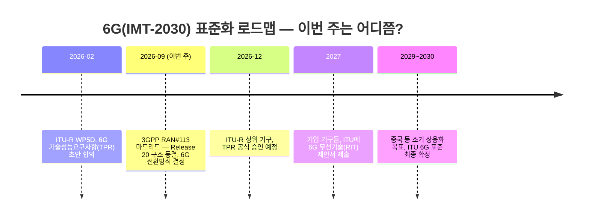

# 주간 통신 브리핑 — 2026-09-15

> ※ 지난주(2026-09-08자) 리포트가 발행되지 않아 한 주 공백이 있었습니다. 이번 호는 원칙대로 최근 7일(9/8~9/15) 소식을 다루되, 공백을 메우기 위해 경계에 걸친 주요 소식(중국 6G 계획, 9/7 발표) 1건을 예외적으로 포함했습니다.

## 이번 주 3줄 요약
- 3GPP(이동통신 표준을 정하는 국제 협의체) RAN 워킹그룹이 스페인 마드리드에서 회의(9/14~17, 이번 리포트 작성 시점 기준 진행 중)를 열어, **Release 20**의 시스템 구조를 확정(동결)하고 5G에서 6G로 넘어가는 구체적인 전환 방식을 결정하고 있습니다. 같은 주 중국은 2030년까지 760조 원을 투자해 6G를 포함한 차세대 통신망을 전면 구축하겠다는 국가 계획을 발표했습니다.
- 국내에서는 과기정통부가 조선소(HD현대삼호)를 직접 방문해 AI 기지국(AI-RAN)으로 용접·도장 로봇을 실시간 제어하는 '피지컬 AI' 실증을 점검했고, 에치에프알모바일은 정부의 '지능형 오픈랜 실증단지' 사업에 AI-RAN 장비 공급사로 참여한다고 밝혔습니다. 대한항공·아시아나항공은 오늘(9/15)부터 스타링크 기반 기내 와이파이를 시작했습니다.
- arXiv에는 여러 AI가 통신망을 직접 조작할 때의 안전장치(런타임 어슈어런스), 거대언어모델의 '토큰'을 이용한 6G 시맨틱 통신, 허리케인 상황에서 실제 기지국이 왜 먹통이 됐는지 원인을 분석한 연구 등이 새로 올라왔습니다.

## 한눈에 보기

| 소스 | 항목 | 난이도 | 한 줄 설명 |
|---|---|---|---|
| TTA | 제1307호 — AI 신뢰성과 블록체인 | ★★ | 제목만 확인, 본문 PDF 접근 차단으로 상세 요약 불가 |
| 저널/학회 | 이번 주 확인 불가 | — | IEEE Xplore·ComSoc·Spectrum 도메인이 이번 세션 네트워크 정책으로 접근 차단됨 |
| arXiv | Open Spectrum — 오픈랜을 스펙트럼 공유까지 확장 | ★★★ | 기지국 개방형 구조의 원리를 주파수 공유·센싱까지 넓히는 아키텍처 제안 |
| arXiv | Assured AI-Native Network Control Loops | ★★★ | 여러 AI가 동시에 통신망을 제어할 때 서로 충돌하지 않도록 보장하는 연구 방향 정리 |
| arXiv | 시맨틱→토큰 통신, 거대모델 기반 6G | ★★★ | 챗GPT 같은 AI가 쓰는 '토큰' 단위로 통신 자체를 설계하자는 6G 제안 |
| arXiv | 허리케인 헐린 통신망 장애 원인 분석 | ★★ | "기지국이 부서져서"가 아니라 "정전·회선 단절" 때문이었다는 실증 데이터 |
| arXiv | OTFS vs OFDM 변조 성능 비교 | ★★ | 6G 후보 변조기술이 빠르게 움직이는 환경에서 기존 기술보다 나은지 실험 |
| 표준화 | 3GPP RAN#113 마드리드 회의 (진행 중) | ★★ | Release 20 아키텍처 동결 + 6G 전환방식 결정, 이번 주 실제 열리는 회의 |
| 표준화 | ITU IMT-2030(6G) | ★★ | 이번 주 신규 공식 소식 없음, 다음 승인은 2026년 12월 |
| IITP | 주간기술동향 제2220호 — 피지컬 AI 표준화 방향 | ★★ | 로봇이 클라우드와 통신하며 지능화되는 흐름과 표준화 과제 |
| 업계뉴스 | 과기정통부, HD현대삼호 조선소 AI-RAN 실증 점검 | ★ | AI 기지국으로 용접·도장 로봇을 실시간 제어하는 '피지컬 AI' 현장 검증 |
| 업계뉴스 | 에치에프알모바일, 지능형 오픈랜 실증단지 AI-RAN 공급사 참여 | ★ | 국책 오픈랜 실증사업에 국내 장비사가 AI-RAN 공급기업으로 합류 |
| 업계뉴스 | 대한항공·아시아나, 스타링크 기내 와이파이 개시 | ★ | 저궤도 위성통신을 이용한 기내 무료 와이파이, 동아시아 대형 항공사 최초 |
| 업계뉴스 | 중국, 정보통신산업 15차 5개년 계획 발표(9/7) | ★★ | 2030년까지 760조 원 투자, 6G·차세대 통신망 전면 구축 목표 제시 |

*위 타임라인: 6G는 ITU(국제전기통신연합)라는 UN 산하 기구가 "성능 목표"를, 3GPP라는 산업계 협의체가 "구체적인 기술 규격"을 나누어 정하는 이원화된 절차로 표준화되고 있습니다. 이번 주 3GPP 마드리드 회의와 중국의 6G 투자 계획은 모두 이 타임라인 위의 사건입니다.*

---

## 1. TTA ICT Standard Weekly 제1307호

**발행일**: 2026-09-14 (이번 주 신규 호 확인됨)

TTA(한국정보통신기술협회)가 매주 발행하는 ICT 표준 동향 소식지입니다.

### AI 신뢰성과 블록체인 ★★
- **원문 링크**: https://committee.tta.or.kr/data/weekly_view.jsp?news_id=10369
- **쉬운 설명**: 제목으로 미루어, AI가 내놓는 판단이나 데이터를 사람이 믿을 수 있게 만드는 데 블록체인(여러 컴퓨터가 거래 기록을 함께 검증·보관해 위조하기 어렵게 만드는 분산 장부 기술)을 활용하는 방안을 다루는 것으로 추정됩니다.
- **왜 중요한가**: AI가 통신망 운영이나 중요한 의사결정에 점점 더 깊이 관여하면서, "이 AI 판단을 믿을 수 있는가"를 검증하는 기술이 표준화 논의의 화두로 떠오르고 있습니다.
- **⚠️ 접근 제한 안내**: 이번 주도 본문 PDF(weekly.tta.or.kr 호스트)가 이번 세션의 네트워크 정책으로 접근 차단(3주 연속)되어 상세 요약은 제목 기반 추정에 그쳤습니다. 목록 페이지도 최신 1건만 노출하는 구조가 계속되고 있어, 지난주(9/7 전후 발행되었을 것으로 추정되는 제1306호)의 존재 여부도 확인하지 못했습니다.

---

## 2. 저널/학회 신규 논문

**이번 주 확인 불가**: IEEE Xplore(ieeexplore.ieee.org), IEEE ComSoc(comsoc.org), IEEE Spectrum(spectrum.ieee.org) 세 도메인 모두 이번 세션의 네트워크 egress 정책에 의해 접근 자체가 차단되어 있었습니다(3주 연속 동일 증상). 웹검색으로도 지난 7일 내 새로 게재가 확정된 통신 관련 기사를 찾지 못해, 억지로 채우지 않고 이번 주는 건너뜁니다.

---

## 3. arXiv 주목 논문

지난 7일(2026-09-08~09-15) cs.NI(네트워킹), eess.SP(신호처리) 카테고리에 제출된 논문 중 관심 분야에 맞춰 선별했습니다.

### Open Spectrum — 오픈랜의 개방형 원리를 주파수 공유까지 넓히기 ★★★
- **원문 링크**: https://arxiv.org/abs/2609.11843 (제출일 2026-09-10)
- **쉬운 설명(도입)**: 지난주까지 여러 차례 다룬 "오픈랜(Open RAN)"은 기지국을 여러 부품으로 나누고 서로 다른 제조사끼리도 호환되게 만든 개방형 구조입니다. "스펙트럼(주파수 대역)"은 무선 신호가 실려 가는 공간 자원인데, 지금까지는 통신사마다 정부로부터 할당받은 주파수를 독점적으로 씁니다.
- **심화 내용**: 이 논문은 오픈랜의 "여러 회사 장비를 표준 인터페이스로 조합한다"는 원리를 한 단계 더 확장해, 통신뿐 아니라 레이더 같은 "센싱(주변 환경 감지)" 서비스까지 같은 인프라와 주파수를 여러 주체가 나눠 쓰도록 하는 "Open Spectrum" 구조를 제안합니다. 디지털 트윈(현실을 컴퓨터 안에 똑같이 복제한 가상 모델)으로 전파 간섭을 미리 예측해 배분한 결과, 신호 품질(SINR)이 최대 12dB 개선됐습니다.
- **왜 중요한가**: 6G 시대에는 통신·레이더·위성 등 다양한 서비스가 한정된 주파수를 두고 경쟁하게 되는데, 이 연구는 "누가 먼저 쓰느냐"가 아니라 "어떻게 지능적으로 나눠 쓰느냐"의 기술적 밑그림을 제시합니다.

### Assured AI-Native Network Control Loops — 여러 AI가 통신망을 동시에 조작해도 안전하려면 ★★★
- **원문 링크**: https://arxiv.org/abs/2609.11996 (제출일 2026-09-09)
- **쉬운 설명(도입)**: 요즘 통신망은 "닫힌 루프(closed loop)" 자동화, 즉 문제를 스스로 감지하고 스스로 고치는 AI 제어 장치들을 곳곳에 심어 두는 방향으로 진화하고 있습니다. 오픈랜의 지능형 제어기(RIC), 네트워크 디지털 트윈, AI 오케스트레이션(여러 자원을 자동으로 조율하는 것) 등이 그 예입니다.
- **심화 내용**: 문제는 이런 AI 제어 장치 하나하나는 각자 "괜찮은" 결정을 내려도, 여러 개가 같은 자원(같은 주파수, 같은 서버 등)을 동시에 건드리면 서로의 전제가 어긋나 예상 못한 오작동이 날 수 있다는 점입니다. 이 논문은 각 AI 결정에 "이 결정이 유효하려면 어떤 전제가 참이어야 하는지"를 꼬리표처럼 붙여두고, 그 전제가 깨지는 순간을 실시간 감시해 충돌을 조정하는 "런타임 어슈어런스(실행 중 안전성 보증)" 개념을 제안합니다.
- **왜 중요한가**: "AI가 통신망을 자동으로 운영한다"는 청사진이 실제 상용망에 적용되려면, 여러 AI의 결정이 서로를 방해하지 않는다는 기술적 보증이 먼저 마련돼야 합니다. 지난주 소개한 xTRUCE 논문과 이어지는 흐름입니다.

### 시맨틱에서 토큰 통신으로 — 거대언어모델이 6G 통신 방식 자체를 바꾼다 ★★★
- **원문 링크**: https://arxiv.org/abs/2609.10714 (제출일 2026-09-09)
- **쉬운 설명(도입)**: 지금까지 통신은 "비트(0과 1)"를 얼마나 정확히, 빠르게 전달하느냐가 목표였습니다. 반면 "시맨틱 통신(의미 중심 통신)"은 데이터를 있는 그대로 다 보내는 대신 "의미"만 뽑아 압축해서 보내고, 받는 쪽에서 그 의미를 복원하는 방식입니다. "토큰"은 챗GPT 같은 거대언어모델(LLM)이 문장을 처리할 때 쪼개서 다루는 최소 단위(단어 조각)입니다.
- **심화 내용**: 이 논문은 시맨틱 통신을 구현할 때 데이터 종류마다 의미를 표현하는 방식이 제각각이라 통일하기 어려웠던 문제를, LLM이 이미 쓰고 있는 "토큰"이라는 공통 단위로 풀 수 있다고 제안합니다. 문장·이미지·센서 데이터를 모두 토큰으로 바꿔 주고받으면, 통신망과 AI 모델이 같은 "언어"로 대화하게 되는 셈입니다.
- **왜 중요한가**: 로봇(피지컬 AI)이나 자율주행차처럼 AI가 실시간으로 판단해야 하는 기기가 늘어날수록, "정확한 비트 전달"보다 "필요한 의미만 빠르게 공유"하는 통신 방식이 대역폭과 지연시간을 크게 줄여줄 수 있습니다. 이번 주 국내 조선소 AI-RAN 실증(6절)과도 맞닿아 있는 방향입니다.

### 허리케인 헐린 때 기지국이 먹통 된 진짜 이유 ★★
- **원문 링크**: https://arxiv.org/abs/2609.10944 (제출일 2026-09-10)
- **쉬운 설명**: 태풍이 통신망을 마비시키면 흔히 "기지국(안테나 등 통신 장비)이 물리적으로 부서졌다"고 생각하기 쉽습니다. 연구진이 미국 연방통신위원회(FCC)의 재난 신고 데이터를 6개 주에 걸쳐 분석한 결과, 실제로 장비가 파손된 경우는 전체 장애의 1.1%에 불과했습니다.
- **심화 내용**: 가장 큰 원인은 "정전"(전체의 63.2%)이었고, 산악 지형인 노스캐롤라이나주에서는 "백홀(기지국과 코어망을 잇는 회선)" 단절이 52.2%로 정전(47.3%)보다도 컸으며, 태풍이 지나가는 동안 백홀 문제 비중이 7%에서 85%까지 치솟았습니다.
- **왜 중요한가**: "기지국에 배터리만 더 넣으면 재난에 강해진다"는 통념과 달리, 실제로는 회선(백홀) 자체의 이중화가 더 중요한 지역이 있다는 실증 근거입니다. 통신 재난 대응 정책에 실질적인 시사점을 줍니다.

### OTFS vs OFDM — 6G 후보 변조기술, 실제로 얼마나 더 나은가 ★★
- **원문 링크**: https://arxiv.org/abs/2609.11623 (제출일 2026-09-10)
- **쉬운 설명**: "변조"란 데이터를 무선 전파에 실어 보내는 방식을 말합니다. 5G까지 널리 쓰이는 "OFDM"은 넓은 주파수를 잘게 쪼개 여러 개의 좁은 채널로 동시에 데이터를 보내는 방식이고, "OTFS"는 6G 후보로 거론되는 새로운 변조 방식입니다. (자세한 원리는 아래 "이번 주 기초 개념" 참고)
- **심화 내용**: 연구진이 이동 속도·다중경로(전파가 건물 등에 반사되어 여러 경로로 도달하는 현상) 환경을 바꿔가며 두 방식을 비교한 결과, "고속 이동 및 다중경로가 심한 환경에서는 OTFS가 OFDM보다 일관되게 우수"했습니다.
- **왜 중요한가**: 고속열차나 도심 항공 모빌리티(UAM)처럼 빠르게 움직이는 환경에서 6G 통신 품질을 유지하려면 어떤 변조 방식을 쓸지가 실용적으로 중요한 질문이며, 이 연구는 그 판단 근거를 제공합니다.

---

## 4. 표준화 동향 (3GPP/ITU)

### 3GPP RAN 워킹그룹, 마드리드 회의 개최 (진행 중) — Release 20 구조 동결, 6G 전환방식 결정 ★★
- **원문 링크**: https://www.3gpp.org/specifications-technologies/releases/release-20 (관련 배경, 3gpp.org 직접 접근은 이번 세션에서 차단됨) / 웹검색 기반 종합
- **쉬운 설명(도입)**: "3GPP"는 전 세계 이동통신사·제조사가 참여해 3G~6G 표준을 만드는 국제 협의체이고, "Release(릴리즈)"는 몇 년 주기로 묶어 발표하는 표준 규격 세트입니다. "Stage-2"는 릴리즈 작업 중 세부 신호 규격에 앞서 전체 시스템 구조(어떤 장치들이 어떻게 연결되는지)를 먼저 정하는 단계입니다.
- **내용**: 3GPP TSG RAN 워킹그룹들이 2026년 9월 14일부터 17일까지 스페인 마드리드에서 RAN#113 회의를 열고 있습니다(이 리포트 작성 시점 기준 진행 중, 최종 결과는 다음 주 확인 예정). 이번 회의에서 Release 20의 Stage-2(시스템 구조) 동결이 예정돼 있고, 그동안 논의돼 온 5G에서 6G로 넘어가는 여러 "마이그레이션(전환) 옵션" 중 실제로 채택할 방식이 좁혀질 것으로 업계는 전망하고 있습니다.
- **왜 중요한가**: "6G가 언젠가 나온다"가 아니라, 실제로 통신사들이 기존 5G망 위에 6G를 어떤 순서·구조로 얹을지가 이번 마드리드 회의에서 구체적으로 정해지는 단계입니다. 다음 주 리포트에서 확정된 결과를 다룰 예정입니다.

### ITU IMT-2030 — 6G 성능 요구사항 ★★
- **이번 주(2026-09-08~09-15) 신규 공식 소식은 없습니다.** 지난 2월 ITU-R WP5D(6G 표준을 실무 조율하는 작업반)가 합의한 20개 기술성능요구사항(TPR, Technical Performance Requirements — 6G가 최소한 얼마나 빠르고 얼마나 지연이 적어야 하는지 등을 정한 평가 기준) 초안의 상위 기구 정식 승인은 여전히 2026년 12월로 예정되어 있습니다.

---

## 5. IITP 주간기술동향

**제2220호 (발행일: 2026-09-09)**

### 피지컬 AI의 발전에 따른 기술 및 표준화 방향 ★★
- **원문 링크**: https://www.itfind.or.kr/admin/getStreamDocsRegi.htm?identifier=TVOL_1405
- **쉬운 설명**: "피지컬 AI"는 로봇처럼 현실 세계에서 직접 움직이고 작업하는 AI를 말합니다. 이 기사는 로봇 산업이 "제조 공장의 자동화 장비"에서 "클라우드와 실시간으로 통신하며 판단하는 지능형 서비스"로 진화하고 있다며, 이를 위한 로봇·클라우드 통신 표준의 현재 한계와 앞으로 필요한 표준화 방향을 짚었습니다.
- **왜 중요한가**: 로봇이 스스로 연산하는 대신 통신망 너머의 AI에게 판단을 맡기는 "클라우드 로보틱스" 구조가 늘어날수록, 그 판단을 실시간으로 주고받을 통신망의 지연시간·안정성 표준이 핵심 인프라가 됩니다. 이번 주 국내 조선소 AI-RAN 실증 사례(6절)를 이해하는 배경 지식이 됩니다.

---

## 6. 업계 뉴스

### 과기정통부, HD현대삼호 조선소 AI-RAN 피지컬 AI 실증 점검 ★
- **날짜**: 2026-09-10
- **원문 링크**: https://www.edaily.co.kr/News/Read?newsId=03739206645578808 / https://www.itdaily.kr/news/articleView.html?idxno=241531
- **쉬운 설명**: 과학기술정보통신부가 전남 영암군 HD현대삼호 조선소를 방문해, AI 기지국(AI-RAN)을 활용한 로봇 자동화 실증 현장을 점검했습니다. KT 컨소시엄은 4족보행 용접로봇이 스스로 작업 환경을 인식해 정밀 용접을 하고, AI 도장로봇이 선체 표면 이미지를 실시간 분석해 자율주행하며 도장하는 체계를 구축했습니다. SK텔레콤 컨소시엄은 석유화학 공장 순찰 로봇, 자동차 공장 무인 이송 로봇을 실증합니다.
- **왜 중요한가**: 로봇 자체의 연산·배터리 한계와, 클라우드 방식일 때 생기는 통신 지연 문제를 AI-RAN(기지국에 AI 연산 기능을 결합한 기술)으로 보완하려는 실제 산업 현장 사례입니다. "AI-RAN이 왜 필요한가"를 가장 구체적으로 보여주는 이번 주 뉴스입니다.

### 에치에프알모바일, '2026 지능형 오픈랜 실증단지 조성 사업'에 AI-RAN 공급기업으로 참여 ★
- **날짜**: 2026-09-15
- **원문 링크**: (웹검색 기반, 과기정통부·NIA 주관 국책사업 관련 보도)
- **쉬운 설명**: 국내 통신장비 기업 에치에프알모바일이 과학기술정보통신부와 한국지능정보사회진흥원(NIA)이 추진하는 오픈랜 실증단지 조성 사업에 AI-RAN 장비 공급사로 합류한다고 밝혔습니다. 에치에프알은 SK텔레콤·노키아의 AI-RAN 파트너로 이미 통신 3사 모두에 레퍼런스를 보유하고 있습니다.
- **왜 중요한가**: 오픈랜(개방형 기지국 구조)과 AI-RAN이 정부 국책사업 안에서 결합되어 실증되는 것은, 특정 대기업 장비에 의존하지 않는 국산 AI-RAN 생태계를 키우려는 정책 방향을 보여줍니다.

### 대한항공·아시아나항공, 스타링크 기내 와이파이 서비스 개시 ★
- **날짜**: 2026-09-15
- **원문 링크**: https://news.koreanair.com/ (관련 배경) / https://www.cbci.co.kr/news/articleView.html?idxno=605912
- **쉬운 설명**: "NTN(비지상망)"은 위성 등 지상 기지국이 아닌 장비로 통신하는 네트워크입니다. 대한항공과 아시아나항공이 오늘부터 일론 머스크의 스페이스X가 운영하는 저궤도 위성군 "스타링크"를 이용한 기내 무료 와이파이 서비스를 시작했습니다. 우선 개조를 마친 항공기 4대(에어버스 A350-900 3대, 보잉 777-300ER 1대)에 적용되며, 동아시아 대형 항공사 중 최초 도입 사례입니다.
- **왜 중요한가**: 저궤도 위성통신이 실험 단계를 넘어 일반 소비자가 매일 체감할 수 있는 서비스(기내 와이파이)로 상용화되는 대표 사례입니다. 앞으로 다룰 국내 저궤도 위성통신 서비스 논의의 비교 기준점이 됩니다.

### 중국, '정보통신산업 발전 15차 5개년 계획' 발표 — 2030년까지 6G·차세대 통신망 전면 구축 ★★
- **날짜**: 2026-09-07 (공백 주간에 걸친 소식이라 예외적으로 포함)
- **원문 링크**: https://korean.cri.cn/2026/09/07/ARTI1788771734397958
- **쉬운 설명**: 중국 공업정보화부가 2026~2030년을 대상으로 한 통신산업 발전 계획을 발표했습니다. 정보 인프라에 3조8천억 위안(약 760조 원)을 투자하고, 2030년까지 정보통신산업 매출 4조1천억 위안(약 820조 원), 5G(5G-A 포함) 이용자 보급률 95% 등 13개 지표를 목표로 제시했습니다. 6G는 이 계획과 '2026년 정부 업무보고'에 함께 담기며 국가 핵심 전략 분야로 격상됐습니다.
- **왜 중요한가**: 중국이 국가 차원에서 6G에 얼마나 큰 규모의 자원을 투입하는지 보여주는 지표로, 앞서 다룬 3GPP·ITU의 국제 표준화 일정과 별개로 개별 국가의 6G 상용화 속도 경쟁이 이미 시작됐음을 시사합니다.

---

## 이번 주 기초 개념 한 가지: 변조와 OFDM이란 무엇인가?

무선통신은 결국 "0과 1로 이루어진 디지털 데이터를, 눈에 보이지 않는 전파에 실어 보내는 일"입니다. 이때 데이터를 전파의 특정 성질(세기, 위상, 주파수 등)에 대응시켜 싣는 과정을 "변조(modulation)"라고 부릅니다. 가장 단순한 예로, 전파를 껐다 켰다 하는 것만으로도 모스부호처럼 정보를 전달할 수 있는데, 실제 통신은 이보다 훨씬 정교하게 전파의 세기와 위상을 조합해 한 번에 더 많은 비트를 실어 보냅니다. 그런데 넓은 주파수 대역 하나를 통째로 써서 빠르게 신호를 보내면 문제가 생깁니다. 건물이나 산에 부딪혀 반사된 전파가 조금씩 다른 시간에 도착하는 "다중경로(multipath)" 현상 때문에, 앞서 보낸 신호와 뒤에 보낸 신호가 서로 겹쳐 뭉개지는 "심볼 간 간섭"이 발생하기 때문입니다. "OFDM(직교주파수분할다중화)"은 이 문제를 풀기 위해 넓은 주파수 대역을 수백~수천 개의 매우 좁은 채널(부반송파)로 잘게 쪼개고, 각 채널에서는 상대적으로 느린 속도로 데이터를 보내는 방식입니다. 좁은 채널 하나하나는 느리기 때문에 다중경로로 인한 신호 겹침의 영향을 덜 받고, 이 좁은 채널 수백~수천 개를 동시에 활용하면 전체적으로는 여전히 빠른 속도를 낼 수 있습니다. "직교(orthogonal)"라는 말은 이 좁은 채널들이 수학적으로 서로 간섭하지 않도록 정교하게 배치되어 있다는 뜻입니다. OFDM은 4G(LTE)부터 5G까지 핵심 변조 방식으로 자리 잡았지만, 한 가지 약점이 있습니다. 송신기나 수신기가 매우 빠르게 움직이면(고속열차, 도심 항공 모빌리티 등) "도플러 효과"로 주파수 자체가 미세하게 흔들리는데, OFDM의 좁은 채널들은 이런 흔들림에 특히 취약합니다. 이번 주 arXiv 논문이 다룬 "OTFS(직교시간주파수공간)"는 데이터를 시간·주파수 두 축이 아니라 "지연-도플러"라는 새로운 축 위에 배치해, 빠르게 움직이는 환경에서도 신호가 덜 흔들리도록 설계된 6G 후보 변조 방식입니다. 즉 OFDM이 "느린 채널을 잘게 쪼개 안정성을 얻는 방식"이라면, OTFS는 "움직임 자체를 견디는 좌표계로 옮겨 안정성을 얻는 방식"이라고 이해하면 됩니다. 앞으로 6G가 자율주행차·도심항공 모빌리티처럼 빠르게 움직이는 기기를 안정적으로 연결하려 할수록, 이런 변조 방식의 선택이 실제 서비스 품질을 좌우하게 됩니다.

---

## 이번 주 용어집 (가나다순)

- **AI-RAN**: 기지국(RAN)에 AI 연산 기능을 결합해, 통신 신호 처리와 AI 서비스를 같은 장비에서 함께 수행하는 기술. 이번 주 조선소 로봇 실증의 핵심 기술입니다.
- **NTN(비지상망)**: 지상 기지국이 아닌 위성·고고도 플랫폼 등을 이용해 통신 서비스를 제공하는 네트워크. 이번 주 스타링크 기내 와이파이가 대표 사례입니다.
- **OFDM(직교주파수분할다중화)**: 넓은 주파수 대역을 여러 개의 좁은 채널로 쪼개 동시에 데이터를 보내는 4G·5G의 핵심 변조 방식. "이번 주 기초 개념"에서 자세히 설명했습니다.
- **OTFS(직교시간주파수공간)**: 데이터를 지연-도플러 좌표계에 배치해, 빠르게 움직이는 환경에서도 안정적으로 통신하도록 설계된 6G 후보 변조 방식.
- **Release(릴리즈)/Stage-2**: 3GPP가 몇 년 주기로 발표하는 표준 규격 묶음(Release)과, 그 안에서 세부 신호 규격보다 먼저 전체 시스템 구조를 정하는 단계(Stage-2).
- **RIC(무선 지능형 제어기)**: 오픈랜 구조에서 여러 AI 프로그램이 기지국 설정을 실시간 최적화하도록 돕는 제어기.
- **TPR(기술성능요구사항)**: ITU가 6G(IMT-2030) 무선기술을 평가하기 위해 정한 최소 성능 기준(속도, 지연시간 등).
- **런타임 어슈어런스(실행 중 안전성 보증)**: 여러 AI 제어 장치가 통신망을 동시에 조작할 때, 각 결정의 전제가 깨지지 않는지 실시간으로 감시해 충돌을 막는 안전장치 개념.
- **백홀(Backhaul)**: 기지국과 통신사 코어망(핵심 처리 시설)을 잇는 회선. 허리케인 피해 분석에서 정전 다음으로 큰 장애 원인으로 지목됐습니다.
- **시맨틱 통신 / 토큰 통신**: 데이터를 있는 그대로 전송하는 대신 "의미"만 뽑아 압축해 주고받는 통신 방식(시맨틱 통신)과, 이를 거대언어모델의 처리 단위인 "토큰"으로 표준화하려는 접근(토큰 통신).
- **오픈 스펙트럼(Open Spectrum)**: 오픈랜의 개방형·공유 원리를 주파수 대역 자체에까지 확장해, 통신·센싱 등 여러 서비스가 지능적으로 주파수를 나눠 쓰도록 하는 아키텍처.
- **피지컬 AI**: 로봇처럼 현실 세계에서 직접 움직이고 작업을 수행하는 AI. 통신망의 실시간성이 뒷받침돼야 제대로 작동합니다.
