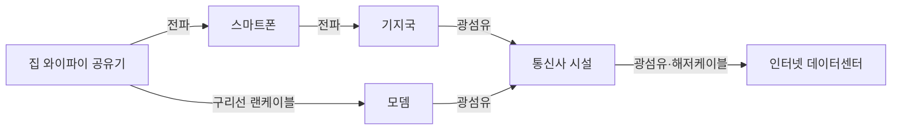
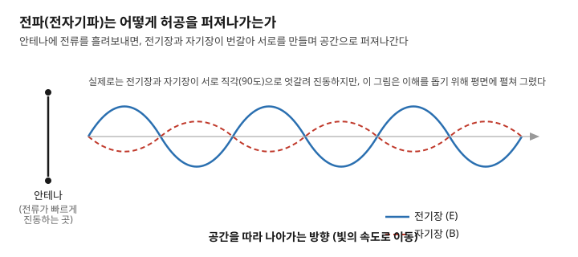

# 주간 통신 브리핑 — 2026-09-21

> ※ 이번 호부터 "기초 개념 우선" 형식을 정식으로 시작합니다. 지난 리포트(09-15)는 예전 형식으로 쓰여 있어 복습 대상에서 제외합니다. 오늘은 커리큘럼 1번·2번부터 순서대로 시작합니다.

> 이번 주 배울 것: 통신은 어떤 통로로 이루어지는가. 그중 선 없는 통로인 전파(전자기파)란 무엇인가.

## 0. 30초 요약

- 통신은 정보를 신호로 바꿔 **구리선·광섬유·전파** 세 통로 중 하나로 보내는 일입니다.
- **전파(전자기파)**는 전기장·자기장의 출렁임이 허공으로 퍼져나가는 파동입니다.
- 이번 주 뉴스에서는 정부와 통신 3사가 이 세 통로에 대한 투자를 늘리기로 했습니다. 특히 해저케이블·광통신·위성이 대상입니다. 중국은 위성을 새로 쏘아 올려 전파로 지상과 통신합니다.

## 1. 새로 시작하며

이번 리포트부터 커리큘럼 순서를 지켜 기초부터 설명합니다.
지난 리포트들은 RAN, 오픈랜처럼 어려운 개념을 순서 없이 다뤄 이해되지 않았습니다.
그래서 이번 호부터는 가장 밑바닥인 "통신이란 무엇인가"부터 다시 시작합니다.

**미리 생각해볼 질문**: 메시지를 보낼 때 그 정보는 실제로 무엇을 타고 이동할까요? (정답은 2절에)

## 2. 이번 주 개념 ① — 통신이란 무엇인가

### 문제부터
바로 옆 사람과 대화할 때는 목소리만으로 충분합니다.
하지만 목소리는 수십 미터만 벗어나도 사라집니다.
그런데도 우리는 지구 반대편 가족과 실시간으로 통화합니다.
해외 서버의 영상도 몇 초 만에 내려받습니다.
이게 어떻게 가능할까요?

### 정의
통신(通信)이란, 정보를 신호로 바꿔 먼 곳까지 전달하는 일입니다. 그리고 다시 원래 정보로 되돌리는 일입니다.

### 동작 원리
택배를 생각해봅시다.
물건을 상자에 담아 주소를 적어 보내면, 받는 사람이 상자를 열어 물건을 꺼냅니다.
통신도 이와 비슷합니다.
목소리·문자·영상 같은 정보를 전기 신호나 빛 신호로 바꾸는 과정을 **부호화**라 부릅니다.
이렇게 만든 신호는 세 가지 통로 중 하나를 타고 이동합니다.
**구리선**(전류가 흐르는 금속 선)은 전기 신호를 나릅니다.
**광섬유**(Optical Fiber)는 빛의 점멸 신호를 나릅니다. 머리카락 굵기의 유리 선입니다.
**전파**(전자기파, Electromagnetic Wave)는 선 없이 퍼져나가는 신호입니다.
받는 쪽은 이 신호를 다시 원래 정보로 되돌립니다.
이를 **복호화**라 부릅니다.

| 통로 | 신호의 정체 | 대표적으로 쓰이는 곳 |
|---|---|---|
| 구리선 | 전기(전류)의 흐름 | 집 안 랜케이블, 옛날 전화선 |
| 광섬유 | 빛의 점멸 | 해저케이블, 통신사 백본망 |
| 전파 | 공중으로 퍼지는 전자기파 | 와이파이, 5G, 위성통신 |

**이 그림에서 볼 것**: 메시지 하나가 전파·광섬유·구리선을 번갈아 탄다는 것.

### 체감 사례
스마트폰으로 메시지를 보내는 순간에도 이 세 통로를 모두 거칩니다.
폰에서 기지국까지는 전파입니다.
기지국에서 통신사 시설까지는 대부분 광섬유입니다.
집에서 공유기와 셋톱박스를 잇는 구간은 흔히 구리선(랜케이블)입니다.

### 흔한 오해
와이파이가 곧 인터넷이라고 생각하기 쉽습니다.
하지만 와이파이는 스마트폰과 공유기 사이 마지막 구간에서만 쓰이는 전파일 뿐입니다.
실제 데이터 대부분은 그 뒤로 광섬유를 타고 이동합니다.

### 한 줄 정리
결국 통신이란, 정보를 신호로 바꿔 세 통로 중 하나로 실어 보내는 일입니다.

---

## 3. 이번 주 개념 ② — 전파(전자기파)란 무엇인가

### 문제부터
구리선과 광섬유는 반드시 물리적인 선을 깔아야 합니다.
그런데 움직이는 스마트폰, 하늘의 비행기, 우주의 위성까지 선으로 연결할 수는 없습니다.
선 없이 정보를 보내려면 무엇이 필요할까요?

### 정의
전파(전자기파, Electromagnetic Wave)란 파동입니다. 전기장과 자기장이 서로를 만들어내며 공간으로 퍼져나갑니다.

### 동작 원리
호수에 돌을 던지면 물결이 동심원을 그리며 퍼져나갑니다.
안테나도 이와 비슷하게 작동합니다.
안테나에 전류(전자의 흐름)를 아주 빠르게 진동시키면, 그 주변에 전기장이 생겨납니다.
이 전기장이 변하면 자기장을 만듭니다.
그 자기장이 다시 전기장을 만듭니다.
이 되풀이가 빛의 속도로 공간에 퍼져나가는 것이 바로 전파입니다.
이 파동에 정보를 실어 보내는 과정을 **변조**라 부릅니다.
받는 쪽 안테나가 흔들림을 읽어 정보를 되찾는 과정을 **복조**라 부릅니다.

**이 그림에서 볼 것**: 전기장(E)과 자기장(B)이 번갈아 서로를 만드는 모습.

### 체감 사례
스마트폰 신호 막대가 줄어드는 것은, 안테나에서 멀어질수록 전파가 약해지기 때문입니다.
전자레인지를 켜면 와이파이가 느려지기도 합니다.
전자레인지와 와이파이가 비슷한 대역의 전파를 함께 쓰기 때문입니다.

### 흔한 오해
전파와 빛(가시광선)이 전혀 다른 것이라 생각하기 쉽습니다.
하지만 둘 다 같은 전자기파 가족입니다.
다만 1초에 얼마나 빨리 출렁이는지, 즉 **주파수**가 다를 뿐입니다.
주파수는 다음 리포트(커리큘럼 3번)에서 본격적으로 다룹니다.

### 한 줄 정리
결국 전파란, 전기·자기장의 출렁임이 허공을 타고 퍼져나가는 파동입니다. 그 위에 정보를 실어 나릅니다.

이번 주 개념①에서 말한 세 통로 중 하나인 '전파'가 바로 이 전자기파입니다.

---

## 4. 개념으로 읽는 이번 주 뉴스

### ① 정부·통신 3사, AI 시대 통신망 투자 협의체 출범 ★★

- **쉬운 설명**: 과기정통부와 SK텔레콤·KT·LG유플러스가 처음 만났습니다. 5G 단독모드·해저케이블·위성·광통신에 대한 투자를 늘리기로 했습니다. 통신 3사의 설비투자는 계속 줄어들고 있었습니다. 2019년 9조6천억 원에서 2024년 6조 원 수준까지 떨어졌습니다. 정부는 연말까지 종합대책을 내놓기로 했습니다.
- **개념과의 연결**: 이 협의체가 다루는 해저케이블·광통신은 개념①의 '광섬유' 통로입니다. 위성은 개념②의 '전파' 통로에 대한 실제 투자입니다.
- **원문 링크(2026-09-18)**: [한국경제 "정부·통신3사, AI 통신망 투자 늘린다"](https://www.hankyung.com/article/2026091844561)

### ② 중국, 로켓으로 위성 8기·무선통신 시험위성 1기 발사 ★

- **쉬운 설명**: 중국이 9월 16일 상하이 앞바다에서 인력(引力)-1 Y3 로켓을 쏘아 올렸습니다. 저궤도 위성 인터넷용 '첸판' 위성군 8기가 실려 있었습니다. 초고속 무선통신 기술을 시험하는 위성 1기도 함께 궤도에 올랐습니다. 스페이스X의 스타링크처럼 저궤도에서 인터넷을 제공하려는 프로젝트의 일부입니다.
- **개념과의 연결**: 이 위성들이 지상과 통신하는 방법도 개념②의 전파입니다. 광섬유를 우주까지 연결할 수는 없어, 위성통신은 전파에만 의존합니다.
- **원문 링크(발사 2026-09-16, 보도 2026-09-17)**: [네이트뉴스 "中, 해상·육상서 9~10기 위성 각각 발사"](https://m.news.nate.com/view/20260917n31706)

### ③ 3GPP, 마드리드서 6G 표준화 정기회의 개최 ★★★ (건너뛰어도 좋음)

- **쉬운 설명**: 3GPP(이동통신 표준을 정하는 국제 산업 협의체)가 9월 14~17일 스페인 마드리드에서 정기회의(RAN 플레너리 #113)를 열었습니다. 지난 호에서 '진행 중'으로 예고했던 안건이 이번 회의의 핵심이었습니다. 5G에서 6G로 넘어가는 구체적인 전환 방식을 결정하는 자리였습니다. 다만 공식 결과 문서(3gpp.org)가 이 리포트 작성 환경에서 접근 차단됩니다. 그래서 실제로 무엇이 확정됐는지는 확인하지 못했습니다. 확인되는 대로 다음 호에서 다루겠습니다.
- **개념과의 연결**: 이 회의도 결국 전파(개념②)를 주고받는 방식에 대한 규칙을 정합니다.
- **원문 링크(회의 기간 2026-09-14~17)**: [3GPP "Working Group Reports to RAN Plenary #113"](https://www.3gpp.org/news-events/3gpp-news/ran113-reports)

## 5. 그 밖의 소식

- **여러 AI가 기지국을 동시에 제어하면 생기는 충돌을 막는 연구** — 서로 다른 목표를 가진 AI 두 개가 같은 기지국 자원을 두고 충돌하는 것을 실제 장비로 확인했습니다. 이를 막는 안전장치도 제안한 논문입니다(2026-09-16 제출). [arXiv 2609.18857](https://arxiv.org/abs/2609.18857)

## 6. 이해 점검 퀴즈

**Q1.** 카카오톡 메시지가 스마트폰에서 목적지까지 가는 동안 지나가는 통로가 아닌 것은?
a) 전파 b) 광섬유 c) 구리선 d) 소리굽쇠의 진동

**Q2.** 와이파이에 대한 설명 중 틀린 것은?
a) 스마트폰과 공유기 사이 마지막 구간에서 쓰인다
b) 전파(전자기파)의 한 종류다
c) 와이파이 자체가 인터넷이며 그 뒤로는 선이 필요 없다
d) 공유기에서 멀어지면 신호가 약해진다

**Q3.** 안테나가 전파를 만들어내는 원리로 옳은 것은?
a) 안테나 속 물이 진동해서
b) 전류의 진동이 전기장을 만들고, 전기장의 변화가 자기장을 만드는 과정이 되풀이돼서
c) 안테나가 빛을 반사해서
d) 안테나 안의 자석이 회전해서

**Q4.** 전파와 가시광선(빛)의 관계로 옳은 것은?
a) 전혀 다른 현상이다
b) 같은 전자기파 가족이며 출렁이는 빠르기(주파수)만 다르다
c) 빛은 전파의 반대말이다
d) 빛은 전자기파가 아니다

**Q5.** 이번 주 중국이 쏘아올린 위성이 지상과 통신할 때 사용하는 것은?
a) 광섬유 케이블 b) 구리선 c) 전파(전자기파) d) 소리

### 정답과 해설

1. **정답 d**. 통신은 구리선·광섬유·전파 세 통로만 씁니다. (2절 '동작 원리' 참고)
2. **정답 c**. 와이파이는 마지막 구간의 전파일 뿐, 그 뒤로는 대부분 광섬유가 이어받습니다. (2절 '흔한 오해' 참고)
3. **정답 b**. 전류의 진동 → 전기장 → 자기장 → 다시 전기장, 이 되풀이가 전파를 만듭니다. (3절 '동작 원리' 참고)
4. **정답 b**. 전파와 빛은 같은 전자기파 가족이며, 주파수(출렁이는 빠르기)만 다릅니다. (3절 '흔한 오해' 참고)
5. **정답 c**. 위성은 광섬유로 연결할 수 없어 전파로만 지상과 통신합니다. (3절, 4절 뉴스② 참고)

## 7. 이번 주 용어집

- **광섬유(Optical Fiber)** — 빛의 점멸로 신호를 나르는 유리·플라스틱 선. 굵기는 머리카락 정도.
- **구리선** — 전류(전기)의 흐름으로 신호를 실어 나르는 금속 선.
- **변조·복조** — 전파에 정보를 싣는 과정(변조)과, 그 정보를 다시 꺼내는 과정(복조).
- **안테나** — 전류의 진동을 전파로, 전파를 다시 전류로 바꾸는 장치.
- **전파(전자기파, Electromagnetic Wave)** — 전기장·자기장이 서로 만들며 퍼지는 파동.
- **통신(通信)** — 정보를 신호로 바꿔 먼 곳까지 보낸 뒤, 다시 원래 정보로 되돌리는 일.

## 8. 다음 주 예고

- 커리큘럼 3번 **주파수와 파장**, 4번 **대역폭**을 다룰 예정입니다. "몇 GHz 대역"이 실제로 무슨 뜻인지 설명합니다. 왜 대역폭이 넓으면 속도가 빨라지는지도 다룹니다.
- 3GPP RAN#113(마드리드) 회의의 확정 결과도 다시 확인합니다. 이번 호에서는 확인하지 못했습니다.

## 부록: 이번 주 수집 상태

| 소스 | 상태 | 비고 |
|---|---|---|
| TTA ICT Standard Weekly | 목록 접근 성공 | 최신호가 지난주와 동일한 제1307호. 신규 호 없어 이번 주는 다루지 않음 |
| IITP 주간기술동향 | 접근 성공 | 최신호가 지난주와 동일한 제2220호. 신규 호 없어 이번 주는 다루지 않음 |
| arXiv API | 정상 작동 | 이번 주는 429 오류 없이 1차 경로(export.arxiv.org) 성공 |
| 3GPP/ITU | www.3gpp.org 직접 차단 | 웹검색으로 회의 일정은 확인, 결과 상세는 확인 못함 |
| IEEE 계열(Xplore·ComSoc·Spectrum) | 4주 연속 차단 | 1회 시도 후 스킵 |
| 국내 언론 일부(hankyung, e-focus, news1, nate) | 이번 세션에서 신규로 차단 확인 | 웹검색 스니펫으로 대체 |
