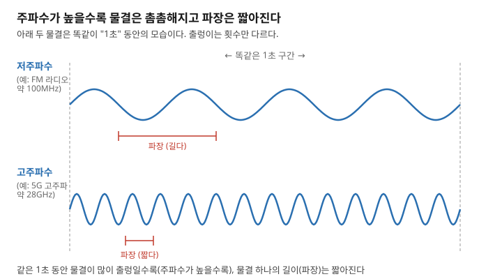
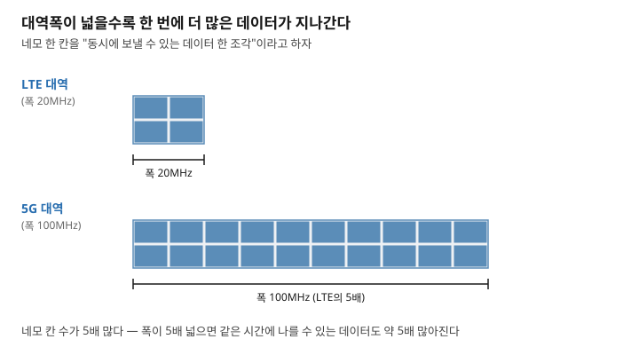

# 주간 통신 브리핑 — 2026-09-22

> 이번 주 배울 것: "5G는 3.5GHz를 쓴다"는 말이 무슨 뜻인지 이해합니다. "폭이 100MHz다"라는 말도 이해합니다.

## 0. 30초 요약

- **주파수**는 전파가 1초 동안 몇 번 출렁이는지를 나타내는 숫자입니다. 단위는 **헤르츠(Hz)**입니다.
- 주파수가 높을수록 물결 하나의 길이인 **파장**은 짧아집니다.
- **대역폭**은 통신에 쓰는 주파수 범위의 폭입니다. 폭이 넓을수록 한 번에 더 많은 데이터를 보냅니다.
- 이번 주 3GPP 회의는 6G가 쓸 주파수 범위와 채널 폭을 논의했습니다. 스타링크는 한국에서 일반 서비스를 시작했습니다. 미국은 주파수 경매로 100조 원 이상을 벌 것으로 예상됩니다.

## 1. 지난주 복습

지난주에는 통신이 구리선·광섬유·전파 세 통로로 이루어진다고 배웠습니다.
그중 전파(전자기파)는 전기장과 자기장이 서로를 만들며 퍼지는 파동입니다.
안테나에서 전류가 진동하면 이 파동이 빛의 속도로 퍼져나갑니다.

**확인 문제**: 전파는 무엇과 무엇이 서로를 만들며 퍼져나가는 파동일까요?
정답: 전기장과 자기장입니다. (지난주 3절 참고)

## 2. 이번 주 개념① — 주파수와 파장

### 문제부터
뉴스에 "5G는 3.5GHz 대역을 쓴다"는 말이 자주 나옵니다.
와이파이 설정에도 "2.4GHz"와 "5GHz"라는 숫자가 보입니다.
이 숫자가 무엇을 뜻하는지 모르면 뉴스를 읽어도 이해가 안 됩니다.

### 정의
주파수(Frequency)란, 파동이 1초 동안 출렁이는 횟수입니다.
파장(Wavelength)이란, 물결 하나가 차지하는 거리입니다.

### 동작 원리
줄넘기 줄을 생각해봅시다.
줄을 빨리 흔들면 물결이 촘촘하게 여러 개 생깁니다.
천천히 흔들면 물결이 성기게 한두 개만 생깁니다.
전파도 똑같습니다.
안테나 속 전류가 1초에 몇 번 진동하느냐가 주파수를 결정합니다.
이 진동은 빛의 속도로 일정하게 퍼져나갑니다.
그래서 1초에 진동을 많이 할수록 주파수가 높아집니다.
주파수가 높을수록 물결 하나의 길이, 즉 파장은 짧아집니다.
반대로 진동을 적게 할수록 파장은 길어집니다.
주파수와 파장은 이렇게 반비례 관계입니다.
1초에 한 번 출렁이면 1헤르츠(Hz)입니다.
1초에 10억 번 출렁이면 1기가헤르츠(GHz)입니다.
"기가"는 10억을 뜻하는 접두사입니다.

**이 그림에서 볼 것**: 같은 1초 동안 저주파수는 물결이 적습니다. 고주파수는 물결이 촘촘합니다.

### 체감 사례
스마트폰이 "5G" 또는 "LTE"에 접속할 때 특정 GHz 대역을 씁니다.
와이파이 공유기의 "2.4GHz"와 "5GHz"도 각각 다른 주파수 대역입니다.
전자레인지가 와이파이를 방해하기도 합니다. 둘이 2.4GHz 부근의 비슷한 대역을 함께 쓰기 때문입니다.

### 흔한 오해
"주파수 숫자가 크면 통신이 무조건 빠르다"고 생각하기 쉽습니다.
하지만 주파수 자체는 속도를 뜻하지 않습니다.
속도를 결정하는 것은 다음 절에서 배울 대역폭입니다.
주파수는 그 대역폭이 "어디에 위치하는지"를 가리킬 뿐입니다.

### 한 줄 정리
결국 주파수란, 1초에 몇 번 출렁이는지를 나타내는 숫자입니다. 파장은 그 물결 하나의 길이입니다.

지난주에 배운 전파(전자기파)가 바로 이렇게 주파수를 가지고 출렁이는 파동입니다.

---

## 3. 이번 주 개념② — 대역폭

### 문제부터
"5G는 폭 100MHz를 쓴다"는 말도 뉴스에 자주 나옵니다.
"주파수가 부족하다"는 말도 나옵니다.
폭이 왜 중요한지, 왜 부족하다는 것인지 알기 어렵습니다.

### 정의
대역폭(Bandwidth)이란, 통신에 사용하는 주파수 범위의 폭입니다.
시작 주파수부터 끝 주파수까지의 차이입니다.

### 동작 원리
도로를 생각해봅시다.
차선이 많은 넓은 도로는 한 번에 더 많은 차가 지나갑니다.
차선이 하나뿐인 좁은 도로는 차가 밀립니다.
통신에서도 마찬가지입니다.
주파수 범위(도로)가 넓을수록 동시에 지나갈 수 있는 데이터 조각(차)이 많아집니다.
그래서 대역폭이 넓을수록 초당 전송량, 즉 속도가 커집니다.
폭이 2배가 되면 실어 나를 수 있는 데이터도 거의 2배가 됩니다.

**이 그림에서 볼 것**: 폭이 5배 넓은 5G 대역은 데이터 조각도 5배 더 담습니다.

### 체감 사례
LTE는 보통 폭 20MHz 정도를 씁니다.
5G는 그보다 훨씬 넓은 폭 100MHz를 씁니다.
5G가 LTE보다 빠른 이유 중 하나가 바로 이 넓어진 폭입니다.
유튜브에서 4K 영상이 끊기지 않는 것도 넓은 대역폭 덕분입니다.

| 통신 방식 | 대역폭(폭) | 체감 비유 |
|---|---|---|
| LTE(4G) | 약 20MHz | 2시간짜리 영화를 약 40초에 받는 속도 |
| 5G(중대역) | 약 100MHz | 같은 영화를 약 8초에 받는 속도 |
| 와이파이 7 | 최대 320MHz | 같은 영화를 약 2~3초에 받는 속도 |

### 흔한 오해
대역폭과 "체감 속도"를 같은 것으로 생각하기 쉽습니다.
하지만 대역폭은 도로의 폭일 뿐입니다.
그 도로를 같은 시간에 몇 명이 함께 쓰는지(혼잡도)에 따라 체감 속도는 달라집니다.
혼잡을 나누는 방법은 다음 단계 커리큘럼에서 다룹니다.

### 한 줄 정리
결국 대역폭이란, 한 번에 실어 나를 수 있는 주파수 범위의 폭입니다. 넓을수록 더 많은 데이터를 동시에 보냅니다.

이번 주 개념①에서 배운 주파수가 "어느 위치"라면, 대역폭은 그 자리의 "폭"입니다.

---

## 4. 개념으로 읽는 이번 주 뉴스

### ① 3GPP, 마드리드 회의서 6G 주파수 범위·채널 폭 논의 ★★

- **쉬운 설명**: 3GPP가 9월 14~17일 마드리드에서 정기회의를 열었습니다. 3GPP는 이동통신 표준을 정하는 국제 산업 협의체입니다. 이번 회의는 RAN 플레너리 #113입니다. 지난 호에서 예고했던 회의입니다. 이번 회의에서 6G가 쓸 주파수 범위를 논의했습니다. 기존 5G는 7.125GHz 이하 대역을 씁니다. 여기에 더해 7GHz 부근도 6G 후보 대역에 넣기로 했습니다. 24.25~52.6GHz 구간도 후보에 포함됩니다. 채널의 폭(대역폭)을 어떻게 정할지도 논의했습니다. 같은 대역을 5G와 6G가 어떻게 나눠 쓸지도 논의했습니다. 아직 최종 확정은 아닙니다.
- **개념과의 연결**: 이 회의가 정하는 것이 개념①의 주파수 범위입니다. 채널 폭은 개념②의 대역폭입니다.
- **원문 링크(회의 기간 2026-09-14~17)**: [3GPP "Working Group Reports to RAN Plenary #113"](https://www.3gpp.org/news-events/3gpp-news/ran113-reports)

### ② 스타링크, 한국 일반 고객 대상 정식 서비스 시작 ★

- **쉬운 설명**: 스페이스X의 저궤도 위성 인터넷 스타링크가 한국에서 서비스를 시작했습니다. 9월 15일부터 일반 고객 대상입니다. 같은 날 대한항공과 아시아나항공도 스타링크 기내 와이파이를 도입했습니다. 스타링크는 미국에서 Ku밴드(12~18GHz) 이용 허가를 받았습니다. Ka밴드(27~40GHz)도 마찬가지입니다. 한국에서도 이 대역을 씁니다. 국내에는 이미 무궁화위성이 비슷한 Ku밴드를 쓰고 있습니다. 정부가 전파 혼신 여부를 검증한 뒤 승인했습니다.
- **개념과의 연결**: Ku밴드·Ka밴드는 특정 GHz 범위에 붙인 이름입니다. 개념①에서 배운 "GHz 숫자가 곧 주파수"라는 것을 보여주는 실제 사례입니다.
- **원문 링크(서비스 개시 2026-09-15)**: 대한항공·아시아나항공 보도자료 및 국내 언론 다수 보도 (개별 기사 링크는 이 환경에서 접근 차단되어 인용 불가, 발행일은 검색 스니펫으로 확인)

### ③ 美 FCC 의장 "향후 주파수 경매로 100조 원 이상 예상" ★★

- **쉬운 설명**: 미국 연방통신위원회(Federal Communications Commission, FCC) 의장이 발언했습니다. 이름은 브렌던 카이며, 9월 16일 발언입니다. 앞으로 몇 년간 이어질 주파수 경매들이 100조 원 넘는 수익을 낼 수 있다는 내용입니다. 100조 원은 약 1000억 달러입니다. 앞서 7월에는 어퍼 C밴드(3.98~4.2GHz)에서 경매를 결정했습니다. 폭은 160MHz입니다. 이 경매는 2027년에 열립니다. 카 의장은 추가 경매도 2028년 말까지 이어가겠다고 밝혔습니다.
- **개념과의 연결**: 경매로 파는 것은 특정 주파수의 "폭", 즉 개념②의 대역폭입니다. 폭이 넓을수록 더 비싸게 팔립니다.
- **원문 링크(2026-09-16)**: [Investing.com(로이터 통신) "US official says upcoming spectrum auctions could generate more than $100 billion"](https://www.investing.com/news/stock-market-news/us-official-says-upcoming-spectrum-auctions-could-generate-more-than-100-billion-4904751)

## 5. 그 밖의 소식

- **TTA ICT Standard Weekly 제1308호 발행**
  제목: "프런티어 AI 모델의 지속적 출현에 따른 보안 패러다임의 전환". 이번 주 개념과는 직접 연결되지 않는 AI 보안 주제입니다. [TTA 위클리 목록](https://committee.tta.or.kr/data/weekly_list.jsp) (제목만 확보, 본문 PDF는 접근 차단)

## 6. 이해 점검 퀴즈

**Q1.** 주파수에 대한 설명으로 옳은 것은?
a) 파동이 1초 동안 출렁이는 횟수다
b) 파동 하나의 길이다
c) 데이터가 저장되는 공간이다
d) 신호의 세기를 나타내는 단위다

**Q2.** 주파수와 파장의 관계로 옳은 것은?
a) 둘은 관계가 없다
b) 주파수가 높을수록 파장도 길어진다
c) 주파수가 높을수록 파장은 짧아진다
d) 파장이 길수록 주파수도 같이 커진다

**Q3.** 1초에 10억 번 출렁이는 파동의 주파수를 부르는 말은?
a) 1헤르츠(Hz) b) 1메가헤르츠(MHz) c) 1기가헤르츠(GHz) d) 1테라헤르츠(THz)

**Q4.** 대역폭에 대한 설명으로 틀린 것은?
a) 통신에 쓰는 주파수 범위의 폭이다
b) 폭이 넓을수록 한 번에 더 많은 데이터를 보낼 수 있다
c) 대역폭이 넓으면 혼잡해도 항상 체감 속도가 일정하다
d) 5G가 LTE보다 빠른 이유 중 하나는 더 넓은 대역폭이다

**Q5.** 이번 주 뉴스에서 미국 FCC가 경매로 팔려는 것은 실제로 무엇인가?
a) 특정 주파수의 폭(대역폭) b) 스마트폰 단말기 c) 광섬유 케이블 d) 위성 자체

### 정답과 해설

1. **정답 a**. 주파수는 1초 동안 출렁이는 횟수입니다. (2절 '정의' 참고)
2. **정답 c**. 주파수가 높을수록 물결 하나의 길이인 파장은 짧아집니다. (2절 '동작 원리' 참고)
3. **정답 c**. "기가"는 10억을 뜻합니다. 1초에 10억 번이면 1기가헤르츠(GHz)입니다. (2절 '동작 원리' 참고)
4. **정답 c**. 대역폭이 넓어도 함께 쓰는 사람이 많으면(혼잡하면) 체감 속도는 떨어질 수 있습니다. (3절 '흔한 오해' 참고)
5. **정답 a**. FCC가 경매하는 것은 특정 GHz 대역의 MHz 폭, 즉 대역폭입니다. (4절 뉴스③ 참고)

## 7. 이번 주 용어집

- **대역폭(Bandwidth)** — 통신에 사용하는 주파수 범위의 폭. 넓을수록 더 많은 데이터를 동시에 보낸다.
- **주파수(Frequency)** — 파동이 1초 동안 출렁이는 횟수. 단위는 헤르츠(Hz). 1000배마다 킬로(k)·메가(M)·기가(G)를 붙인다.
- **파장(Wavelength)** — 물결 하나가 차지하는 거리. 주파수가 높을수록 짧아진다.
- **Ku밴드·Ka밴드** — 위성통신에 흔히 쓰이는 주파수 대역을 부르는 이름. 각각 12~18GHz, 27~40GHz 부근을 가리킨다.
- **미국 연방통신위원회(Federal Communications Commission, FCC)** — 미국의 주파수 정책을 관리하는 기관. 주파수 경매도 이곳이 연다.

## 8. 다음 주 예고

- 커리큘럼 5번 **주파수 대역별 성질**을 다룰 예정입니다. 낮은 주파수는 멀리 가고, 높은 주파수는 빠르지만 벽을 못 뚫는 이유입니다.
- 6번 **주파수는 왜 국가가 나눠주는가**도 다룹니다. 경매와 간섭 문제를 설명합니다.
- 이번 주 뉴스③의 미국 주파수 경매 이야기가 바로 6번 개념의 실제 사례가 됩니다.
- 3GPP RAN#113의 채널 폭 최종안은 아직 확인 못했습니다. 확정되는 대로 다시 다룹니다.

## 부록: 이번 주 수집 상태

| 소스 | 상태 | 비고 |
|---|---|---|
| TTA ICT Standard Weekly | 목록 접근 성공 | User-Agent 헤더를 추가해야 400 오류 없이 접근됨(신규 확인). 신규호 제1308호 확보 |
| IITP 주간기술동향 | 접근 성공 | 최신호가 지난주와 동일한 제2220호. 신규 호 없어 이번 주는 다루지 않음 |
| arXiv API | 1차 경로 성공(429 없음) | cs.NI 대역폭 관련 검색 결과 중 이번 주 개념과 바로 연결되는 논문 없어 리포트에는 넣지 않음 |
| 3GPP/ITU | www.3gpp.org 직접 차단 | 웹검색으로 RAN#113 세부 내용(6G 주파수 범위·채널 폭 논의)까지 확인 성공. 지난주보다 진전됨 |
| IEEE 계열(Xplore·ComSoc·Spectrum) | 5주 연속 차단 | 1회 시도 후 스킵 |
| 국내외 언론 다수 | 본문 WebFetch 차단 다수 | 이번 주 새로 확인된 차단: finance.yahoo.com, investing.com(및 kr.investing.com), koreadaily.com, news.koreanair.com, radioseoul1650.com, wsau.com, electimes.com, theguru.co.kr, thefastmode.com, telecomreviewasia.com, free6gtraining.com. 대부분 검색 스니펫으로 날짜·내용 확인 |
