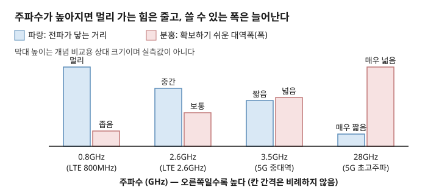
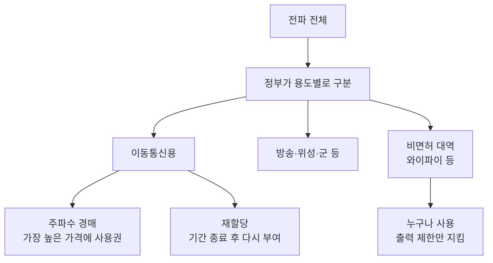

# 주간 통신 브리핑 — 2026-09-29

> 이번 주 배울 것: 주파수마다 성질이 다르다는 것, 그리고 그 주파수를 국가가 나눠주는 이유를 이해합니다.

## 0. 30초 요약

- **낮은 주파수**는 멀리 가고 벽을 잘 뚫습니다. 대신 쓸 수 있는 폭이 좁습니다.
- **높은 주파수**는 넓은 폭을 확보하기 쉬워 빠릅니다. 대신 멀리 못 가고 벽에 막힙니다.
- 전파는 눈에 안 보이고 국경도 없습니다. 같은 주파수를 둘이 쓰면 서로 뒤섞입니다. 그래서 국가가 나눠줍니다.
- 나누는 방법은 크게 셋입니다. 경매, 재할당, 누구나 쓰는 대역 지정입니다.
- 이번 주 뉴스는 개념의 실제 사례 중심입니다. 한국의 주파수 재할당과 미국의 6GHz 와이파이 규칙을 봅니다.

## 1. 지난주 복습

지난주에는 주파수와 대역폭을 배웠습니다.
주파수는 전파가 1초에 출렁이는 횟수입니다. 대역폭은 통신에 쓰는 주파수 범위의 폭입니다.
폭이 넓을수록 한 번에 실어 나르는 데이터가 늘어 빨라집니다.

**확인 문제**: LTE는 폭 약 20MHz, 5G 중대역은 약 100MHz입니다. 어느 쪽이 빠를까요? 이유는?
정답: 5G입니다. 폭이 5배 넓어 한 번에 더 많은 데이터를 담습니다. (지난주 3절 참고)

## 2. 이번 주 개념 ① — 주파수 대역별 성질

### 문제부터
와이파이는 2.4GHz와 5GHz 두 가지를 씁니다.
왜 하나만 쓰지 않을까요? 공유기에서 먼 방은 2.4GHz가 더 잘 됩니다. 같은 방에서는 5GHz가 더 빠릅니다.
이 차이를 모르면 "5G는 왜 건물 안에서 잘 안 터지나"도 이해할 수 없습니다.

### 정의
주파수 대역별 성질이란, 주파수가 다르면 전파가 가는 거리와 벽을 뚫는 힘이 달라지는 현상입니다.
낮은 쪽을 저대역, 중간을 중대역, 높은 쪽을 고대역이라고 부릅니다.

### 동작 원리
물결로 생각해 봅시다. 파도가 큰 물결은 작은 돌을 그냥 넘어갑니다. 잔물결은 돌에 부딪혀 흩어집니다.
이제 실제 전파에서 일어나는 일을 봅니다.
전파는 벽, 유리, 비, 나뭇잎을 만나면 에너지의 일부를 잃습니다. 이것을 **감쇠(減衰, 신호가 약해짐)**라고 합니다.
주파수가 높을수록 물체에 흡수되고 반사되는 정도가 커져 감쇠가 큽니다.
그래서 높은 주파수는 같은 출력으로 보내도 멀리 가지 못합니다.
반대로 낮은 주파수는 파장이 길어 장애물을 돌아 넘고 벽도 더 잘 통과합니다.
하지만 낮은 대역은 이미 여러 서비스가 빼곡히 씁니다. 그래서 새로 확보할 수 있는 폭이 좁습니다.
높은 대역은 비어 있는 넓은 폭을 확보하기 쉬워 빠릅니다. 이것이 거리와 속도의 맞바꿈입니다.

**이 그림에서 볼 것**: 왼쪽 파랑 막대(거리)는 점점 낮아지고, 오른쪽 분홍 막대(폭)는 점점 높아집니다.

### 체감 사례
- 지하주차장에서 통화는 되는데 영상은 느린 경우가 있습니다. 벽을 뚫는 낮은 대역으로 겨우 연결된 것입니다.
- 공유기 옆에서는 5GHz가 빠릅니다. 벽 두 개 너머에서는 2.4GHz가 더 안정적입니다.
- 5G 초고주파(28GHz)는 창문 하나만 지나도 크게 약해집니다. 그래서 기지국을 촘촘히 세워야 합니다.

### 흔한 오해
"높은 주파수가 최신이니 무조건 좋다"고 생각하기 쉽습니다.
그렇지 않습니다. 높은 주파수는 빠르지만 좁은 범위만 덮습니다.
통신사는 넓은 지역은 낮은 대역으로, 붐비는 곳은 높은 대역으로 나눠 섞어 씁니다.

### 한 줄 정리
결국 주파수 대역별 성질이란, 낮은 주파수는 멀리 가고 높은 주파수는 넓은 폭으로 빠르게 가지만 멀리 못 가는 성질입니다.

지난주에 배운 대역폭과 이렇게 이어진다: 높은 대역일수록 넓은 폭을 확보하기 쉬워서 속도가 빨라진다.

---

## 3. 이번 주 개념 ② — 주파수는 왜 국가가 나눠주는가

### 문제부터
같은 동네에서 두 방송국이 같은 주파수로 동시에 방송하면 어떻게 될까요?
두 소리가 뒤섞여 어느 쪽도 알아들을 수 없습니다.
전파는 벽과 국경을 넘어 퍼집니다. 누가 어디서 무엇을 쓰는지 정해 두지 않으면 통신이 무너집니다.

### 정의
주파수 분배란, 국가가 전파를 쓸 수 있는 범위를 용도와 사용자별로 나눠 정하는 일입니다.
전파는 한정된 자원이라 국가가 관리합니다.

### 동작 원리
땅으로 비유하면, 정부가 도로 구역을 나눠 임대해 주는 것과 같습니다.
실제로는 이렇게 진행됩니다. 정부는 먼저 "이 범위는 이동통신용, 이 범위는 방송용"처럼 용도를 정합니다.
그다음 이동통신용 범위를 통신사에 나눠줍니다. 서로의 신호가 섞이는 현상을 **간섭(干涉)**이라 부릅니다. 이를 막으려는 것입니다.
나눠주는 방법은 크게 세 가지입니다.
첫째, **주파수 경매**입니다. 여러 회사가 가격을 써내고 가장 높게 낸 회사가 일정 기간 독점 사용권을 얻습니다.
둘째, **재할당**입니다. 이용 기간이 끝난 주파수를 기존 사용자에게 다시 내줍니다. 이때 대가를 새로 정합니다.
셋째, **비면허 대역**입니다. 누구나 허가 없이 쓰되 출력 제한을 지킵니다. 와이파이가 대표적입니다.

**이 그림에서 볼 것**: 이동통신용 주파수는 경매나 재할당으로 통신사에 가고, 와이파이용은 누구나 쓰는 비면허 대역으로 갑니다.

### 체감 사례
통신사가 요금을 올리거나 투자를 늘리는 배경에는 이 주파수 비용이 있습니다.
집 와이파이가 저녁에 느려지는 것도 이유가 있습니다. 이웃 공유기들이 같은 비면허 대역을 함께 쓰며 서로 간섭하기 때문입니다.

### 흔한 오해
"공기 중 전파는 누구나 공짜로 쓸 수 있다"고 생각하기 쉽습니다.
그렇지 않습니다. 이동통신 주파수는 수조 원의 대가를 내고 독점 사용권을 삽니다.
자유롭게 쓰는 것은 정해진 비면허 대역뿐입니다.

### 한 줄 정리
결국 주파수 분배란, 뒤섞이는 전파를 막기 위해 국가가 한정된 전파를 나눠주고 대가를 받는 것입니다.

개념 ①에서 배운 대역별 성질이 "어느 대역이 쓸모 있는가"를 정한다. 그래서 대역마다 가치와 가격이 달라진다.

---

## 4. 개념으로 읽는 이번 주 뉴스

> 이번 주는 개념 ①·②에 딱 맞는 새 소식이 적었습니다. 그래서 발행일이 확인된 사례를 골랐고, 날짜를 함께 적었습니다.

### ① 한국, 2026년 만료 이동통신 주파수 370MHz 폭 전량 재할당 ★★

- **쉬운 설명**: 2026년에 이용 기간이 끝나는 3G·LTE 주파수는 총 370MHz 폭입니다. 정부는 이를 모두 통신사에 다시 내주기로 했습니다(재할당). 대가는 약 3조 1000억 원으로 정해졌고, 실내 5G 장비를 2만 곳 넘게 더 설치하면 약 2조 9000억 원까지 낮아집니다. 1.8GHz(20MHz 폭)와 2.6GHz(100MHz 폭)는 이용 기간이 3년입니다. 나머지는 5년입니다. 6G에 대비해 나중에 대역을 정리할 여지를 남긴 것입니다. 최근에도 "과거 경매가에 묶인 재할당 가격" 논란이 이어집니다(2026-09-13 보도, 제목만 확인).
- **미리보기(3문장)**: 5G 단독모드(SA)는 5G 전용 장비만으로 망을 꾸리는 방식입니다. 기존에는 LTE 장비에 5G를 얹어 썼습니다. 정식 설명은 커리큘럼 25번에서 합니다.
- **이번 주 개념 ①·②와의 연결**: 개념 ②의 "재할당"이 실제로 일어난 사례입니다. 대가는 개념 ①에서 본 대역의 가치와 폭에 따라 달라집니다.
- **원문 링크**: [과기정통부, 주파수 재할당 대가 14.8% 인하…대역별 3·5년 차등 적용 (아주경제, 2025-12-10)](https://www.ajunews.com/view/20251210112941737) / [과거 경매가에 묶인 주파수 재할당…"현재 가치 반영하는 별도 기준 필요" (네이트뉴스, 2026-09-13)](https://m.news.nate.com/view/20260913n10362)
- **확인 한계**: 금액과 조건은 검색 스니펫 요약 기준이며, 본문은 접근 차단으로 직접 확인하지 못했습니다.

### ② 미국, 6GHz 대역 1200MHz 폭을 와이파이 등 비면허로 유지 ★★

- **쉬운 설명**: 6GHz 대역(5.925~7.125GHz)은 폭이 1200MHz입니다. 미국은 이 전체를 누구나 쓰는 비면허 대역으로 두고 있습니다. 와이파이 6E와 7이 이 대역을 씁니다. 2026년에는 위치 정보를 이용해 야외에서도 출력을 낼 수 있게 하는 규칙이 추가됐고, 2026-04-27부터 효력이 생겼습니다. 한편 이동통신 쪽은 같은 대역을 6G용으로 원합니다. 그래서 두 진영의 다툼이 이어집니다.
- **이번 주 개념 ①·②와의 연결**: 개념 ②의 비면허 대역 사례입니다. 폭 1200MHz는 지난주 대역폭 개념으로 보면 아주 넓은 도로입니다.
- **원문 링크(2026-02-25 연방 관보 게시)**: [Federal Register "Unlicensed Use of the 6 GHz Band; Expanding Flexible Use in Mid-Band Spectrum Between 3.7 and 24 GHz"](https://www.federalregister.gov/documents/2026/02/25/2026-03744/unlicensed-use-of-the-6-ghz-band-expanding-flexible-use-in-mid-band-spectrum-between-37-and-24-ghz)

### ③ 미국, 2027년 상위 C밴드 160MHz 폭 경매 결정 (지난주 뉴스 이어서) ★

- **쉬운 설명**: 미국은 7월에 중대역 160MHz 폭을 2027년 경매에 부치기로 표결했습니다. 9월 16일에는 규제기관 의장이 앞으로 경매 수익이 1000억 달러를 넘을 수 있다고 말했습니다. 이 대역은 4GHz 부근 중대역이라, 개념 ①에서 본 "거리와 폭의 균형점"에 있는 대역입니다.
- **이번 주 개념 ①·②와의 연결**: 경매(개념 ②)의 대상이 하필 중대역인 것은 개념 ①의 이유 때문입니다. 멀리 가고 폭도 넓은 균형 대역이 가장 값지기 때문입니다.
- **원문 링크(2026-09-16)**: [Investing.com(로이터) "US official says upcoming spectrum auctions could generate more than $100 billion"](https://www.investing.com/news/stock-market-news/us-official-says-upcoming-spectrum-auctions-could-generate-more-than-100-billion-4904751)

## 5. 그 밖의 소식

- **삼성전자, KT·SK텔레콤 AI-RAN 실증 사업 계약 (2026-09-23)** — 10월부터 조선소·석유화학 단지에 5G 전용망을 깔고 AI 기지국을 시험합니다. [Advanced Television](https://www.advanced-television.com/2026/09/23/samsung-signs-ai-contracts-with-kt-and-sk-telecom/)
- **TTA ICT Standard Weekly 제1309호** — "TTA 정보보호 시험·인증체계와 AI 시대 대응 방향" (제목만 확보, 발행일은 목록에 표기 없음) [TTA 위클리 목록](https://committee.tta.or.kr/data/weekly_list.jsp)
- **IITP 주간기술동향 제2221호 (2026-09-23)** — 통신 직접 관련 글은 없고, AI 공급망 보안 위협과 ISO/IEC 42001 대응 글이 있습니다. [IITP 목록](https://www.itfind.or.kr/publication/regular/weeklytrend/weekly/list.do)

## 6. 이해 점검 퀴즈

**Q1.** 같은 출력으로 보낼 때 벽을 가장 잘 뚫고 멀리 가는 것은?
a) 28GHz b) 3.5GHz c) 0.8GHz d) 모두 같다

**Q2.** 높은 주파수 대역의 장점으로 옳은 것은?
a) 벽을 잘 뚫는다 b) 넓은 폭을 확보하기 쉬워 빠르다 c) 기지국이 적게 필요하다 d) 간섭이 절대 없다

**Q3.** 전파가 벽이나 비를 만나 약해지는 현상을 무엇이라 하는가?
a) 재할당 b) 대역폭 c) 감쇠 d) 경매

**Q4.** 국가가 주파수를 나눠주는 가장 직접적인 이유는?
a) 통신사를 돕기 위해 b) 같은 주파수를 둘이 쓰면 신호가 뒤섞이는 간섭이 생기므로 c) 전파가 무거워서 d) 와이파이를 금지하려고

**Q5.** 이용 기간이 끝난 주파수를 기존 사용자에게 다시 내주는 방식은?
a) 경매 b) 재할당 c) 비면허 대역 d) 감쇠

### 정답과 해설

1. **정답 c**. 낮은 주파수일수록 벽을 잘 뚫고 멀리 갑니다. (2절 '동작 원리' 참고)
2. **정답 b**. 높은 대역은 넓은 폭을 확보하기 쉬워 빠르지만, 멀리 못 가서 기지국이 더 필요합니다. (2절 '동작 원리', '체감 사례' 참고)
3. **정답 c**. 감쇠는 신호가 약해지는 현상입니다. (2절 '동작 원리' 참고)
4. **정답 b**. 같은 주파수를 함께 쓰면 뒤섞이는 간섭이 생깁니다. (3절 '문제부터', '동작 원리' 참고)
5. **정답 b**. 재할당입니다. 경매는 새로 사용권을 파는 방식입니다. (3절 '동작 원리', 4절 뉴스① 참고)

## 7. 이번 주 용어집

- **간섭(Interference)** — 같은 주파수의 신호가 서로 뒤섞여 알아듣기 어려워지는 현상.
- **감쇠(Attenuation)** — 전파가 벽·비 등을 만나 약해지는 것. 주파수가 높을수록 크다.
- **비면허 대역** — 허가 없이 누구나 쓸 수 있는 주파수 범위. 와이파이가 대표적이다.
- **재할당** — 이용 기간이 끝난 주파수를 기존 사용자에게 다시 내주는 것. 대가를 새로 정한다.
- **주파수 경매** — 여러 회사가 가격을 써내 가장 높은 회사가 일정 기간 사용권을 얻는 방식.
- **저대역·중대역·고대역** — 주파수 높낮이에 따른 구분. 저대역은 멀리, 고대역은 넓은 폭이 장점이다.
- **5G 단독모드(SA)** — 5G 전용 장비만으로 꾸리는 방식. 정식 설명은 커리큘럼 25번에서 한다. (3문장 미리보기)

## 8. 다음 주 예고

- 커리큘럼 7번 **신호 세기와 잡음**을 다룹니다. dBm이 무슨 뜻인지, 스마트폰 안테나 막대기의 정체를 설명합니다.
- 이어서 8번 **변조**를 다룹니다. 0과 1을 전파에 싣는 방법입니다.
- 3GPP RAN#113 후속과 6G 채널 폭 확정 여부는 계속 지켜봅니다.

## 부록: 이번 주 수집 상태

| 소스 | 상태 | 비고 |
|---|---|---|
| TTA ICT Standard Weekly | 성공 | `-A "Mozilla/5.0"` 사용. 신규 제1309호 제목 확보, 본문 PDF는 차단으로 미확인 |
| IITP 주간기술동향 | 성공 | 신규 제2221호(2026-09-23). 통신 직접 관련 기사 없음 |
| arXiv | 시도 안 함 | 이번 개념과 직접 연결되는 논문이 없다고 판단해 생략 |
| 3GPP/ITU | 웹검색으로 확인 | RAN#113은 지난주 다룸. 신규 결과 없음 |
| IEEE 계열 | 시도 안 함 | 5주 연속 차단 기록으로 생략 |
| 뉴스 | 부분 성공 | 이번 주 개념과 맞는 새 소식이 적어 발행일 확인된 사례 위주로 구성. 언론사 본문은 검색 스니펫으로만 확인 |
